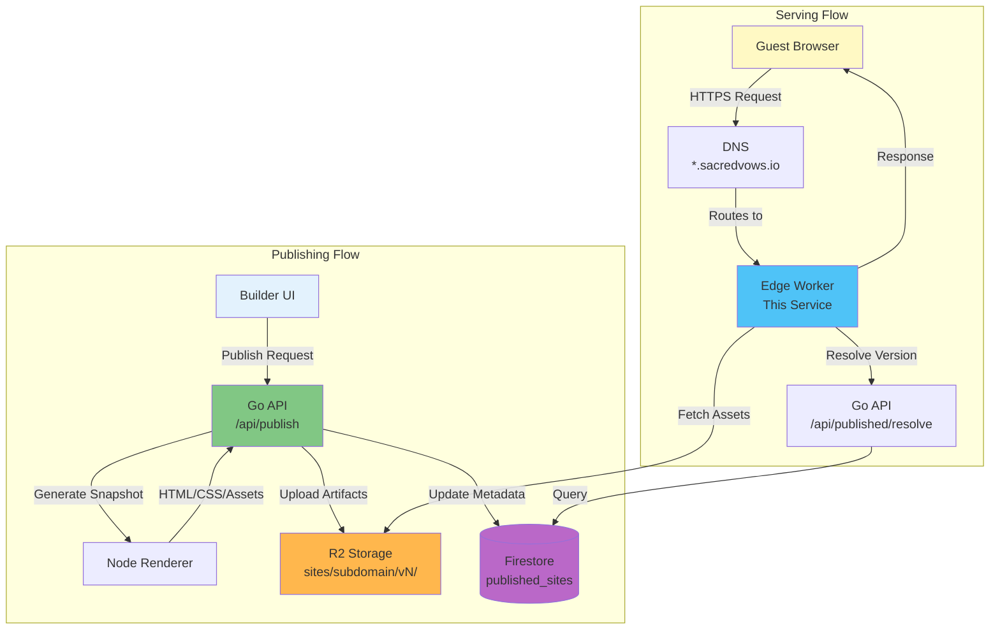
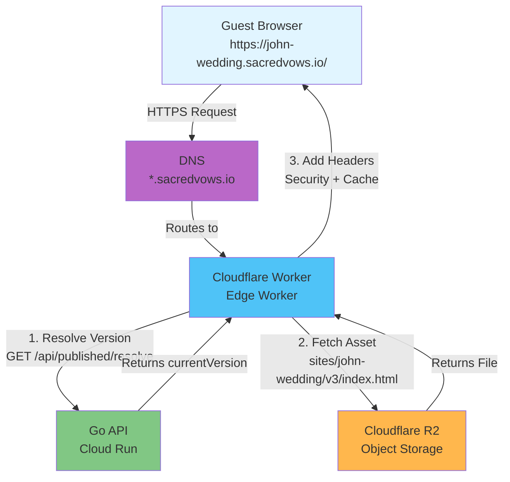
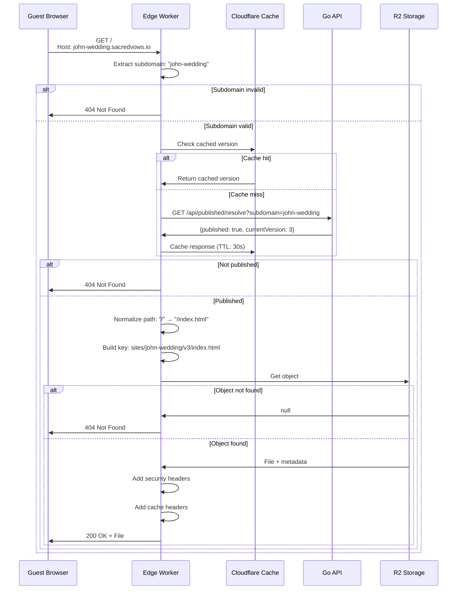
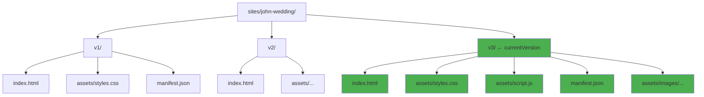
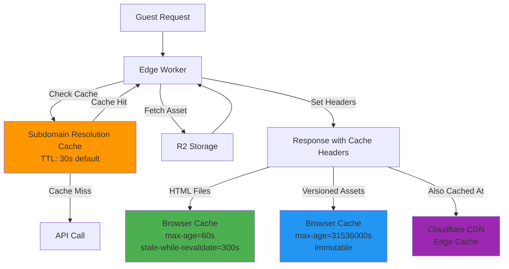

# Sacred Vows Edge Worker (Cloudflare)

A Cloudflare Worker that serves published wedding invitations directly from Cloudflare R2 storage, routing requests by subdomain extracted from the `Host` header.

## Overview

This edge worker is the public-facing component that serves published wedding invitation sites to guests. It operates at the edge (close to users) for low latency and high performance, serving static assets directly from R2 without hitting the main API for every request.

### System Architecture



### Architecture Role



The worker sits between:
- **Frontend**: Published invitation sites accessed by guests
- **Backend**: Go API that manages publishing and stores metadata
- **Storage**: Cloudflare R2 bucket containing versioned static artifacts

## How It Works

### Request Flow



**Step-by-step process:**

1. **Subdomain Extraction**
   - Reads the `Host` header from the incoming request
   - Extracts the subdomain by removing the base domain (e.g., `john-wedding` from `john-wedding.sacredvows.io`)
   - Returns 404 if the host doesn't match the expected base domain pattern

2. **Version Resolution**
   - Checks Cloudflare cache first (if available)
   - Calls the API endpoint: `GET /api/published/resolve?subdomain=<subdomain>`
   - Receives response: `{ "subdomain": "...", "published": true, "currentVersion": 3 }`
   - Caches this response for a short TTL (default: 30 seconds) to reduce API calls
   - Returns 404 if the subdomain is not published or doesn't exist

3. **Asset Retrieval**
   - Normalizes the request path (e.g., `/` → `/index.html`, `/about/` → `/about/index.html`)
   - Constructs the R2 object key: `sites/<subdomain>/v<currentVersion>/<path>`
   - Fetches the object from the R2 bucket
   - Returns 404 if the object doesn't exist

4. **Response Headers**
   - Sets appropriate `Content-Type` headers (infers from file extension if missing)
   - Applies security headers (CSP, X-Frame-Options, etc.)
   - Sets caching headers:
     - **HTML files**: `Cache-Control: public, max-age=60, stale-while-revalidate=300`
     - **Versioned assets** (CSS, JS, images): `Cache-Control: public, max-age=31536000, immutable`
   - Preserves R2 metadata (ETag, etc.)

### Versioned Artifacts

Artifacts are stored with version prefixes to enable:
- **Immutable deployments**: Each publish creates a new version directory
- **Safe republishing**: New versions don't overwrite old files
- **Long-term caching**: Versioned assets can be cached indefinitely since they never change
- **Rollback capability**: Previous versions remain accessible (within retention window)
- **Automatic cleanup**: Only the last N versions are kept (configurable via `PUBLISH_VERSION_RETENTION_COUNT`, default: 3)



**Example R2 structure:**
```
sites/john-wedding/
  ├── v1/
  │   ├── index.html
  │   ├── assets/styles.css
  │   └── manifest.json
  ├── v2/
  │   ├── index.html
  │   └── ...
  └── v3/  ← currentVersion
      ├── index.html
      └── ...
```

## Configuration

### Required Bindings

Configure these in `wrangler.toml` or via Cloudflare Dashboard:

- **`R2_BUCKET`** (R2 bucket binding)
  - The Cloudflare R2 bucket containing published site artifacts
  - Example: `sacred-vows-published-dev`

- **`PUBLISHED_BASE_DOMAIN`** (string)
  - Base domain used for subdomain extraction
  - Example: `sacredvows.io` or `dev.sacredvows.io`
  - The worker will extract subdomains from hosts matching `*.${PUBLISHED_BASE_DOMAIN}`

- **`API_ORIGIN`** (string)
  - Base URL of the Go API for resolving subdomain versions
  - Example: `https://api.sacredvows.io` or `https://api.dev.sacredvows.io`
  - Should include the API base path if applicable (e.g., `https://api.dev.sacredvows.io/api`)

### Optional Configuration

- **`RESOLVE_CACHE_TTL_SECONDS`** (string, default: `"30"`)
  - Cache TTL in seconds for subdomain resolution responses
  - Controls how long the worker caches the mapping between subdomain and current version
  - Lower values = more frequent API calls but faster updates after republishing
  - Higher values = fewer API calls but slower propagation of new versions

### Example `wrangler.toml`

```toml
name = "dev-published-sites"
main = "src/index.ts"
compatibility_date = "2024-12-01"
account_id = "your-cloudflare-account-id"

[vars]
PUBLISHED_BASE_DOMAIN = "dev.sacredvows.io"
API_ORIGIN = "https://api.dev.sacredvows.io/api"
RESOLVE_CACHE_TTL_SECONDS = "30"

[[r2_buckets]]
binding = "R2_BUCKET"
bucket_name = "sacred-vows-published-dev"
```

## Development

### Prerequisites

- Node.js (v18 or later)
- npm
- Cloudflare account with Workers and R2 access
- Wrangler CLI (installed via npm)

### Setup

1. **Install dependencies**:
   ```bash
   cd apps/edge-worker
   npm install
   ```

2. **Configure `wrangler.toml`**:
   - Set `account_id` (found in Cloudflare Dashboard → Workers & Pages → Overview)
   - Update `PUBLISHED_BASE_DOMAIN` to match your environment
   - Update `API_ORIGIN` to point to your API
   - Configure R2 bucket binding

3. **Authenticate with Cloudflare**:
   ```bash
   npx wrangler login
   ```

### Local Development

Run the worker locally for testing:

```bash
npm run dev
```

This starts a local development server. You can test by:
- Setting up local DNS (e.g., `/etc/hosts`) to point subdomains to `127.0.0.1`
- Using curl with a `Host` header:
  ```bash
  curl -H "Host: john-wedding.dev.sacredvows.io" http://localhost:8787/
  ```

### Type Checking

Check TypeScript types without running:

```bash
npm run typecheck
```

## Deployment

### Manual Deployment

1. **Ensure configuration is correct**:
   - Review `wrangler.toml`
   - Verify R2 bucket exists and is accessible
   - Confirm API endpoint is reachable

2. **Deploy**:
   ```bash
   npm run deploy
   ```

3. **Verify deployment**:
   ```bash
   npx wrangler deployments list
   ```

### DNS Configuration

For the worker to serve requests, configure DNS:

1. **Wildcard DNS record**:
   - Create a DNS record: `*.<PUBLISHED_BASE_DOMAIN>` → Cloudflare Worker (proxied)
   - Example: `*.dev.sacredvows.io` → `dev-published-sites` (Worker)

2. **TLS/SSL**:
   - Cloudflare automatically provides TLS certificates for proxied records
   - Ensure SSL/TLS encryption mode is set to "Full" or "Full (strict)" in Cloudflare Dashboard

3. **Worker Routes**:
   - Routes can be configured via Terraform (see `infra/terraform/`)
   - Or manually in Cloudflare Dashboard → Workers & Pages → Routes
   - Pattern: `*.<PUBLISHED_BASE_DOMAIN>/*`

### CI/CD Deployment

The worker can be deployed via GitHub Actions. See:
- `.github/workflows/deploy.yml` for deployment automation
- `infra/terraform/` for infrastructure-as-code configuration

## Security

### Security Headers

The worker applies conservative security headers to all responses:

- **`X-Content-Type-Options: nosniff`** - Prevents MIME type sniffing
- **`X-Frame-Options: DENY`** - Prevents embedding in iframes
- **`Referrer-Policy: strict-origin-when-cross-origin`** - Controls referrer information
- **`Permissions-Policy`** - Restricts browser features (geolocation, microphone, camera)
- **`Content-Security-Policy`** - Restricts resource loading (currently permissive for Google Fonts)

### CSP Configuration

The current CSP is intentionally permissive to support:
- Google Fonts (used in layout templates)
- Inline styles (required by some layouts)
- Inline scripts (required by some layouts)

To tighten CSP:
1. Audit which external resources your layouts actually use
2. Update the `securityHeaders()` function in `src/index.ts`
3. Test thoroughly with published sites

### Input Validation

- Subdomain extraction validates against the base domain pattern
- Path normalization prevents directory traversal
- Only published sites with valid versions are served

## Caching Strategy



### Subdomain Resolution Caching

- **Endpoint**: `GET /api/published/resolve?subdomain=<subdomain>`
- **TTL**: Configurable via `RESOLVE_CACHE_TTL_SECONDS` (default: 30 seconds)
- **Purpose**: Reduces API load while allowing reasonable update propagation
- **Location**: Cloudflare's edge cache (via `cf.cacheEverything`)

### Asset Caching

- **HTML files** (`index.html`, `*.html`):
  - `Cache-Control: public, max-age=60, stale-while-revalidate=300`
  - Short cache allows quick updates after republishing
  - Stale-while-revalidate provides good UX during cache refresh
  - Cached at: Browser + Cloudflare CDN

- **Versioned assets** (CSS, JS, images, etc.):
  - `Cache-Control: public, max-age=31536000, immutable`
  - Long cache because versioned paths never change
  - Immutable flag tells browsers to never revalidate
  - Cached at: Browser + Cloudflare CDN

### Cache Invalidation

- **Automatic**: New versions use new paths, so old caches naturally expire
- **Manual**: If needed, purge Cloudflare cache via Dashboard or API

## Error Handling

The worker returns appropriate HTTP status codes:

- **200 OK**: Asset found and served successfully
- **404 Not Found**: Returned when:
  - Host doesn't match base domain pattern
  - Subdomain not found or not published
  - Asset file doesn't exist in R2
- **500 Internal Server Error**: Unexpected errors (logged to Cloudflare)

## Monitoring & Debugging

### Cloudflare Dashboard

- **Workers & Pages** → Your worker → Metrics
  - View request count, error rate, CPU time
  - Check logs for errors

### Logs

- Access real-time logs via `wrangler tail`:
  ```bash
  npx wrangler tail
  ```

- Or view in Cloudflare Dashboard → Workers & Pages → Your worker → Logs

### Common Issues

1. **404 for valid subdomains**:
   - Check API endpoint is reachable: `curl ${API_ORIGIN}/api/published/resolve?subdomain=test`
   - Verify subdomain is published in database
   - Check R2 bucket contains artifacts at expected path

2. **Wrong version served**:
   - Check `RESOLVE_CACHE_TTL_SECONDS` - may need to wait for cache expiry
   - Verify API resolve endpoint returns correct `currentVersion`

3. **CORS or CSP errors**:
   - Review security headers in `securityHeaders()` function
   - Check browser console for specific blocked resources

4. **DNS not resolving**:
   - Verify wildcard DNS record exists and points to worker
   - Check Cloudflare proxy status (should be "Proxied")
   - Confirm worker routes are configured

## Related Documentation

- **Publishing Process**: `docs/publishing-process.md` - End-to-end flow explanation
- **Publishing Guide**: `docs/publishing.md` - API endpoints and configuration
- **Deployment**: `docs/DEPLOYMENT.md` - Full deployment guide
- **Cloudflare Setup**: `infra/terraform/CLOUDFLARE_SETUP.md` - Infrastructure setup

## Code Structure

```
apps/edge-worker/
├── src/
│   └── index.ts          # Main worker entry point
├── package.json          # Dependencies and scripts
├── wrangler.toml         # Wrangler configuration
├── tsconfig.json         # TypeScript configuration
└── README.md             # This file
```

### Key Functions

- `getSubdomain(host, baseDomain)`: Extracts subdomain from Host header
- `normalizePath(pathname)`: Normalizes request paths (handles `/` and trailing slashes)
- `resolveSubdomain(env, subdomain)`: Calls API to get current version
- `securityHeaders()`: Returns security headers object
- `fetch(request, env)`: Main request handler

## Performance Considerations

- **Edge execution**: Runs at Cloudflare's edge locations worldwide
- **R2 access**: Direct access to R2 from worker (no egress fees)
- **Caching**: Multi-layer caching (Cloudflare CDN + browser cache)
- **Low latency**: Typical response time < 50ms for cached assets

## Limitations

- **Single bucket**: Currently supports one R2 bucket per worker
- **No authentication**: Public sites are accessible to anyone with the URL
- **CSP restrictions**: May need adjustment if layouts use external resources
- **Cache TTL**: Short TTL on resolution means some delay after republishing

## Future Enhancements

Potential improvements:
- Support for custom domains (not just subdomains)
- Analytics integration (track page views)
- A/B testing support (serve different versions)
- Rate limiting per subdomain
- Custom error pages
- Support for multiple R2 buckets (multi-region)
