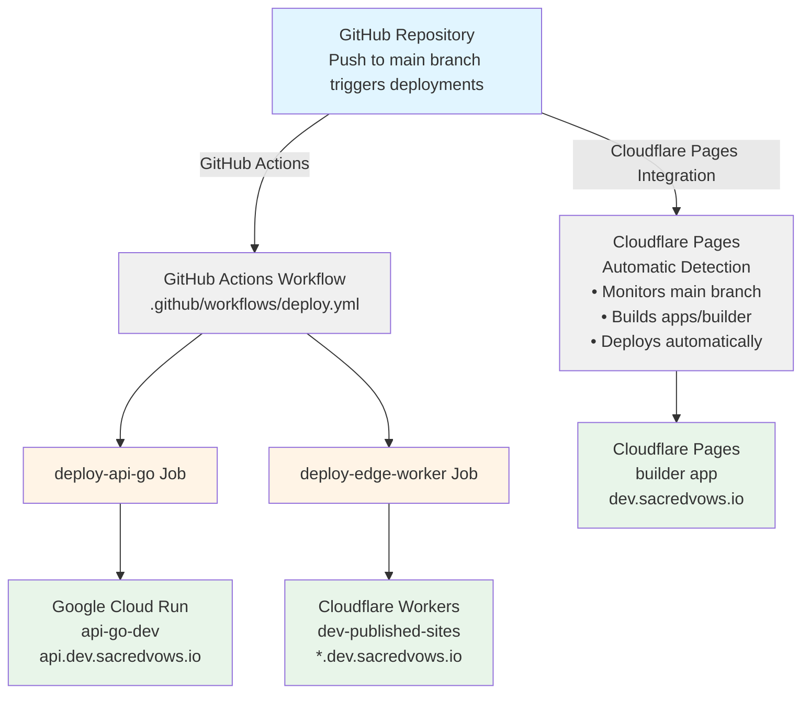

# Deployment Guide - Sacred Vows

This guide covers the automated deployment pipeline for Sacred Vows using GitHub Actions.

## Table of Contents

1. [Overview](#overview)
2. [Architecture](#architecture)
3. [Prerequisites](#prerequisites)
4. [GitHub Secrets Setup](#github-secrets-setup)
5. [Deployment Workflows](#deployment-workflows)
6. [Manual Deployment](#manual-deployment)
7. [Troubleshooting](#troubleshooting)
8. [Future Production Setup](#future-production-setup)

---

## Overview

The Sacred Vows deployment pipeline automatically deploys three components:

1. **api-go** → Google Cloud Run (dev environment)
2. **edge-worker** → Cloudflare Workers (dev environment)
3. **builder** → Cloudflare Pages (automatic, no GitHub Actions needed)

**Current Status**: All deployments triggered by `main` branch pushes go to the **dev** environment. Production deployment will be configured separately once the production environment is ready.

---

## Architecture



### Component Details

#### api-go (Google Cloud Run)
- **Service Name**: `api-go-dev`
- **Region**: `asia-northeast1` (Tokyo, Japan - supports domain mapping)
- **Artifact Registry**: `api-dev`
- **Image**: `asia-northeast1-docker.pkg.dev/sacred-vows/api-dev/api-go:latest`
- **Domain**: `api.dev.sacredvows.io`

#### edge-worker (Cloudflare Workers)
- **Worker Name**: `dev-published-sites`
- **R2 Bucket**: `sacred-vows-published-dev`
- **Base Domain**: `dev.sacredvows.io`
- **API Origin**: `https://api.dev.sacredvows.io/api`

#### builder (Cloudflare Pages)
- **Deployment**: Automatic via Cloudflare Pages integration
- **No GitHub Actions**: Cloudflare Pages automatically detects and deploys on push to `main`
- **Domain**: Configured in Cloudflare Pages dashboard

---

## Prerequisites

### 1. Required Accounts

- **GitHub Account**: Repository access
- **Google Cloud Platform Account**: 
  - Project ID: `sacred-vows`
  - Billing enabled
  - Required APIs enabled (see below)
- **Cloudflare Account**: 
  - Domain `sacredvows.io` added
  - API token with Workers permissions

### 2. GCP Setup

Ensure the following APIs are enabled:

```bash
gcloud services enable \
  cloudbuild.googleapis.com \
  run.googleapis.com \
  artifactregistry.googleapis.com \
  firestore.googleapis.com \
  storage.googleapis.com \
  secretmanager.googleapis.com \
  cloudresourcemanager.googleapis.com \
  iam.googleapis.com \
  --project=sacred-vows
```

### 3. Infrastructure

The infrastructure should already be provisioned via Terraform. If not, see:
- `infra/terraform/DEPLOYMENT.md` for GCP infrastructure setup
- `infra/terraform/CLOUDFLARE_SETUP.md` for Cloudflare infrastructure setup

---

## GitHub Secrets Setup

Configure the following secrets in your GitHub repository:

**Settings → Secrets and variables → Actions → New repository secret**

### Required Secrets

#### 1. `GCP_SA_KEY`
**Description**: Google Cloud Service Account JSON key for authentication

**Service Account Name**: `github-actions-deploy` (or similar descriptive name)

**Service Account Description**: `Service account for GitHub Actions to deploy api-go to Cloud Run` (or similar descriptive text)

**Steps to create**:
1. Go to [GCP Console](https://console.cloud.google.com) → IAM & Admin → Service Accounts
2. Create or select service account:
   - **Name**: `github-actions-deploy` (or similar)
   - **Description**: `Service account for GitHub Actions to deploy api-go to Cloud Run`
3. Grant roles:
   - `Cloud Run Admin` (to deploy services)
   - `Service Account User` (to use service accounts)
   - `Artifact Registry Writer` (to push images)
   - `Cloud Build Editor` (to build images)
   - `Service Usage Admin` (to use Cloud Build service - required for `gcloud builds submit`)
   - `Storage Admin` (to access Cloud Build storage buckets)
   - `Viewer` (to view build logs and status - optional but recommended)
4. Create JSON key:
   - Click on service account → Keys → Add Key → Create new key → JSON
   - Download the JSON file
5. Copy entire JSON content and paste as secret value

**Example structure**:
```json
{
  "type": "service_account",
  "project_id": "sacred-vows",
  "private_key_id": "...",
  "private_key": "...",
  ...
}
```

#### 2. `GCP_PROJECT_ID`
**Description**: GCP Project ID

**Value**: `sacred-vows`

#### 3. `CLOUDFLARE_API_TOKEN`
**Description**: Cloudflare API token for deploying Workers

**Token Name**: `github-actions-workers-deploy` (or similar descriptive name)

**Steps to create**:
1. Go to [Cloudflare Dashboard](https://dash.cloudflare.com/profile/api-tokens)
2. Click "Create Token"
3. **Token Name**: Enter `github-actions-workers-deploy` (or similar descriptive name)
4. Use "Edit Cloudflare Workers" template or create custom token with:
   - **Resources**: Select `Account` (for Workers permissions)
   - **Permissions**: 
     - Select `Workers Scripts` → `Edit` (required for deploying Workers)
     - Optionally: `Workers R2 Storage` → `Read` (if worker needs R2 access)
   - **Account Resources**: Include your account
   - **Additional Permissions** (add another permission group):
     - **Resources**: Select `User`
     - **Permissions**: 
       - Select `User Details` → `Read` (required for Wrangler authentication)
   - **Zone Resources**: Include `sacredvows.io` (if needed for zone-level permissions)
5. Copy token and paste as secret value

**Note**: 
- Token should start with a long alphanumeric string
- **Required permissions**:
  - `Workers Scripts` → `Edit` (required for deploying Workers)
  - `User Details` → `Read` (required for Wrangler authentication - must be added as a separate permission group with User resource)
- **Optional permissions**:
  - `Workers R2 Storage` → `Read` (if worker needs R2 access)
- **Important**: Make sure to add `User Details` → `Read` as a separate permission group by clicking "Add more" and selecting `User` as the resource type

### Verify Secrets

After adding secrets, verify they're set correctly:
1. Go to Settings → Secrets and variables → Actions
2. Confirm all three secrets are listed
3. Secrets are encrypted and cannot be viewed after creation

---

## Deployment Workflows

### Automatic Deployment

Deployments are triggered automatically when code is pushed to the `main` branch.

#### Workflow Jobs

1. **deploy-api-go**
   - Builds Docker image from `apps/api-go/Dockerfile`
   - Pushes to Artifact Registry (`api-dev`)
   - Updates Cloud Run service (`api-go-dev`)
   - Runs in parallel with edge-worker deployment

2. **deploy-edge-worker**
   - Installs dependencies (`npm ci`)
   - Deploys Worker using Wrangler CLI
   - Updates `dev-published-sites` worker
   - Runs in parallel with api-go deployment

#### Workflow File

Location: `.github/workflows/deploy.yml`

**Trigger**: Push to `main` branch

**Environment**: `dev` (both jobs use dev environment)

### Viewing Deployments

1. Go to GitHub repository → Actions tab
2. Click on latest workflow run
3. View logs for each job:
   - Green checkmark = success
   - Red X = failure (check logs for details)

### Deployment Status

After successful deployment:
- **api-go**: Available at `https://api.dev.sacredvows.io`
- **edge-worker**: Active and routing requests for `*.dev.sacredvows.io`
- **builder**: Automatically deployed by Cloudflare Pages

---

## Manual Deployment

If you need to deploy manually (e.g., for testing or troubleshooting):

### Manual api-go Deployment

```bash
# Navigate to api-go directory
cd apps/api-go

# Authenticate with GCP
gcloud auth login
gcloud config set project sacred-vows

# Build and push Docker image
gcloud builds submit \
  --tag asia-northeast1-docker.pkg.dev/sacred-vows/api-dev/api-go:latest \
  --project sacred-vows \
  --region asia-northeast1

# Deploy to Cloud Run
gcloud run services update api-go-dev \
  --image asia-northeast1-docker.pkg.dev/sacred-vows/api-dev/api-go:latest \
  --region asia-northeast1 \
  --project sacred-vows
```

### Manual edge-worker Deployment

```bash
# Navigate to edge-worker directory
cd apps/edge-worker

# Install dependencies
npm ci

# Set Cloudflare API token
export CLOUDFLARE_API_TOKEN="your-token-here"

# Deploy worker
npx wrangler deploy
```

### Verify Manual Deployments

**api-go**:
```bash
# Check service status
gcloud run services describe api-go-dev \
  --region asia-northeast1 \
  --project sacred-vows

# Test health endpoint
curl https://api.dev.sacredvows.io/health
```

**edge-worker**:
```bash
# List workers
npx wrangler deployments list

# View worker logs
npx wrangler tail
```

---

## Troubleshooting

### Common Issues

#### 1. GitHub Actions: Authentication Failed

**Error**: `Error: failed to authenticate with Google Cloud`

**Solutions**:
- Verify `GCP_SA_KEY` secret is correctly set (full JSON, no extra whitespace)
- Check service account has required IAM roles
- Ensure service account key hasn't expired or been deleted

#### 2. GitHub Actions: Build Failed

**Error**: `gcloud builds submit` fails

**Common Error**: `The user is forbidden from accessing the bucket [PROJECT_ID_cloudbuild]`

**Solutions**:
- **Add missing IAM roles to service account**:
  - `Service Usage Admin` (required for `serviceusage.services.use` permission)
  - `Storage Admin` (to access Cloud Build storage buckets)
  - These roles are in addition to the roles listed in the setup section
- Check Cloud Build API is enabled: `gcloud services enable cloudbuild.googleapis.com`
- Verify Artifact Registry repository exists: `gcloud artifacts repositories list`
- Check Dockerfile syntax and build context
- Verify service account has all required roles by checking IAM bindings:
  ```bash
  gcloud projects get-iam-policy sacred-vows \
    --flatten="bindings[].members" \
    --filter="bindings.members:serviceAccount:github-actions-deploy@sacred-vows.iam.gserviceaccount.com"
  ```

#### 3. GitHub Actions: Cloud Run Update Failed

**Error**: `gcloud run services update` fails

**Solutions**:
- Verify Cloud Run service exists: `gcloud run services list`
- Check service account permissions
- Ensure image was successfully pushed to Artifact Registry

#### 4. GitHub Actions: Wrangler Deploy Failed

**Error**: `wrangler deploy` fails with authentication error

**Solutions**:
- Verify `CLOUDFLARE_API_TOKEN` secret is set correctly
- Check token has `Workers:Edit` permission
- Ensure token hasn't expired

#### 5. Worker Deployment: Wrong Worker Name

**Error**: Worker deployed with incorrect name

**Solutions**:
- Check `apps/edge-worker/wrangler.toml` has correct `name` field
- Verify name matches Terraform configuration: `dev-published-sites`
- Redeploy with correct configuration

#### 6. Worker Deployment: R2 Bucket Not Found

**Error**: R2 bucket binding fails

**Solutions**:
- Verify R2 bucket exists in Cloudflare dashboard
- Check bucket name in `wrangler.toml` matches actual bucket name
- Ensure bucket is in the same account as the worker

### Debugging Steps

1. **Check GitHub Actions Logs**:
   - Go to Actions → Failed workflow → Click on failed job
   - Expand failed step to see detailed error messages

2. **Verify Secrets**:
   - Ensure all required secrets are set
   - Check for typos in secret names
   - Verify secret values are correct

3. **Test Locally**:
   - Try manual deployment commands (see above)
   - This helps isolate whether issue is with GitHub Actions or deployment itself

4. **Check Infrastructure**:
   - Verify Cloud Run service exists: `gcloud run services list`
   - Verify Artifact Registry exists: `gcloud artifacts repositories list`
   - Verify Cloudflare Worker exists: `npx wrangler deployments list`

5. **Review Configuration**:
   - Check `wrangler.toml` matches dev environment requirements
   - Verify Dockerfile builds successfully locally
   - Ensure all environment variables are set correctly

### Getting Help

If issues persist:
1. Check existing documentation:
   - `infra/terraform/DEPLOYMENT.md` for GCP setup
   - `docs/cloudflare-setup.md` for Cloudflare setup
   - `docs/cloudflare-pages-troubleshooting.md` for Pages issues
2. Review GitHub Actions logs for specific error messages
3. Test manual deployments to isolate the issue

---

## Future Production Setup

When the production environment is ready, the deployment pipeline will need to be updated to support production deployments. Here's what will be needed:

### 1. Production Infrastructure

- Production Cloud Run service: `api-go-prod`
- Production Artifact Registry: `api-prod`
- Production Cloudflare Worker: `prod-published-sites`
- Production R2 bucket: `sacred-vows-published-prod`

### 2. GitHub Secrets

Additional secrets for production:
- `GCP_SA_KEY_PROD`: Production GCP service account key
- `CLOUDFLARE_API_TOKEN_PROD`: Production Cloudflare token (or reuse existing)

### 3. Workflow Updates

The workflow will need:
- Production deployment jobs (triggered by tags or separate branch)
- Environment-specific configurations
- Production-specific image tags and service names

### 4. Deployment Strategy

Options for production deployments:
- **Tag-based**: Deploy to prod when a git tag is created (e.g., `v1.0.0`)
- **Branch-based**: Deploy to prod when code is pushed to `prod` branch
- **Manual**: Use GitHub Actions workflow_dispatch for manual production deployments

### 5. Configuration Files

- Production `wrangler.toml` or environment-specific overrides
- Production-specific Terraform configurations (already exists in `infra/terraform/prod/`)

### Example Production Workflow Structure

```yaml
on:
  push:
    branches:
      - main  # Dev deployments
    tags:
      - 'v*'  # Production deployments

jobs:
  deploy-api-go-dev:
    # ... existing dev job ...
  
  deploy-api-go-prod:
    if: startsWith(github.ref, 'refs/tags/v')
    # ... production job ...
```

**Note**: This is a placeholder for future implementation. Current focus is on dev environment only.

---

## Additional Resources

- [GCP Cloud Run Documentation](https://cloud.google.com/run/docs)
- [Cloudflare Workers Documentation](https://developers.cloudflare.com/workers/)
- [Cloudflare Pages Documentation](https://developers.cloudflare.com/pages/)
- [GitHub Actions Documentation](https://docs.github.com/en/actions)
- [Wrangler CLI Documentation](https://developers.cloudflare.com/workers/wrangler/)

---

## Summary

The deployment pipeline automatically:
1. ✅ Builds and deploys `api-go` to Google Cloud Run (dev)
2. ✅ Deploys `edge-worker` to Cloudflare Workers (dev)
3. ✅ Builder is automatically deployed by Cloudflare Pages

All deployments are triggered by pushes to the `main` branch and target the dev environment. Production deployment will be configured separately when ready.

