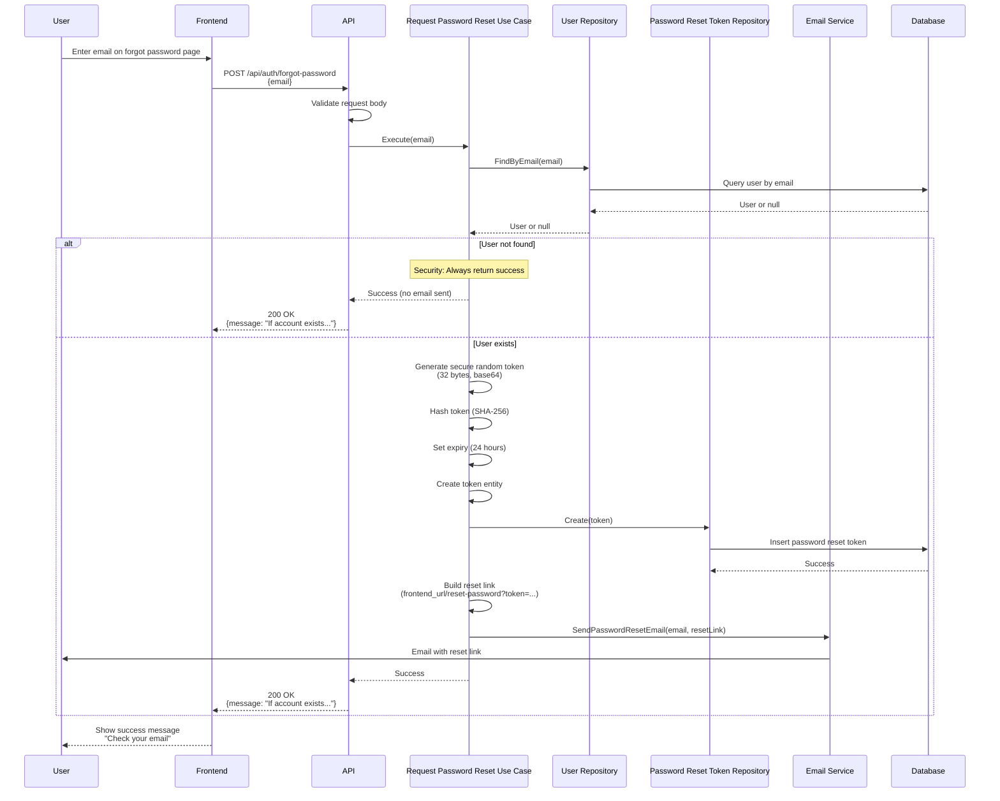

# Forgot Password API

## Overview

The Forgot Password API endpoint allows users to request a password reset link via email. This endpoint is designed for unauthenticated users who have forgotten their password. For security reasons, it always returns success, even if the email doesn't exist, to prevent email enumeration attacks.

**Endpoint:** `POST /api/auth/forgot-password`
**Authentication:** Not required

## Architectural Diagram



## Request Format

**HTTP Method:** `POST`
**Path:** `/api/auth/forgot-password`
**Content-Type:** `application/json`

### Request Body

```json
{
  "email": "user@example.com"
}
```

**Fields:**
- `email` (required, string): User's email address

## Response Format

### Success Response (200 OK)

```json
{
  "message": "If an account with that email exists, we've sent a password reset link."
}
```

**Note:** This response is returned regardless of whether the email exists, to prevent email enumeration attacks.

### Error Responses

#### 400 Bad Request - Invalid Request Data

```json
{
  "error": "Email is required"
}
```

#### 500 Internal Server Error

```json
{
  "error": "Failed to process password reset request"
}
```

#### 503 Service Unavailable - Email Service Not Configured

```json
{
  "error": "Email service is not configured. Password reset is currently unavailable."
}
```

## Flow Details

### Step-by-Step Process

1. **Request Validation**
   - Frontend sends password reset request with email
   - API validates request body structure

2. **User Lookup**
   - Use case queries database for user with provided email
   - If user doesn't exist, still returns success (security best practice)

3. **Token Generation**
   - Generate secure random token (32 bytes)
   - Encode token as base64 URL-safe string
   - Hash token with SHA-256 for storage
   - Set expiration to 24 hours from now

4. **Token Storage**
   - Create password reset token entity
   - Store token hash in database
   - Token is single-use and expires after 24 hours

5. **Email Sending**
   - Build reset link: `<frontend_url>/reset-password?token=<raw_token>`
   - Send password reset email to user
   - Email includes reset link with token

6. **Response**
   - Always return success message
   - Message doesn't reveal if email exists
   - Frontend shows generic success message

## Security Considerations

1. **Email Enumeration Prevention**
   - Always returns success, even if email doesn't exist
   - Prevents attackers from discovering valid email addresses
   - Generic message: "If an account with that email exists..."

2. **Token Security**
   - Tokens are cryptographically random (32 bytes)
   - Tokens are hashed before storage (SHA-256)
   - Tokens expire after 24 hours
   - Tokens are single-use

3. **Token Storage**
   - Only token hash is stored in database
   - Original token never stored
   - Token lookup uses hash comparison

4. **Email Security**
   - Reset links include secure token
   - Links expire after 24 hours
   - Links are single-use

5. **Rate Limiting**
   - Consider implementing rate limiting
   - Prevents abuse and email spam
   - Protects against brute force attacks

## Error Handling

### Missing Email

When email is missing:
- Returns `400 Bad Request` status code
- Error message: "Email is required"
- Frontend should highlight missing field

### Email Service Unavailable

When email service is not configured:
- Returns `503 Service Unavailable` status code
- Error message indicates service is unavailable
- Frontend should show appropriate message

### Server Errors

When database or email sending fails:
- Returns `500 Internal Server Error`
- Error message: "Failed to process password reset request"
- Frontend should show generic error message

## Integration Points

### Backend Components

- **Handler**: `internal/interfaces/http/handlers/auth_handler.go::ForgotPassword`
- **Use Case**: `internal/usecase/auth/request_password_reset.go::RequestPasswordResetUseCase`
- **Repository**: `internal/interfaces/repository/password_reset_repository.go`
- **Email Service**: `internal/infrastructure/email/email_service.go`
- **Domain**: `internal/domain/password_reset.go`

### Frontend Components

- **Service**: `src/services/authService.ts::requestPasswordReset`
- **Component**: `src/components/Auth/ForgotPasswordPage.tsx`
- **Email Template**: `internal/infrastructure/email/templates/password_reset.html`

## Email Template

The password reset email includes:
- Clear subject line
- Reset link with token
- Expiration notice (24 hours)
- Security notice
- Brand-consistent styling

## Testing

### Manual Testing

```bash
curl -X POST http://localhost:3000/api/auth/forgot-password \
  -H "Content-Type: application/json" \
  -d '{
    "email": "user@example.com"
  }'
```

### Expected Behavior

1. **Successful Request (Email Exists):**
   - Returns 200 status code
   - Success message in response
   - Password reset token created in database
   - Email sent to user with reset link

2. **Successful Request (Email Doesn't Exist):**
   - Returns 200 status code
   - Same success message (security)
   - No email sent
   - No token created

3. **Missing Email:**
   - Returns 400 status code
   - Error message: "Email is required"

### Frontend Testing

1. Navigate to forgot password page
2. Enter email address
3. Submit form
4. Verify:
   - Success message displayed
   - Message doesn't reveal if email exists
   - If email exists, check inbox for reset link
   - Reset link contains token parameter

## Related Documentation

- [System Design](./system-design.md) - Overall authentication architecture
- [Reset Password API](./reset-password.md) - Password reset with token
- [Request Password Change OTP](./request-password-change-otp.md) - Authenticated password change

