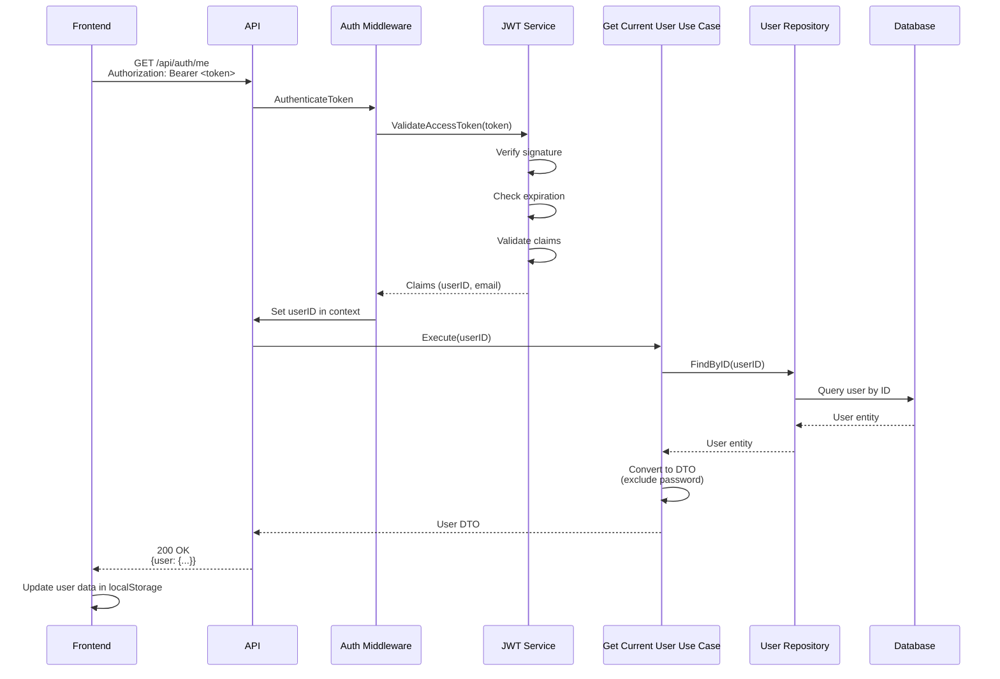

# Get Current User API

## Overview

The Get Current User API endpoint retrieves information about the currently authenticated user. This endpoint is commonly used to verify token validity, fetch updated user information, and check authentication status.

**Endpoint:** `GET /api/auth/me`
**Authentication:** Required (Bearer token)

## Architectural Diagram



## Request Format

**HTTP Method:** `GET`
**Path:** `/api/auth/me`
**Content-Type:** `application/json`

### Request Headers

- `Authorization`: `Bearer <access_token>` (required)

### Request Body

No request body required.

## Response Format

### Success Response (200 OK)

```json
{
  "user": {
    "id": "2CmR8x3K9FpL2nQ5rT7vW0y",
    "email": "user@example.com",
    "name": "John Doe"
  }
}
```

### Error Responses

#### 401 Unauthorized - Authentication Required

```json
{
  "error": "Authentication required"
}
```

#### 401 Unauthorized - Invalid or Expired Token

```json
{
  "error": "Invalid or expired token"
}
```

#### 404 Not Found - User Not Found

```json
{
  "error": "User not found"
}
```

## Flow Details

### Step-by-Step Process

1. **Token Validation**
   - Frontend sends request with access token in Authorization header
   - Middleware extracts and validates JWT token
   - Verifies token signature, expiration, issuer, and audience
   - Extracts userID and email from token claims
   - Sets userID in request context

2. **User Lookup**
   - Use case retrieves userID from context
   - Queries database for user by ID
   - If user not found, returns 404 Not Found

3. **Response Formatting**
   - Converts user entity to DTO
   - Excludes sensitive information (password)
   - Returns user data

4. **Frontend Handling**
   - Frontend receives user data
   - Updates user data in localStorage
   - Updates UI with current user information

## Security Considerations

1. **Token Validation**
   - Token must be valid and not expired
   - Token signature is verified
   - Token claims are validated

2. **User Verification**
   - User must exist in database
   - User ID from token is verified
   - Prevents access to deleted users

3. **Data Sanitization**
   - Password is never returned
   - Only safe user data is exposed
   - DTO pattern ensures data safety

4. **Authentication Required**
   - Endpoint requires valid access token
   - Unauthenticated requests are rejected
   - Provides secure user information access

## Error Handling

### Missing Authentication

When access token is missing:
- Returns `401 Unauthorized` status code
- Error message: "Authentication required"
- Frontend should redirect to login page

### Invalid or Expired Token

When token is invalid or expired:
- Returns `401 Unauthorized` or `403 Forbidden` status code
- Error message: "Invalid or expired token"
- Frontend should attempt token refresh or redirect to login

### User Not Found

When user associated with token no longer exists:
- Returns `404 Not Found` status code
- Error message: "User not found"
- Frontend should clear tokens and redirect to login

## Integration Points

### Backend Components

- **Handler**: `internal/interfaces/http/handlers/auth_handler.go::GetCurrentUser`
- **Middleware**: `internal/interfaces/http/middleware/auth_middleware.go::AuthenticateToken`
- **Use Case**: `internal/usecase/auth/get_current_user.go::GetCurrentUserUseCase`
- **Repository**: `internal/interfaces/repository/user_repository.go`
- **JWT Service**: `internal/infrastructure/auth/jwt.go::JWTService`
- **Domain**: `internal/domain/user.go`

### Frontend Components

- **Service**: `src/services/authService.ts::getCurrentUserFromAPI`
- **API Client**: `src/services/apiClient.ts` (automatic token injection)
- **Components**: `src/components/Auth/ProtectedRoute.tsx` (token validation)

## Use Cases

### Token Validation

The endpoint is commonly used to validate token validity:

```typescript
// Check if user is authenticated
const user = await getCurrentUserFromAPI();
if (user) {
  // Token is valid, user is authenticated
} else {
  // Token is invalid, redirect to login
}
```

### User Information Refresh

The endpoint can be used to fetch updated user information:

```typescript
// Refresh user data
const user = await getCurrentUserFromAPI();
updateUserInLocalStorage(user);
```

### Protected Route Verification

The endpoint is used by protected routes to verify authentication:

```typescript
// In ProtectedRoute component
useEffect(() => {
  getCurrentUserFromAPI()
    .then(user => {
      setAuthenticated(true);
      setUser(user);
    })
    .catch(() => {
      // Token invalid, redirect to login
      navigate('/login');
    });
}, []);
```

## Testing

### Manual Testing

```bash
# First, login to get access token
curl -X POST http://localhost:3000/api/auth/login \
  -H "Content-Type: application/json" \
  -d '{"email":"test@example.com","password":"password123"}'

# Extract access token from response, then get current user
curl -X GET http://localhost:3000/api/auth/me \
  -H "Authorization: Bearer <access_token>"
```

### Expected Behavior

1. **Successful Request:**
   - Returns 200 status code
   - User data in response
   - No password in response

2. **Missing Token:**
   - Returns 401 status code
   - Error message: "Authentication required"

3. **Invalid Token:**
   - Returns 401 or 403 status code
   - Error message: "Invalid or expired token"

4. **User Not Found:**
   - Returns 404 status code
   - Error message: "User not found"

### Frontend Testing

1. Login to get access token
2. Call getCurrentUserFromAPI()
3. Verify:
   - User data returned
   - User data updated in localStorage
   - UI updated with user information

## Related Documentation

- [System Design](./system-design.md) - Overall authentication architecture
- [Login API](./login.md) - Session establishment
- [Refresh Token API](./refresh-token.md) - Token refresh mechanism

