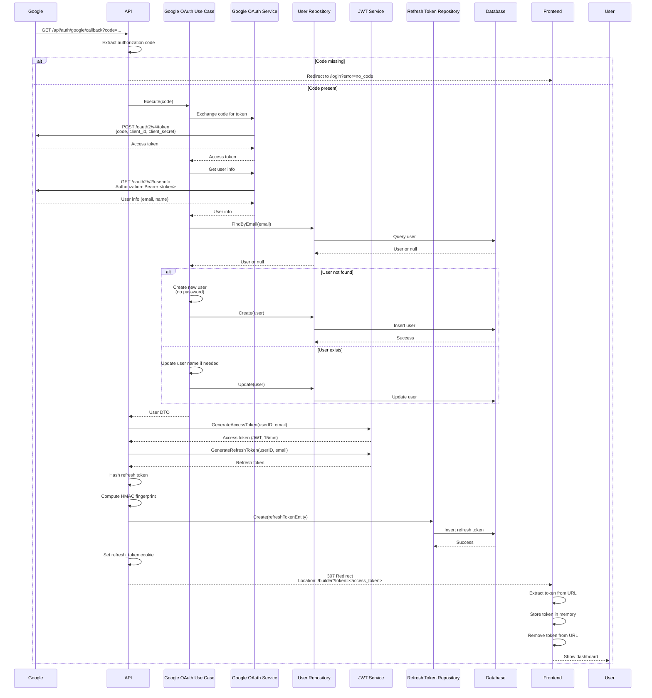

# Google OAuth Callback API

## Overview

The Google OAuth Callback API endpoint handles the redirect from Google after user authorization. It exchanges the authorization code for user information, creates or updates the user account, generates tokens, and redirects to the frontend with the access token.

**Endpoint:** `GET /api/auth/google/callback`
**Authentication:** Not required

## Architectural Diagram



## Request Format

**HTTP Method:** `GET`
**Path:** `/api/auth/google/callback`
**Query Parameters:**
- `code` (required): Authorization code from Google
- `error` (optional): Error code if authorization was denied

## Response Format

### Success Response (307 Temporary Redirect)

**Status Code:** `307 Temporary Redirect`
**Location Header:** `<frontend_url>/builder?token=<access_token>`

The response redirects to the frontend with the access token in the URL query parameter.

**Response Headers:**
- `Set-Cookie`: `refresh_token=<token>; HttpOnly; Secure; SameSite=Lax; Path=/; Max-Age=2592000`

### Error Responses

#### Redirect with Error (307 Temporary Redirect)

**Location Header:** `<frontend_url>/login?error=<error_type>`

Error types:
- `no_code`: Authorization code missing
- `oauth_failed`: OAuth exchange failed
- `token_failed`: Token generation failed

## Flow Details

### Step-by-Step Process

1. **Code Extraction**
   - Google redirects to callback URL with authorization code
   - API extracts code from query parameters
   - If code is missing, redirects to frontend with error

2. **Token Exchange**
   - Use case exchanges authorization code for access token
   - Makes request to Google token endpoint
   - Receives access token from Google

3. **User Information Retrieval**
   - Use case fetches user information from Google
   - Makes request to Google userinfo endpoint
   - Receives email, name, and other profile information

4. **User Creation/Update**
   - Use case checks if user exists by email
   - If user doesn't exist:
     - Creates new user with email and name
     - Sets password to empty string (OAuth users have no password)
   - If user exists:
     - Updates user name if provided and not already set

5. **Token Generation**
   - Generate access token (JWT) with 15-minute expiration
   - Generate refresh token (random base64 string) with 30-day expiration
   - Hash refresh token with bcrypt
   - Compute HMAC fingerprint
   - Store refresh token in database

6. **Cookie Setting**
   - Set refresh token in HttpOnly cookie
   - Cookie configured for security (HttpOnly, Secure, SameSite)

7. **Frontend Redirect**
   - Redirect to frontend with access token in URL
   - Frontend extracts token from URL
   - Frontend stores token in memory
   - Frontend removes token from URL for security

## Security Considerations

1. **Authorization Code Security**
   - Authorization code is single-use
   - Code expires quickly (typically within minutes)
   - Code is exchanged server-side only

2. **Token Security**
   - Access tokens are short-lived (15 minutes)
   - Refresh tokens stored in HttpOnly cookies
   - Tokens never exposed in client-side code

3. **User Creation**
   - OAuth users have no password
   - Email is used as unique identifier
   - User ID generated using KSUID

4. **Error Handling**
   - Errors redirect to frontend with error parameter
   - No sensitive information in error messages
   - User-friendly error handling

5. **URL Token Security**
   - Token in URL is temporary
   - Frontend immediately removes token from URL
   - Token stored in memory, not localStorage

## Error Handling

### Missing Authorization Code

When authorization code is missing:
- Redirects to frontend: `/login?error=no_code`
- Frontend should show error message
- User can retry OAuth flow

### OAuth Exchange Failure

When token exchange fails:
- Redirects to frontend: `/login?error=oauth_failed`
- Frontend should show error message
- User can retry OAuth flow

### Token Generation Failure

When token generation fails:
- Redirects to frontend: `/login?error=token_failed`
- Frontend should show error message
- User can retry OAuth flow

## Integration Points

### Backend Components

- **Handler**: `internal/interfaces/http/handlers/auth_handler.go::GoogleCallback`
- **Use Case**: `internal/usecase/auth/google_oauth.go::GoogleOAuthUseCase`
- **Service**: `internal/infrastructure/auth/google.go::GoogleOAuthService`
- **Repository**: `internal/interfaces/repository/user_repository.go`
- **JWT Service**: `internal/infrastructure/auth/jwt.go::JWTService`
- **Domain**: `internal/domain/user.go`

### Frontend Components

- **Component**: `src/components/Auth/ProtectedRoute.tsx` (handles token from URL)
- **Service**: `src/services/authService.ts`
- **Token Storage**: `src/services/tokenStorage.ts`

## Frontend Token Handling

The frontend handles the token from the URL:

```typescript
// In ProtectedRoute or similar component
const searchParams = new URLSearchParams(window.location.search);
const token = searchParams.get('token');

if (token) {
  // Store token in memory
  tokenStorage.setAccessToken(token);

  // Remove token from URL
  window.history.replaceState({}, '', window.location.pathname);

  // Redirect to dashboard
  navigate('/builder');
}
```

## Testing

### Manual Testing

```bash
# Complete OAuth flow:
# 1. Navigate to /api/auth/google
# 2. Authorize with Google
# 3. Google redirects to /api/auth/google/callback?code=...
# 4. Should redirect to frontend with token
```

### Expected Behavior

1. **Successful Flow:**
   - Google redirects with authorization code
   - API exchanges code for user info
   - User created/updated in database
   - Tokens generated and stored
   - Redirects to frontend with access token
   - Frontend stores token and redirects to dashboard

2. **Missing Code:**
   - Redirects to frontend with `error=no_code`
   - Frontend shows error message

3. **OAuth Failure:**
   - Redirects to frontend with `error=oauth_failed`
   - Frontend shows error message

### Frontend Testing

1. Click "Sign in with Google"
2. Complete Google authorization
3. Verify:
   - Redirected to frontend with token in URL
   - Token extracted and stored in memory
   - Token removed from URL
   - Redirected to dashboard
   - Refresh token cookie set

## Related Documentation

- [System Design](./system-design.md) - Overall authentication architecture
- [Google OAuth Initiate API](./google-oauth-initiate.md) - OAuth flow initiation
- [Google Verify API](./google-verify.md) - Client-side OAuth flow

