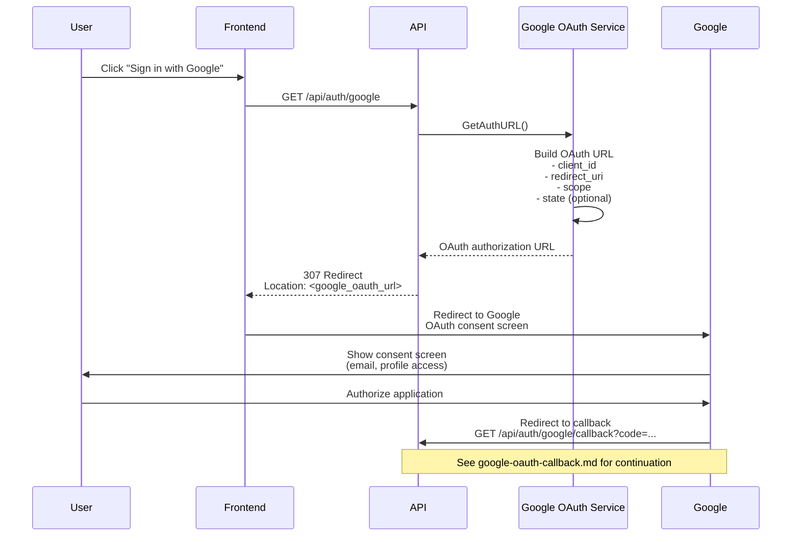

# Google OAuth Initiate API

## Overview

The Google OAuth Initiate API endpoint starts the server-side OAuth 2.0 authorization code flow by redirecting the user to Google's OAuth consent screen. This is the first step in the Google OAuth authentication process.

**Endpoint:** `GET /api/auth/google`
**Authentication:** Not required

## Architectural Diagram



## Request Format

**HTTP Method:** `GET`
**Path:** `/api/auth/google`
**Query Parameters:** None required

## Response Format

### Success Response (307 Temporary Redirect)

**Status Code:** `307 Temporary Redirect`
**Location Header:** `https://accounts.google.com/o/oauth2/v2/auth?client_id=...&redirect_uri=...&scope=...&response_type=code`

The response redirects the user to Google's OAuth consent screen.

### Error Responses

No error responses are typically returned, as this endpoint simply redirects to Google.

## Flow Details

### Step-by-Step Process

1. **User Initiation**
   - User clicks "Sign in with Google" button on frontend
   - Frontend redirects to `/api/auth/google`

2. **OAuth URL Generation**
   - API calls Google OAuth service to generate authorization URL
   - URL includes:
     - `client_id`: Google OAuth client ID
     - `redirect_uri`: Callback URL (`/api/auth/google/callback`)
     - `scope`: Requested permissions (e.g., `openid email profile`)
     - `response_type`: `code` (authorization code flow)
     - `state`: Optional state parameter for CSRF protection

3. **Redirect to Google**
   - API returns 307 redirect to Google OAuth URL
   - Browser automatically follows redirect
   - User is taken to Google's consent screen

4. **User Authorization**
   - User reviews requested permissions
   - User clicks "Allow" or "Deny"
   - Google processes authorization

5. **Callback Handling**
   - Google redirects to callback URL with authorization code
   - See [Google OAuth Callback API](./google-oauth-callback.md) for continuation

## OAuth Configuration

### Required Environment Variables

- `GOOGLE_CLIENT_ID`: Google OAuth client ID
- `GOOGLE_CLIENT_SECRET`: Google OAuth client secret
- `GOOGLE_REDIRECT_URI`: OAuth callback URL (default: `http://localhost:3000/api/auth/google/callback`)
- `FRONTEND_URL`: Frontend URL for final redirect (default: `http://localhost:5173`)

### OAuth Scopes

The system requests the following scopes from Google:
- `openid`: OpenID Connect authentication
- `email`: User's email address
- `profile`: User's basic profile information

## Security Considerations

1. **HTTPS Required**
   - OAuth flow should use HTTPS in production
   - Prevents interception of authorization codes
   - Google requires HTTPS for production OAuth apps

2. **Redirect URI Validation**
   - Google validates redirect URI matches registered URI
   - Prevents redirect URI attacks
   - Must be exactly configured in Google Console

3. **State Parameter**
   - Optional state parameter can be used for CSRF protection
   - State is returned in callback for verification
   - Prevents cross-site request forgery

4. **Client Secret Security**
   - Client secret stored securely in environment variables
   - Never exposed to frontend
   - Server-side only

## Integration Points

### Backend Components

- **Handler**: `internal/interfaces/http/handlers/auth_handler.go::GoogleOAuth`
- **Service**: `internal/infrastructure/auth/google.go::GoogleOAuthService`
- **Configuration**: Environment variables for OAuth credentials

### Frontend Components

- **Component**: Login/Signup pages with Google OAuth button
- **Navigation**: Redirect to `/api/auth/google` on button click

## OAuth Flow Comparison

This endpoint initiates the **server-side OAuth flow**. The system also supports a **client-side OAuth flow** using the [Google Verify API](./google-verify.md).

### Server-Side Flow (This Endpoint)
- User redirected to Google
- Google redirects back to server callback
- Server exchanges code for tokens
- Server creates/updates user
- Server redirects to frontend with token

### Client-Side Flow (Google Verify API)
- User authenticates with Google Sign-In JavaScript library
- Frontend receives ID token directly
- Frontend sends ID token to server for verification
- Server verifies token and creates/updates user
- Server returns access token

## Testing

### Manual Testing

```bash
# Navigate to OAuth initiate endpoint
curl -L http://localhost:3000/api/auth/google

# Should redirect to Google OAuth URL
# Follow redirect in browser to complete flow
```

### Expected Behavior

1. **Successful Redirect:**
   - Returns 307 status code
   - Location header points to Google OAuth URL
   - Browser follows redirect automatically

2. **Google Consent Screen:**
   - User sees Google login/consent screen
   - User can authorize or deny
   - On authorization, redirects to callback URL

### Frontend Testing

1. Navigate to login/signup page
2. Click "Sign in with Google" button
3. Verify:
   - Redirects to `/api/auth/google`
   - Browser follows redirect to Google
   - Google consent screen appears
   - After authorization, redirects to callback

## Google Console Configuration

To use this endpoint, the following must be configured in Google Cloud Console:

1. **OAuth 2.0 Client ID**
   - Create OAuth 2.0 credentials
   - Set authorized redirect URIs:
     - `http://localhost:3000/api/auth/google/callback` (development)
     - `https://yourdomain.com/api/auth/google/callback` (production)

2. **OAuth Consent Screen**
   - Configure consent screen
   - Set application name, logo, etc.
   - Add scopes: `openid`, `email`, `profile`

3. **Credentials**
   - Copy Client ID to `GOOGLE_CLIENT_ID`
   - Copy Client Secret to `GOOGLE_CLIENT_SECRET`

## Related Documentation

- [System Design](./system-design.md) - Overall authentication architecture
- [Google OAuth Callback API](./google-oauth-callback.md) - Callback handling
- [Google Verify API](./google-verify.md) - Client-side OAuth flow

