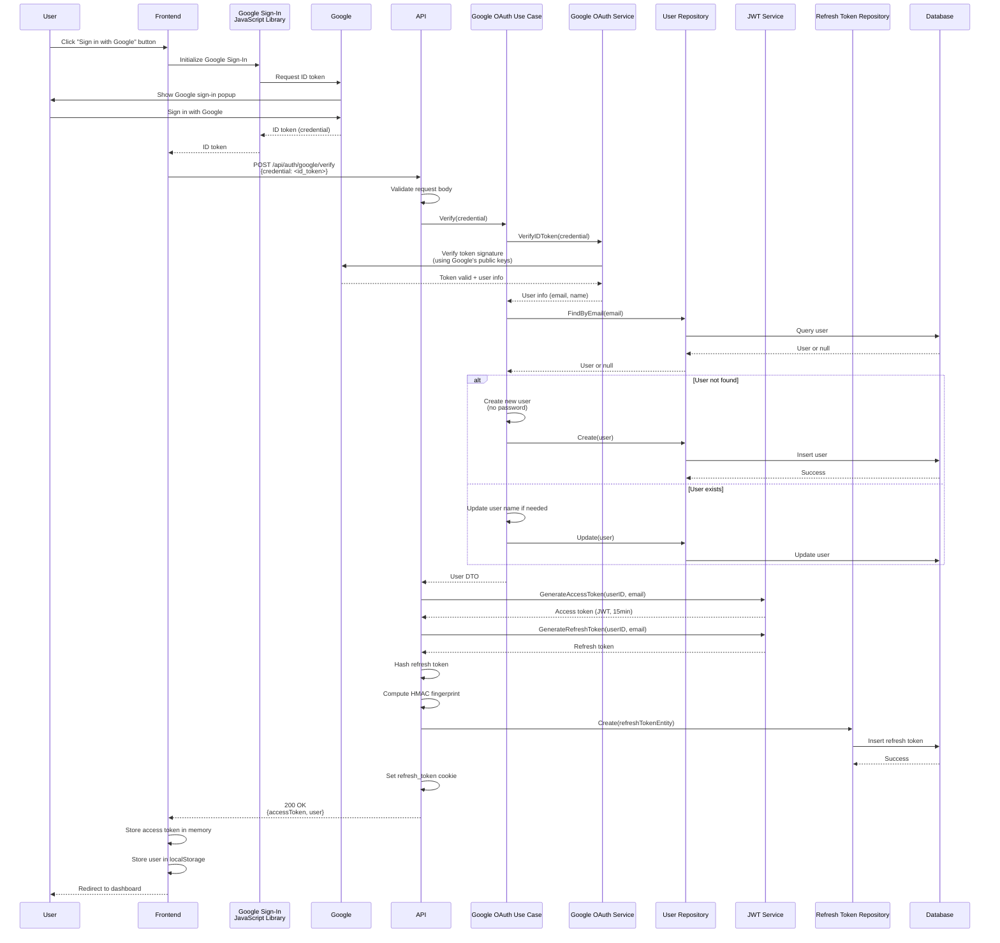

# Google Verify API

## Overview

The Google Verify API endpoint handles client-side OAuth authentication by verifying a Google ID token received from the Google Sign-In JavaScript library. This provides an alternative to the server-side OAuth redirect flow.

**Endpoint:** `POST /api/auth/google/verify`
**Authentication:** Not required

## Architectural Diagram



## Request Format

**HTTP Method:** `POST`
**Path:** `/api/auth/google/verify`
**Content-Type:** `application/json`

### Request Body

```json
{
  "credential": "eyJhbGciOiJSUzI1NiIsImtpZCI6IjEyMzQ1NiJ9..."
}
```

**Fields:**
- `credential` (required, string): Google ID token (JWT) from Google Sign-In library

## Response Format

### Success Response (200 OK)

```json
{
  "accessToken": "eyJhbGciOiJIUzI1NiIsInR5cCI6IkpXVCJ9...",
  "user": {
    "id": "2CmR8x3K9FpL2nQ5rT7vW0y",
    "email": "user@gmail.com",
    "name": "John Doe"
  }
}
```

**Response Headers:**
- `Set-Cookie`: `refresh_token=<token>; HttpOnly; Secure; SameSite=Lax; Path=/; Max-Age=2592000`

### Error Responses

#### 400 Bad Request - Invalid Request Data

```json
{
  "error": "Google credential is required"
}
```

#### 401 Unauthorized - Invalid Credential

```json
{
  "error": "Invalid Google credential"
}
```

#### 500 Internal Server Error

```json
{
  "error": "Failed to generate token"
}
```

## Flow Details

### Step-by-Step Process

1. **Frontend Google Sign-In**
   - User clicks "Sign in with Google" button
   - Google Sign-In JavaScript library initialized
   - Library requests ID token from Google
   - User authenticates with Google
   - Google returns ID token (JWT) to frontend

2. **Token Verification**
   - Frontend sends ID token to API
   - API validates request body
   - Use case verifies ID token using Google's token verifier
   - Verifier checks:
     - Token signature (using Google's public keys)
     - Token expiration
     - Token issuer (must be Google)
     - Token audience (must match client ID)

3. **User Information Extraction**
   - Extract user information from verified token
   - Email, name, and other profile information
   - Token contains verified user identity

4. **User Creation/Update**
   - Use case checks if user exists by email
   - If user doesn't exist:
     - Creates new user with email and name
     - Sets password to empty string (OAuth users have no password)
   - If user exists:
     - Updates user name if provided and not already set

5. **Token Generation**
   - Generate access token (JWT) with 15-minute expiration
   - Generate refresh token (random base64 string) with 30-day expiration
   - Hash refresh token with bcrypt
   - Compute HMAC fingerprint
   - Store refresh token in database

6. **Cookie Setting**
   - Set refresh token in HttpOnly cookie
   - Cookie configured for security (HttpOnly, Secure, SameSite)

7. **Response**
   - Return access token and user data
   - Frontend stores access token in memory
   - Frontend stores user data in localStorage

## Security Considerations

1. **ID Token Verification**
   - Token signature verified using Google's public keys
   - Token expiration checked
   - Token issuer validated (must be Google)
   - Token audience validated (must match client ID)
   - Prevents token forgery

2. **Token Security**
   - Access tokens are short-lived (15 minutes)
   - Refresh tokens stored in HttpOnly cookies
   - Tokens never exposed in client-side code

3. **User Creation**
   - OAuth users have no password
   - Email is used as unique identifier
   - User ID generated using KSUID

4. **Client ID Validation**
   - Google verifier validates client ID
   - Prevents token reuse across different applications
   - Ensures token is for this application

## Error Handling

### Missing Credential

When ID token is missing:
- Returns `400 Bad Request` status code
- Error message: "Google credential is required"
- Frontend should show error message

### Invalid Credential

When ID token is invalid, expired, or doesn't match client ID:
- Returns `401 Unauthorized` status code
- Error message: "Invalid Google credential"
- Frontend should show error message and allow retry

### Token Generation Failure

When token generation fails:
- Returns `500 Internal Server Error`
- Error message: "Failed to generate token"
- Frontend should show error message

## Integration Points

### Backend Components

- **Handler**: `internal/interfaces/http/handlers/auth_handler.go::GoogleVerify`
- **Use Case**: `internal/usecase/auth/google_oauth.go::GoogleOAuthUseCase::Verify`
- **Service**: `internal/infrastructure/auth/google.go::GoogleOAuthService`
- **Repository**: `internal/interfaces/repository/user_repository.go`
- **JWT Service**: `internal/infrastructure/auth/jwt.go::JWTService`
- **Domain**: `internal/domain/user.go`

### Frontend Components

- **Service**: `src/services/authService.ts` (Google Sign-In integration)
- **Component**: Login/Signup pages with Google Sign-In button
- **Library**: Google Sign-In JavaScript library
- **Token Storage**: `src/services/tokenStorage.ts`

## Frontend Implementation

The frontend uses Google Sign-In JavaScript library:

```typescript
// Initialize Google Sign-In
window.google.accounts.id.initialize({
  client_id: GOOGLE_CLIENT_ID,
  callback: handleCredentialResponse
});

// Handle credential response
function handleCredentialResponse(response) {
  // Send ID token to backend
  fetch('/api/auth/google/verify', {
    method: 'POST',
    headers: { 'Content-Type': 'application/json' },
    body: JSON.stringify({ credential: response.credential })
  })
    .then(res => res.json())
    .then(data => {
      // Store tokens
      tokenStorage.setAccessToken(data.accessToken);
      localStorage.setItem('user', JSON.stringify(data.user));
      // Redirect to dashboard
      navigate('/builder');
    });
}
```

## Comparison with Server-Side OAuth

### Client-Side Flow (This API)
- **Pros:**
  - No redirects, smoother UX
  - Popup-based authentication
  - Faster user experience
- **Cons:**
  - Requires Google Sign-In JavaScript library
  - Client ID exposed in frontend code

### Server-Side Flow (OAuth Initiate/Callback)
- **Pros:**
  - No client-side dependencies
  - Client secret never exposed
  - More traditional OAuth flow
- **Cons:**
  - Requires redirects
  - More complex flow
  - Slower user experience

## Testing

### Manual Testing

```bash
# Get ID token from Google Sign-In library, then:
curl -X POST http://localhost:3000/api/auth/google/verify \
  -H "Content-Type: application/json" \
  -d '{
    "credential": "eyJhbGciOiJSUzI1NiIsImtpZCI6IjEyMzQ1NiJ9..."
  }' \
  -c cookies.txt
```

### Expected Behavior

1. **Successful Verification:**
   - Returns 200 status code
   - Access token in response body
   - Refresh token in Set-Cookie header
   - User data in response

2. **Invalid Credential:**
   - Returns 401 status code
   - Error message: "Invalid Google credential"

3. **Missing Credential:**
   - Returns 400 status code
   - Error message: "Google credential is required"

### Frontend Testing

1. Click "Sign in with Google" button
2. Complete Google sign-in in popup
3. Verify:
   - ID token sent to API
   - Access token received and stored
   - User data stored in localStorage
   - Refresh token cookie set
   - Redirected to dashboard

## Related Documentation

- [System Design](./system-design.md) - Overall authentication architecture
- [Google OAuth Initiate API](./google-oauth-initiate.md) - Server-side OAuth flow
- [Google OAuth Callback API](./google-oauth-callback.md) - Server-side callback

