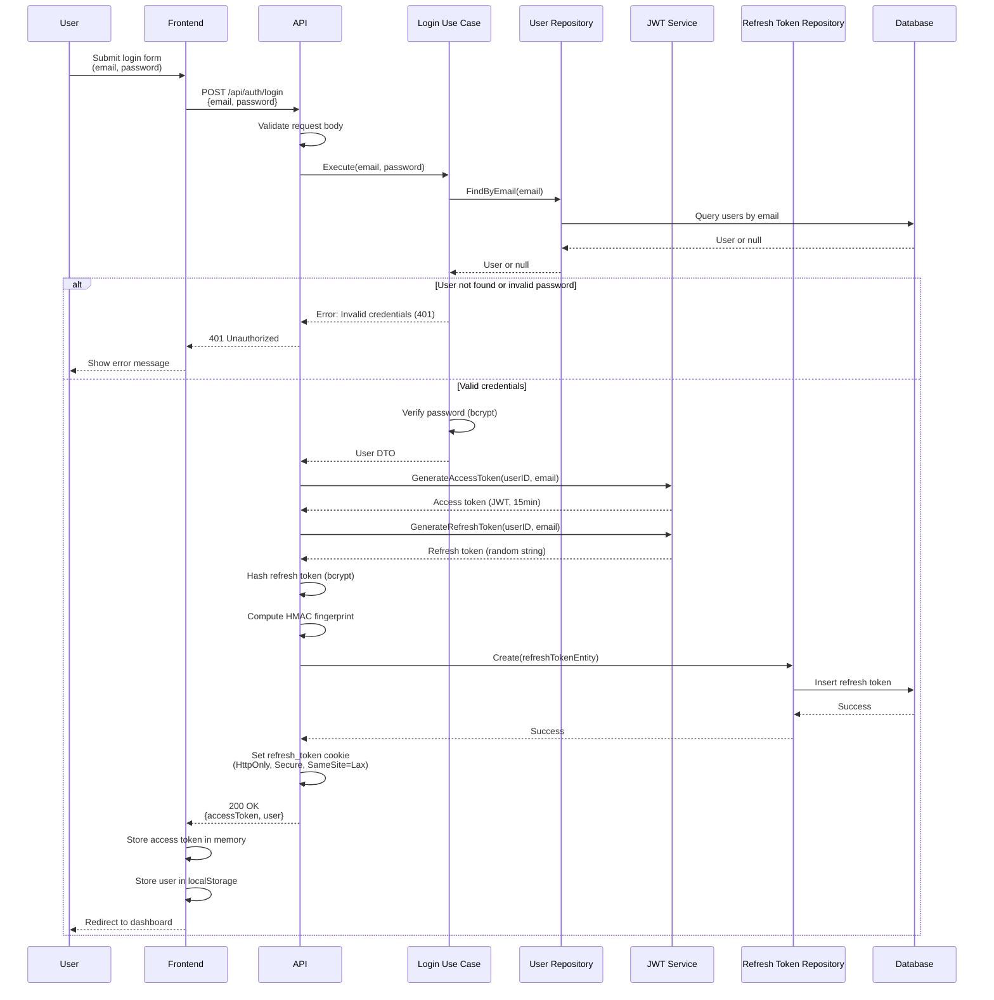

# Login API

## Overview

The Login API endpoint authenticates existing users with email and password. Upon successful authentication, the system generates both an access token and a refresh token, establishing a user session.

**Endpoint:** `POST /api/auth/login`
**Authentication:** Not required

## Architectural Diagram



## Request Format

**HTTP Method:** `POST`
**Path:** `/api/auth/login`
**Content-Type:** `application/json`

### Request Body

```json
{
  "email": "user@example.com",
  "password": "securePassword123"
}
```

**Fields:**
- `email` (required, string): User's email address
- `password` (required, string): User's plain text password

## Response Format

### Success Response (200 OK)

```json
{
  "accessToken": "eyJhbGciOiJIUzI1NiIsInR5cCI6IkpXVCJ9...",
  "user": {
    "id": "2CmR8x3K9FpL2nQ5rT7vW0y",
    "email": "user@example.com",
    "name": "John Doe"
  }
}
```

**Response Headers:**
- `Set-Cookie`: `refresh_token=<token>; HttpOnly; Secure; SameSite=Lax; Path=/; Max-Age=2592000`

### Error Responses

#### 400 Bad Request - Invalid Request Data

```json
{
  "error": "Email and password are required"
}
```

#### 401 Unauthorized - Invalid Credentials

```json
{
  "error": "Invalid credentials"
}
```

#### 500 Internal Server Error

```json
{
  "error": "Failed to generate token"
}
```

## Flow Details

### Step-by-Step Process

1. **Request Validation**
   - Frontend sends login request with email and password
   - API validates request body structure

2. **User Lookup**
   - Use case queries database for user with provided email
   - If user not found, returns 401 Unauthorized

3. **Password Verification**
   - Compare provided password with stored bcrypt hash
   - If password doesn't match, returns 401 Unauthorized
   - Uses constant-time comparison to prevent timing attacks

4. **Token Generation**
   - Generate access token (JWT) with 15-minute expiration
   - Generate refresh token (random base64 string) with 30-day expiration
   - Hash refresh token with bcrypt for storage
   - Compute HMAC fingerprint for indexed lookup

5. **Refresh Token Storage**
   - Store refresh token hash and fingerprint in database
   - Set refresh token in HttpOnly cookie

6. **Response**
   - Return access token and user data
   - Frontend stores access token in memory
   - Frontend stores user data in localStorage for display

## Security Considerations

1. **Password Verification**
   - Uses bcrypt constant-time comparison
   - Prevents timing attacks
   - Never reveals whether email exists or password is wrong (generic error)

2. **Token Security**
   - Access tokens are short-lived (15 minutes)
   - Refresh tokens are stored in HttpOnly cookies (XSS protection)
   - Refresh tokens are hashed before database storage
   - Token rotation prevents reuse attacks

3. **Error Messages**
   - Generic "Invalid credentials" message
   - Doesn't reveal if email exists or password is wrong
   - Prevents user enumeration attacks

4. **Input Validation**
   - Email format validation
   - Request body structure validation

## Error Handling

### Invalid Credentials

When email or password is incorrect:
- Returns `401 Unauthorized` status code
- Error message: "Invalid credentials" (generic)
- Frontend should show generic error message
- Does not reveal whether email exists

### Missing Fields

When required fields are missing:
- Returns `400 Bad Request` status code
- Error message: "Email and password are required"
- Frontend should highlight missing fields

### Server Errors

When database or token generation fails:
- Returns `500 Internal Server Error`
- Error message describes the failure
- Frontend should show generic error message

## Integration Points

### Backend Components

- **Handler**: `internal/interfaces/http/handlers/auth_handler.go::Login`
- **Use Case**: `internal/usecase/auth/login.go::LoginUseCase`
- **Repository**: `internal/interfaces/repository/user_repository.go`
- **JWT Service**: `internal/infrastructure/auth/jwt.go::JWTService`
- **Domain**: `internal/domain/user.go`

### Frontend Components

- **Service**: `src/services/authService.ts::login`
- **Component**: `src/components/Auth/LoginPage.tsx`
- **Token Storage**: `src/services/tokenStorage.ts`
- **API Client**: `src/services/apiClient.ts`

## Testing

### Manual Testing

```bash
curl -X POST http://localhost:3000/api/auth/login \
  -H "Content-Type: application/json" \
  -d '{
    "email": "test@example.com",
    "password": "securePassword123"
  }' \
  -c cookies.txt
```

### Expected Behavior

1. **Successful Login:**
   - Returns 200 status code
   - Access token in response body
   - Refresh token in Set-Cookie header
   - User data in response

2. **Invalid Credentials:**
   - Returns 401 status code
   - Generic error message
   - No user information revealed

3. **Missing Fields:**
   - Returns 400 status code
   - Error message describes missing fields

### Frontend Testing

1. Navigate to login page
2. Enter email and password
3. Submit form
4. Verify:
   - Access token stored in memory
   - User data stored in localStorage
   - Redirect to dashboard
   - Refresh token cookie set in browser

## Related Documentation

- [System Design](./system-design.md) - Overall authentication architecture
- [Register API](./register.md) - Similar flow for new users
- [Refresh Token API](./refresh-token.md) - Token refresh mechanism
- [Logout API](./logout.md) - Session termination

