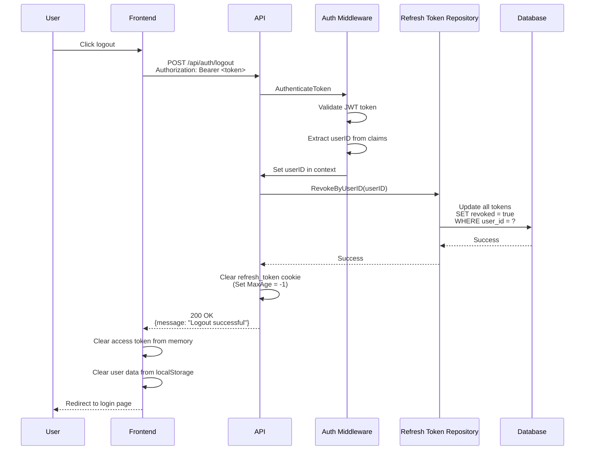

# Logout API

## Overview

The Logout API endpoint terminates a user's session by revoking all refresh tokens associated with the user and clearing the refresh token cookie. This ensures that the user cannot continue to use their session after logging out.

**Endpoint:** `POST /api/auth/logout`
**Authentication:** Required (Bearer token)

## Architectural Diagram



## Request Format

**HTTP Method:** `POST`
**Path:** `/api/auth/logout`
**Content-Type:** `application/json`

### Request Headers

- `Authorization`: `Bearer <access_token>` (required)

### Request Body

No request body required.

## Response Format

### Success Response (200 OK)

```json
{
  "message": "Logout successful"
}
```

**Response Headers:**
- `Set-Cookie`: `refresh_token=; Max-Age=-1; Path=/` (clears cookie)

### Error Responses

#### 401 Unauthorized - Authentication Required

```json
{
  "error": "Authentication required"
}
```

#### 500 Internal Server Error

```json
{
  "error": "Failed to revoke refresh token"
}
```

## Flow Details

### Step-by-Step Process

1. **Authentication**
   - Frontend sends logout request with access token in Authorization header
   - Middleware validates JWT token
   - Middleware extracts userID from token claims
   - Sets userID in request context

2. **Token Revocation**
   - Use case queries database for all refresh tokens for the user
   - Marks all refresh tokens as revoked
   - Prevents any further use of refresh tokens

3. **Cookie Clearing**
   - Clears refresh token cookie by setting MaxAge to -1
   - Cookie is immediately expired
   - Browser removes cookie

4. **Response**
   - Returns success message
   - Frontend clears access token from memory
   - Frontend clears user data from localStorage
   - Frontend redirects to login page

## Security Considerations

1. **Complete Session Termination**
   - All refresh tokens for the user are revoked
   - Prevents token reuse after logout
   - Ensures complete session termination

2. **Cookie Clearing**
   - Refresh token cookie is explicitly cleared
   - Prevents accidental reuse
   - Browser removes cookie immediately

3. **Token Revocation**
   - Tokens are marked as revoked in database
   - Revoked tokens cannot be used for refresh
   - Provides audit trail

4. **Authentication Required**
   - Endpoint requires valid access token
   - Prevents unauthorized logout attempts
   - Ensures user identity is verified

## Error Handling

### Missing Authentication

When access token is missing or invalid:
- Returns `401 Unauthorized` status code
- Error message: "Authentication required"
- Frontend should redirect to login page

### Revocation Failure

When token revocation fails:
- Returns `500 Internal Server Error`
- Error message: "Failed to revoke refresh token"
- Frontend should still clear local tokens and redirect

## Integration Points

### Backend Components

- **Handler**: `internal/interfaces/http/handlers/auth_handler.go::Logout`
- **Middleware**: `internal/interfaces/http/middleware/auth_middleware.go::AuthenticateToken`
- **Repository**: `internal/interfaces/repository/refresh_token_repository.go`
- **Domain**: `internal/domain/refresh_token.go`

### Frontend Components

- **Service**: `src/services/authService.ts::logout`
- **Token Storage**: `src/services/tokenStorage.ts`
- **Components**: Various components with logout functionality

## Testing

### Manual Testing

```bash
# First, login to get access token
curl -X POST http://localhost:3000/api/auth/login \
  -H "Content-Type: application/json" \
  -d '{"email":"test@example.com","password":"password123"}' \
  -c cookies.txt

# Extract access token from response, then logout
curl -X POST http://localhost:3000/api/auth/logout \
  -H "Authorization: Bearer <access_token>"
```

### Expected Behavior

1. **Successful Logout:**
   - Returns 200 status code
   - Success message in response
   - Refresh token cookie cleared
   - All refresh tokens revoked in database

2. **Missing Token:**
   - Returns 401 status code
   - Error message: "Authentication required"

3. **Invalid Token:**
   - Returns 401 status code
   - Error message: "Authentication required"

### Frontend Testing

1. Login to establish session
2. Click logout button
3. Verify:
   - Access token cleared from memory
   - User data cleared from localStorage
   - Refresh token cookie removed
   - Redirect to login page
   - Cannot make authenticated requests

## Related Documentation

- [System Design](./system-design.md) - Overall authentication architecture
- [Login API](./login.md) - Session establishment
- [Refresh Token API](./refresh-token.md) - Token refresh mechanism

