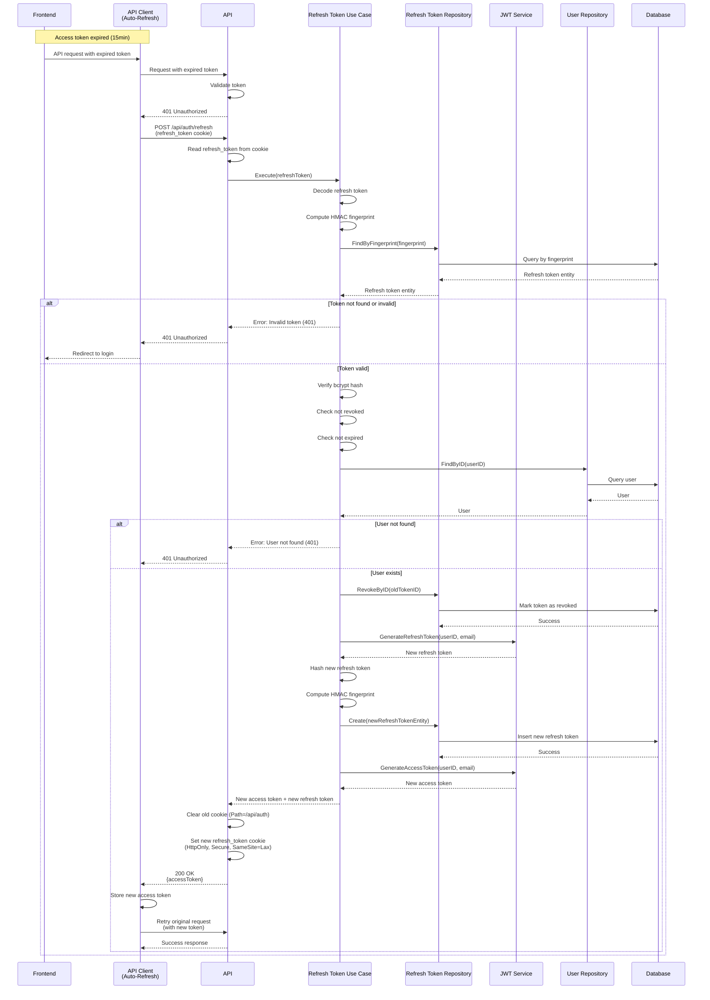

# Refresh Token API

## Overview

The Refresh Token API endpoint allows clients to obtain a new access token using a valid refresh token. This endpoint implements token rotation, generating a new refresh token and revoking the old one on each use, enhancing security.

**Endpoint:** `POST /api/auth/refresh`
**Authentication:** Not required (uses refresh token from HttpOnly cookie)

## Architectural Diagram



## Request Format

**HTTP Method:** `POST`
**Path:** `/api/auth/refresh`
**Content-Type:** `application/json`

### Request Body

No request body required. The refresh token is automatically sent via the `refresh_token` HttpOnly cookie.

### Request Headers

- `Cookie`: `refresh_token=<token>` (automatically sent by browser)

## Response Format

### Success Response (200 OK)

```json
{
  "accessToken": "eyJhbGciOiJIUzI1NiIsInR5cCI6IkpXVCJ9..."
}
```

**Response Headers:**
- `Set-Cookie`: `refresh_token=<new_token>; HttpOnly; Secure; SameSite=Lax; Path=/; Max-Age=2592000`

### Error Responses

#### 401 Unauthorized - Refresh Token Not Found

```json
{
  "error": "Refresh token not found"
}
```

#### 401 Unauthorized - Invalid or Expired Token

```json
{
  "error": "Invalid or expired refresh token"
}
```

#### 500 Internal Server Error

```json
{
  "error": "Failed to refresh token"
}
```

## Flow Details

### Step-by-Step Process

1. **Token Extraction**
   - API reads refresh token from HttpOnly cookie
   - If cookie is missing, returns 401 Unauthorized

2. **Token Lookup**
   - Decode refresh token to extract token bytes
   - Compute HMAC fingerprint using active HMAC key
   - Query database for refresh token by fingerprint (indexed lookup)
   - If token not found, returns 401 Unauthorized

3. **Token Validation**
   - Verify bcrypt hash matches stored hash
   - Check token is not revoked
   - Check token is not expired
   - If validation fails, returns 401 Unauthorized

4. **User Verification**
   - Lookup user by user ID from token
   - If user not found, returns 401 Unauthorized

5. **Token Rotation**
   - Revoke old refresh token (mark as revoked in database)
   - Generate new refresh token (random base64 string)
   - Hash new refresh token with bcrypt
   - Compute HMAC fingerprint for new token
   - Store new refresh token in database

6. **Access Token Generation**
   - Generate new access token (JWT) with 15-minute expiration

7. **Cookie Management**
   - Clear old cookie (Path=/api/auth) to handle legacy cookies
   - Set new refresh token in HttpOnly cookie (Path=/)

8. **Response**
   - Return new access token
   - Frontend stores new access token in memory
   - Frontend retries original request with new token

## Token Rotation

Token rotation is a security feature that generates a new refresh token on each use and immediately revokes the old one. This provides several security benefits:

1. **Prevents Token Reuse**
   - If a refresh token is stolen, it can only be used once
   - Subsequent uses will fail because the token is revoked

2. **Limits Damage Window**
   - Even if a token is compromised, the window of vulnerability is limited
   - Old tokens are immediately invalidated

3. **Enables Revocation Tracking**
   - System can track when tokens are used
   - Can detect suspicious patterns

### Rotation Flow


## Security Considerations

1. **HttpOnly Cookies**
   - Refresh tokens stored in HttpOnly cookies
   - Prevents XSS attacks from accessing tokens
   - Automatic cookie management by browser

2. **Token Hashing**
   - Refresh tokens hashed with bcrypt before storage
   - Original token never stored in database
   - HMAC fingerprint enables fast indexed lookup

3. **Token Rotation**
   - New token generated on each refresh
   - Old token immediately revoked
   - Prevents token reuse attacks

4. **Expiration**
   - Refresh tokens expire after 30 days
   - Expired tokens cannot be used
   - Forces periodic re-authentication

5. **Revocation**
   - Tokens can be revoked (e.g., on logout)
   - Revoked tokens cannot be used
   - Enables session management

## Error Handling

### Missing Refresh Token

When refresh token cookie is missing:
- Returns `401 Unauthorized` status code
- Error message: "Refresh token not found"
- Frontend should redirect to login page

### Invalid or Expired Token

When refresh token is invalid, expired, or revoked:
- Returns `401 Unauthorized` status code
- Error message: "Invalid or expired refresh token"
- Frontend should redirect to login page

### User Not Found

When user associated with token no longer exists:
- Returns `401 Unauthorized` status code
- Error message: "Invalid or expired refresh token"
- Frontend should redirect to login page

## Integration Points

### Backend Components

- **Handler**: `internal/interfaces/http/handlers/auth_handler.go::RefreshToken`
- **Use Case**: `internal/usecase/auth/refresh_token.go::RefreshTokenUseCase`
- **Repository**: `internal/interfaces/repository/refresh_token_repository.go`
- **JWT Service**: `internal/infrastructure/auth/jwt.go::JWTService`
- **Domain**: `internal/domain/refresh_token.go`

### Frontend Components

- **Service**: `src/services/authService.ts::refreshAccessToken`
- **API Client**: `src/services/apiClient.ts` (automatic refresh on 401)
- **Token Storage**: `src/services/tokenStorage.ts`

## Automatic Token Refresh

The frontend API client automatically handles token refresh:

1. **Request Interception**
   - API client adds access token to Authorization header
   - Makes API request

2. **401 Response Handling**
   - If response is 401 Unauthorized, attempt token refresh
   - Prevents multiple simultaneous refresh requests
   - Retries original request with new token

3. **Refresh Failure**
   - If refresh fails, clear tokens and redirect to login
   - Prevents infinite refresh loops

## Testing

### Manual Testing

```bash
# First, login to get refresh token cookie
curl -X POST http://localhost:3000/api/auth/login \
  -H "Content-Type: application/json" \
  -d '{"email":"test@example.com","password":"password123"}' \
  -c cookies.txt

# Then refresh token
curl -X POST http://localhost:3000/api/auth/refresh \
  -b cookies.txt \
  -c cookies.txt
```

### Expected Behavior

1. **Successful Refresh:**
   - Returns 200 status code
   - New access token in response body
   - New refresh token in Set-Cookie header
   - Old refresh token revoked in database

2. **Missing Cookie:**
   - Returns 401 status code
   - Error message: "Refresh token not found"

3. **Expired Token:**
   - Returns 401 status code
   - Error message: "Invalid or expired refresh token"

### Frontend Testing

1. Login to get tokens
2. Wait 15+ minutes or manually expire access token
3. Make API request
4. Verify:
   - Automatic token refresh occurs
   - Original request retried with new token
   - New access token stored in memory
   - New refresh token cookie set

## Related Documentation

- [System Design](./system-design.md) - Overall authentication architecture
- [Login API](./login.md) - Initial token generation
- [Logout API](./logout.md) - Token revocation

