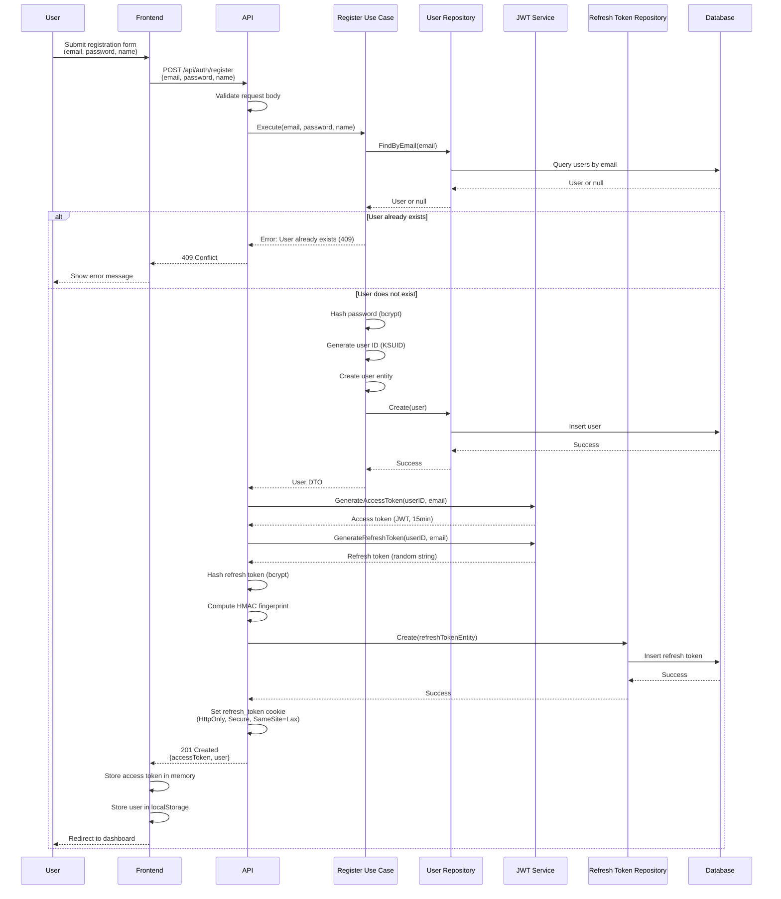

# Register API

## Overview

The Register API endpoint allows new users to create an account with email and password. Upon successful registration, the system generates both an access token and a refresh token, automatically logging the user in.

**Endpoint:** `POST /api/auth/register`
**Authentication:** Not required

## Architectural Diagram



## Request Format

**HTTP Method:** `POST`
**Path:** `/api/auth/register`
**Content-Type:** `application/json`

### Request Body

```json
{
  "email": "user@example.com",
  "password": "securePassword123",
  "name": "John Doe"
}
```

**Fields:**
- `email` (required, string): User's email address (must be unique)
- `password` (required, string): Plain text password (minimum 8 characters)
- `name` (optional, string): User's display name

## Response Format

### Success Response (201 Created)

```json
{
  "accessToken": "eyJhbGciOiJIUzI1NiIsInR5cCI6IkpXVCJ9...",
  "user": {
    "id": "2CmR8x3K9FpL2nQ5rT7vW0y",
    "email": "user@example.com",
    "name": "John Doe"
  }
}
```

**Response Headers:**
- `Set-Cookie`: `refresh_token=<token>; HttpOnly; Secure; SameSite=Lax; Path=/; Max-Age=2592000`

### Error Responses

#### 400 Bad Request - Invalid Request Data

```json
{
  "error": "Email and password are required"
}
```

#### 409 Conflict - User Already Exists

```json
{
  "error": "User already exists",
  "code": "CONFLICT"
}
```

#### 500 Internal Server Error

```json
{
  "error": "Registration failed"
}
```

## Flow Details

### Step-by-Step Process

1. **Request Validation**
   - Frontend sends registration request with email, password, and optional name
   - API validates request body structure

2. **User Existence Check**
   - Use case queries database for existing user with same email
   - If user exists, returns 409 Conflict error

3. **Password Hashing**
   - Password is hashed using bcrypt with cost factor 10
   - Plain text password is never stored

4. **User Creation**
   - Generate unique user ID using KSUID
   - Create user entity with hashed password
   - Save user to database

5. **Token Generation**
   - Generate access token (JWT) with 15-minute expiration
   - Generate refresh token (random base64 string) with 30-day expiration
   - Hash refresh token with bcrypt for storage
   - Compute HMAC fingerprint for indexed lookup

6. **Refresh Token Storage**
   - Store refresh token hash and fingerprint in database
   - Set refresh token in HttpOnly cookie

7. **Response**
   - Return access token and user data
   - Frontend stores access token in memory
   - Frontend stores user data in localStorage for display

## Security Considerations

1. **Password Security**
   - Passwords are hashed with bcrypt before storage
   - Plain text passwords are never stored or logged
   - Password validation ensures minimum length

2. **Token Security**
   - Access tokens are short-lived (15 minutes)
   - Refresh tokens are stored in HttpOnly cookies (XSS protection)
   - Refresh tokens are hashed before database storage
   - Token rotation prevents reuse attacks

3. **Email Uniqueness**
   - Database enforces unique email constraint
   - Prevents duplicate account creation

4. **Input Validation**
   - Email format validation
   - Password strength requirements
   - Request body structure validation

## Error Handling

### User Already Exists

When a user attempts to register with an email that already exists:
- Returns `409 Conflict` status code
- Error message: "User already exists"
- Frontend should prompt user to login instead

### Invalid Input

When required fields are missing or invalid:
- Returns `400 Bad Request` status code
- Error message describes the validation failure
- Frontend should highlight invalid fields

### Server Errors

When database or token generation fails:
- Returns `500 Internal Server Error`
- Error message: "Registration failed"
- Frontend should show generic error message

## Integration Points

### Backend Components

- **Handler**: `internal/interfaces/http/handlers/auth_handler.go::Register`
- **Use Case**: `internal/usecase/auth/register.go::RegisterUseCase`
- **Repository**: `internal/interfaces/repository/user_repository.go`
- **JWT Service**: `internal/infrastructure/auth/jwt.go::JWTService`
- **Domain**: `internal/domain/user.go`

### Frontend Components

- **Service**: `src/services/authService.ts::register`
- **Component**: `src/components/Auth/SignupPage.tsx`
- **Token Storage**: `src/services/tokenStorage.ts`
- **API Client**: `src/services/apiClient.ts`

## Testing

### Manual Testing

```bash
curl -X POST http://localhost:3000/api/auth/register \
  -H "Content-Type: application/json" \
  -d '{
    "email": "test@example.com",
    "password": "securePassword123",
    "name": "Test User"
  }'
```

### Expected Behavior

1. **Successful Registration:**
   - Returns 201 status code
   - Access token in response body
   - Refresh token in Set-Cookie header
   - User data in response

2. **Duplicate Email:**
   - Returns 409 status code
   - Error message indicates user exists

3. **Invalid Input:**
   - Returns 400 status code
   - Error message describes validation failure

### Frontend Testing

1. Navigate to signup page
2. Enter email, password, and optional name
3. Submit form
4. Verify:
   - Access token stored in memory
   - User data stored in localStorage
   - Redirect to dashboard
   - Refresh token cookie set in browser

## Related Documentation

- [System Design](./system-design.md) - Overall authentication architecture
- [Login API](./login.md) - Similar flow for existing users
- [Refresh Token API](./refresh-token.md) - Token refresh mechanism

