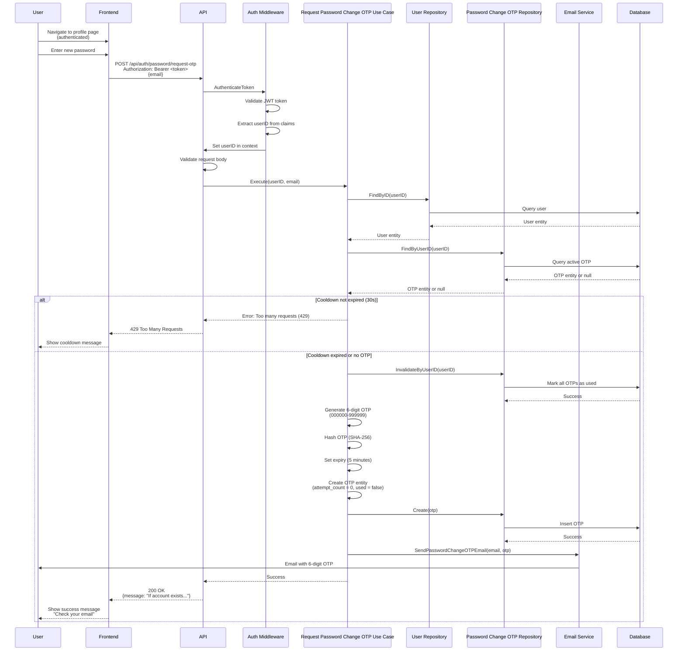

# Request Password Change OTP API

## Overview

The Request Password Change OTP API endpoint sends a 6-digit OTP (One-Time Password) to the user's email for password change verification. This endpoint is used by authenticated users who want to change their password and requires a valid JWT token. The system implements a 30-second cooldown to prevent spam.

**Endpoint:** `POST /api/auth/password/request-otp`
**Authentication:** Required (Bearer token)
**Rate Limit:** 1 request per 30 seconds

## Architectural Diagram



## Request Format

**HTTP Method:** `POST`
**Path:** `/api/auth/password/request-otp`
**Content-Type:** `application/json`

### Request Headers

- `Authorization`: `Bearer <access_token>` (required)

### Request Body

```json
{
  "email": "user@example.com"
}
```

**Fields:**
- `email` (required, string): User's email address

## Response Format

### Success Response (200 OK)

```json
{
  "message": "If an account with that email exists, we've sent a verification code."
}
```

**Note:** This response is returned regardless of whether the email exists, to prevent email enumeration attacks.

### Error Responses

#### 400 Bad Request - Invalid Request Data

```json
{
  "error": "Email is required"
}
```

#### 401 Unauthorized - Authentication Required

```json
{
  "error": "Authentication required"
}
```

#### 429 Too Many Requests - Cooldown Not Expired

```json
{
  "error": "Please wait before requesting a new OTP"
}
```

#### 500 Internal Server Error

```json
{
  "error": "Failed to send OTP"
}
```

#### 503 Service Unavailable - Email Service Not Configured

```json
{
  "error": "Email service is not configured. Password change is currently unavailable."
}
```

## Flow Details

### Step-by-Step Process

1. **Authentication**
   - Frontend sends request with access token in Authorization header
   - Middleware validates JWT token
   - Middleware extracts userID from token claims
   - Sets userID in request context

2. **Request Validation**
   - API validates request body structure
   - Ensures email is provided

3. **User Verification**
   - Use case retrieves user by userID from context
   - Verifies user exists

4. **Cooldown Check**
   - Check if user has requested OTP within last 30 seconds
   - If cooldown not expired, returns 429 Too Many Requests
   - Prevents spam and abuse

5. **OTP Invalidation**
   - Invalidate any existing OTPs for the user
   - Mark old OTPs as used
   - Ensures only one active OTP per user

6. **OTP Generation**
   - Generate 6-digit numeric OTP (000000-999999)
   - Hash OTP with SHA-256 for storage
   - Set expiration to 5 minutes from now
   - Initialize attempt count to 0
   - Mark as unused

7. **OTP Storage**
   - Create password change OTP entity
   - Store OTP hash in database
   - OTP is single-use and expires after 5 minutes

8. **Email Sending**
   - Send OTP email to user
   - Email includes 6-digit OTP
   - Email includes expiration notice (5 minutes)

9. **Response**
   - Always return success message
   - Message doesn't reveal if email exists
   - Frontend shows generic success message

## Security Considerations

1. **Authentication Required**
   - Endpoint requires valid JWT token
   - Prevents unauthorized OTP requests
   - Ensures user identity is verified

2. **Cooldown Mechanism**
   - 30-second minimum between requests
   - Prevents spam and abuse
   - Protects against brute force attacks

3. **OTP Security**
   - OTPs are 6-digit numeric (000000-999999)
   - OTPs are hashed before storage (SHA-256)
   - OTPs expire after 5 minutes
   - OTPs are single-use
   - Maximum 5 attempts per OTP

4. **Email Enumeration Prevention**
   - Always returns success, even if email doesn't exist
   - Prevents attackers from discovering valid email addresses
   - Generic message: "If an account with that email exists..."

5. **OTP Invalidation**
   - Old OTPs are invalidated when new one is requested
   - Ensures only one active OTP per user
   - Prevents OTP confusion

## Error Handling

### Missing Authentication

When access token is missing or invalid:
- Returns `401 Unauthorized` status code
- Error message: "Authentication required"
- Frontend should redirect to login page

### Cooldown Not Expired

When user requests OTP within 30 seconds:
- Returns `429 Too Many Requests` status code
- Error message: "Please wait before requesting a new OTP"
- Frontend should show cooldown timer

### Missing Email

When email is missing:
- Returns `400 Bad Request` status code
- Error message: "Email is required"
- Frontend should highlight missing field

### Email Service Unavailable

When email service is not configured:
- Returns `503 Service Unavailable` status code
- Error message indicates service is unavailable
- Frontend should show appropriate message

## Integration Points

### Backend Components

- **Handler**: `internal/interfaces/http/handlers/auth_handler.go::RequestPasswordChangeOTP`
- **Middleware**: `internal/interfaces/http/middleware/auth_middleware.go::AuthenticateToken`
- **Use Case**: `internal/usecase/auth/request_password_change_otp.go::RequestPasswordChangeOTPUseCase`
- **Repository**: `internal/interfaces/repository/password_change_otp_repository.go`
- **Email Service**: `internal/infrastructure/email/email_service.go`
- **Domain**: `internal/domain/password_change_otp.go`

### Frontend Components

- **Service**: `src/services/authService.ts::requestPasswordChangeOTP`
- **Component**: `src/components/Profile/ProfilePage.tsx`
- **Email Template**: `internal/infrastructure/email/templates/password_change_otp.html`

## OTP Specifications

- **Format**: 6-digit numeric (000000-999999)
- **Validity**: 5 minutes
- **Attempts**: Maximum 5 attempts per OTP
- **Single-Use**: OTP is marked as used after successful verification
- **Resend Cooldown**: 30 seconds minimum between requests
- **Storage**: OTP is hashed with SHA-256 (not plaintext)

## Email Template

The password change OTP email includes:
- Large, readable 6-digit OTP display
- Clear expiry message (5 minutes)
- Security notice
- Professional styling matching brand

## Testing

### Manual Testing

```bash
# First, login to get access token
curl -X POST http://localhost:3000/api/auth/login \
  -H "Content-Type: application/json" \
  -d '{"email":"test@example.com","password":"password123"}'

# Extract access token, then request OTP
curl -X POST http://localhost:3000/api/auth/password/request-otp \
  -H "Authorization: Bearer <access_token>" \
  -H "Content-Type: application/json" \
  -d '{"email": "test@example.com"}'
```

### Expected Behavior

1. **Successful Request:**
   - Returns 200 status code
   - Success message in response
   - OTP created in database
   - Email sent to user with 6-digit OTP

2. **Cooldown Active:**
   - Returns 429 status code
   - Error message indicates cooldown
   - Frontend should show cooldown timer

3. **Missing Authentication:**
   - Returns 401 status code
   - Error message: "Authentication required"

### Frontend Testing

1. Navigate to profile page (authenticated)
2. Enter new password
3. Click "Request Verification Code"
4. Verify:
   - Success message displayed
   - Cooldown timer shown (30 seconds)
   - If email exists, check inbox for 6-digit OTP
   - OTP expires after 5 minutes

## Related Documentation

- [System Design](./system-design.md) - Overall authentication architecture
- [Verify Password Change OTP](./verify-password-change-otp.md) - OTP verification
- [Forgot Password API](./forgot-password.md) - Unauthenticated password reset

