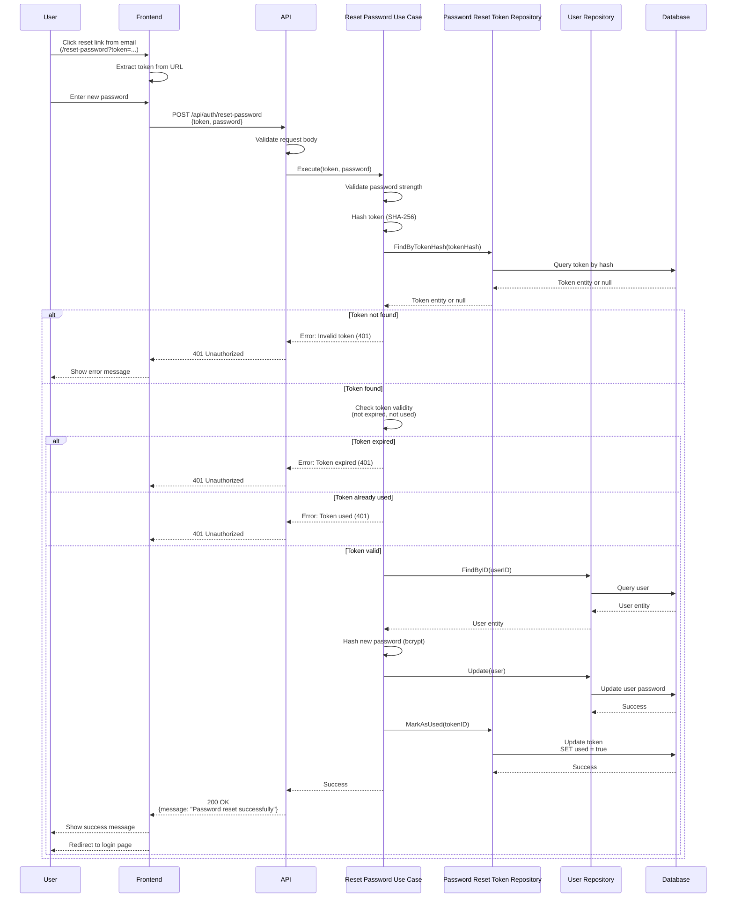

# Reset Password API

## Overview

The Reset Password API endpoint allows users to reset their password using a valid reset token received via email. This endpoint is used in conjunction with the Forgot Password API to complete the password reset flow for unauthenticated users.

**Endpoint:** `POST /api/auth/reset-password`
**Authentication:** Not required (uses reset token)

## Architectural Diagram



## Request Format

**HTTP Method:** `POST`
**Path:** `/api/auth/reset-password`
**Content-Type:** `application/json`

### Request Body

```json
{
  "token": "abc123xyz...",
  "password": "newSecurePassword123"
}
```

**Fields:**
- `token` (required, string): Password reset token from email link
- `password` (required, string): New password (minimum 8 characters)

## Response Format

### Success Response (200 OK)

```json
{
  "message": "Password reset successfully"
}
```

### Error Responses

#### 400 Bad Request - Invalid Request Data

```json
{
  "error": "Token and password are required"
}
```

#### 400 Bad Request - Invalid Password

```json
{
  "error": "Password must be at least 8 characters long"
}
```

#### 401 Unauthorized - Invalid or Expired Token

```json
{
  "error": "Invalid or expired reset token"
}
```

#### 401 Unauthorized - Token Already Used

```json
{
  "error": "Reset token has already been used"
}
```

#### 500 Internal Server Error

```json
{
  "error": "Failed to reset password"
}
```

#### 503 Service Unavailable - Service Not Configured

```json
{
  "error": "Password reset service is not configured. Please contact support."
}
```

## Flow Details

### Step-by-Step Process

1. **Token Extraction**
   - User clicks reset link from email
   - Frontend extracts token from URL query parameter
   - User enters new password

2. **Request Validation**
   - Frontend sends reset request with token and new password
   - API validates request body structure
   - Validates password strength (minimum 8 characters)

3. **Token Lookup**
   - Hash provided token with SHA-256
   - Query database for token by hash
   - If token not found, returns 401 Unauthorized

4. **Token Validation**
   - Check token is not expired (24 hours)
   - Check token is not already used
   - If validation fails, returns 401 Unauthorized

5. **User Lookup**
   - Find user by user ID from token
   - If user not found, returns 404 Not Found

6. **Password Update**
   - Hash new password with bcrypt (cost: 10)
   - Update user password in database
   - Old password is replaced

7. **Token Invalidation**
   - Mark token as used in database
   - Prevents token reuse
   - Token cannot be used again

8. **Response**
   - Return success message
   - Frontend shows success message
   - Frontend redirects to login page

## Security Considerations

1. **Token Security**
   - Tokens are single-use (marked as used after reset)
   - Tokens expire after 24 hours
   - Tokens are hashed before storage
   - Token lookup uses hash comparison

2. **Password Security**
   - Passwords are hashed with bcrypt before storage
   - Password strength validation enforced
   - Plain text passwords never stored

3. **Token Validation**
   - Token must be valid and not expired
   - Token must not be already used
   - Prevents token reuse attacks

4. **User Verification**
   - User must exist in database
   - User ID from token is verified
   - Prevents reset for deleted users

## Error Handling

### Invalid Token

When token is invalid, expired, or already used:
- Returns `401 Unauthorized` status code
- Error message: "Invalid or expired reset token" or "Reset token has already been used"
- Frontend should show error message and allow requesting new reset link

### Invalid Password

When password doesn't meet strength requirements:
- Returns `400 Bad Request` status code
- Error message describes password requirements
- Frontend should highlight password field

### Missing Fields

When required fields are missing:
- Returns `400 Bad Request` status code
- Error message: "Token and password are required"
- Frontend should highlight missing fields

## Integration Points

### Backend Components

- **Handler**: `internal/interfaces/http/handlers/auth_handler.go::ResetPassword`
- **Use Case**: `internal/usecase/auth/reset_password.go::ResetPasswordUseCase`
- **Repository**: `internal/interfaces/repository/password_reset_repository.go`
- **Domain**: `internal/domain/password_reset.go`

### Frontend Components

- **Service**: `src/services/authService.ts::resetPassword`
- **Component**: `src/components/Auth/ResetPasswordPage.tsx`
- **Token Extraction**: Extract token from URL query parameter

## Frontend Token Handling

The frontend extracts the token from the URL:

```typescript
// In ResetPasswordPage component
const searchParams = new URLSearchParams(window.location.search);
const token = searchParams.get('token');

if (!token) {
  // Show error: Invalid reset link
  setError('Invalid reset link. Please request a new password reset.');
} else {
  // Use token in reset request
  await resetPassword(token, newPassword);
}
```

## Testing

### Manual Testing

```bash
# First, request password reset to get token
curl -X POST http://localhost:3000/api/auth/forgot-password \
  -H "Content-Type: application/json" \
  -d '{"email": "user@example.com"}'

# Extract token from email, then reset password
curl -X POST http://localhost:3000/api/auth/reset-password \
  -H "Content-Type: application/json" \
  -d '{
    "token": "abc123xyz...",
    "password": "newSecurePassword123"
  }'
```

### Expected Behavior

1. **Successful Reset:**
   - Returns 200 status code
   - Success message in response
   - User password updated in database
   - Token marked as used
   - User can login with new password

2. **Invalid Token:**
   - Returns 401 status code
   - Error message: "Invalid or expired reset token"

3. **Expired Token:**
   - Returns 401 status code
   - Error message: "Reset token has expired"

4. **Token Already Used:**
   - Returns 401 status code
   - Error message: "Reset token has already been used"

5. **Invalid Password:**
   - Returns 400 status code
   - Error message describes password requirements

### Frontend Testing

1. Click reset link from email
2. Verify token extracted from URL
3. Enter new password
4. Submit form
5. Verify:
   - Success message displayed
   - Redirected to login page
   - Can login with new password
   - Cannot reuse reset token

## Related Documentation

- [System Design](./system-design.md) - Overall authentication architecture
- [Forgot Password API](./forgot-password.md) - Request password reset
- [Request Password Change OTP](./request-password-change-otp.md) - Authenticated password change

