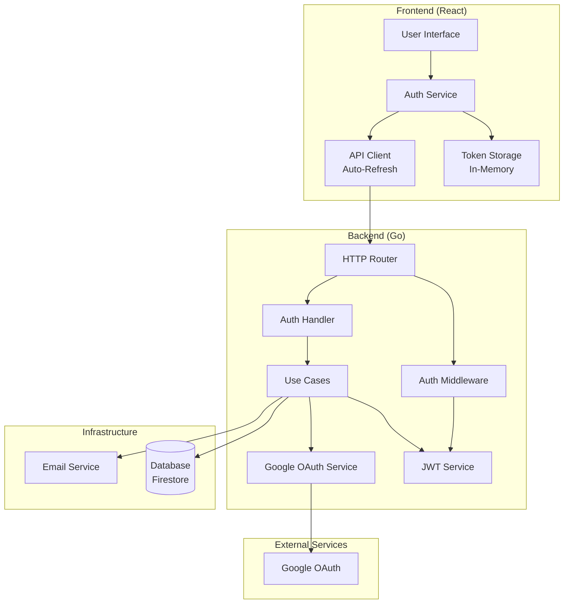
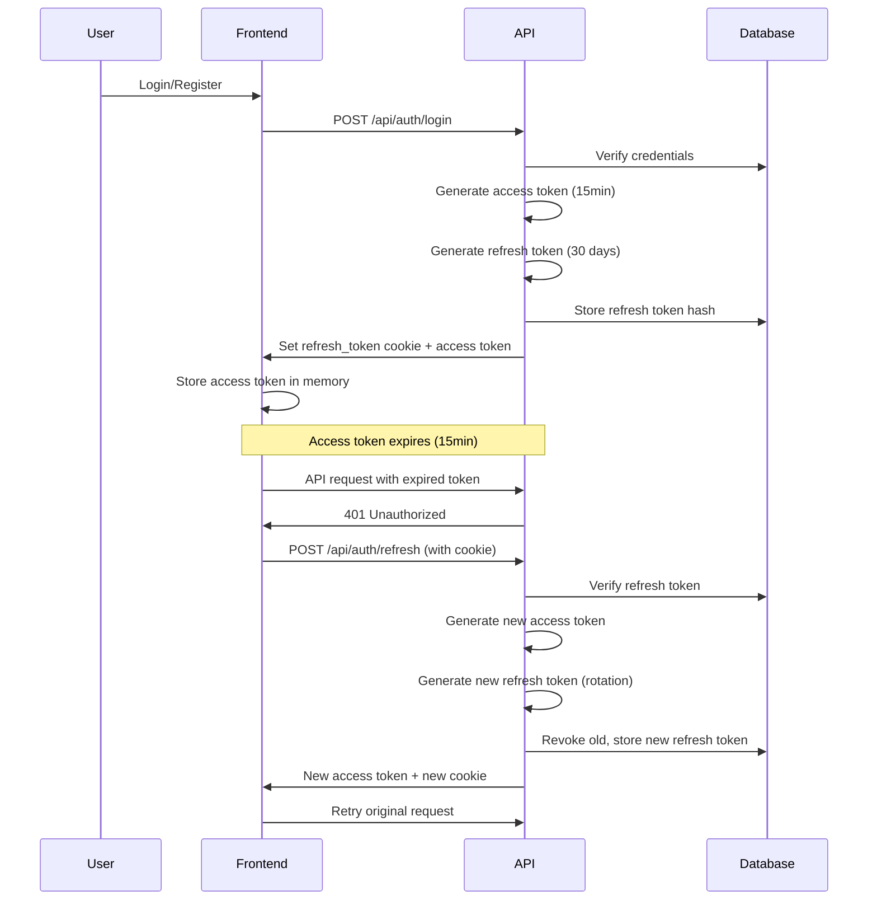

# Authentication System Design

## Overview

The Sacred Vows application implements a comprehensive authentication system using JWT (JSON Web Tokens) with refresh token rotation, supporting both traditional email/password authentication and Google OAuth 2.0. The system follows security best practices including token rotation, HttpOnly cookies, and secure token storage.

## System Architecture

### High-Level Architecture



### Backend Architecture

The backend authentication system is built using Go with a clean architecture pattern:

```
apps/api-go/
├── internal/
│   ├── domain/                    # Domain entities
│   │   ├── user.go               # User entity
│   │   ├── refresh_token.go      # Refresh token entity
│   │   ├── password_reset.go     # Password reset token entity
│   │   └── password_change_otp.go # Password change OTP entity
│   ├── infrastructure/
│   │   └── auth/                  # Authentication infrastructure
│   │       ├── jwt.go            # JWT service (token generation/validation)
│   │       └── google.go          # Google OAuth service
│   ├── usecase/
│   │   └── auth/                  # Authentication use cases
│   │       ├── register.go       # User registration
│   │       ├── login.go          # User login
│   │       ├── refresh_token.go  # Token refresh with rotation
│   │       ├── get_current_user.go
│   │       ├── google_oauth.go   # Google OAuth flow
│   │       ├── request_password_reset.go
│   │       ├── reset_password.go
│   │       ├── request_password_change_otp.go
│   │       └── verify_password_change_otp.go
│   └── interfaces/
│       ├── http/
│       │   ├── handlers/
│       │   │   └── auth_handler.go  # HTTP handlers
│       │   └── middleware/
│       │       └── auth_middleware.go  # Authentication middleware
│       └── repository/            # Repository interfaces
```

### Frontend Architecture

The frontend authentication system is built using React:

```
apps/builder/src/
├── services/
│   ├── authService.ts        # Authentication service
│   ├── tokenStorage.ts      # In-memory token storage
│   └── apiClient.ts         # API client with auto-refresh
└── components/
    └── Auth/
        ├── LoginPage.tsx
        ├── SignupPage.tsx
        ├── ForgotPasswordPage.tsx
        ├── ResetPasswordPage.tsx
        └── ProtectedRoute.tsx  # Route protection
```

## Token System

### Access Tokens

**Type:** JWT (JSON Web Token)
**Storage:** In-memory (JavaScript variable)
**Lifetime:** 15 minutes (configurable)
**Purpose:** Short-lived token for API authentication
**Format:** `Bearer <token>` in Authorization header

**Claims Structure:**
```json
{
  "userId": "string",
  "email": "string",
  "jti": "token-id",
  "exp": 1234567890,
  "iat": 1234567890,
  "nbf": 1234567890,
  "iss": "sacred-vows-api",
  "aud": ["sacred-vows-client"]
}
```

### Refresh Tokens

**Type:** Secure random string (base64-encoded)
**Storage:** HttpOnly cookie (not accessible via JavaScript)
**Lifetime:** 30 days (configurable)
**Purpose:** Long-lived token for obtaining new access tokens
**Security:**
- Stored as bcrypt hash in database
- HttpOnly, Secure, SameSite cookie
- Token rotation on each use
- Revocable

**Cookie Configuration:**
- Name: `refresh_token`
- Path: `/` (so it is sent to all API endpoints)
- HttpOnly: `true` (prevents XSS attacks)
- Secure: `true` on HTTPS, `false` on HTTP (local development)
- SameSite: `Lax`

### Token Lifecycle



## Authentication Flows

### 1. Registration Flow

See [Register API](./register.md) for detailed documentation.

### 2. Login Flow

See [Login API](./login.md) for detailed documentation.

### 3. Token Refresh Flow

See [Refresh Token API](./refresh-token.md) for detailed documentation.

### 4. Google OAuth Flows

The system supports two Google OAuth flows:

- **Server-Side OAuth (Redirect Flow)**: See [Google OAuth Initiate](./google-oauth-initiate.md) and [Google OAuth Callback](./google-oauth-callback.md)
- **Client-Side OAuth (ID Token Verification)**: See [Google Verify API](./google-verify.md)

### 5. Password Reset Flows

- **Forgot Password (Unauthenticated)**: See [Forgot Password API](./forgot-password.md) and [Reset Password API](./reset-password.md)
- **Password Change (Authenticated)**: See [Request Password Change OTP](./request-password-change-otp.md) and [Verify Password Change OTP](./verify-password-change-otp.md)

### 6. User Management

- **Get Current User**: See [Get Current User API](./get-current-user.md)
- **Logout**: See [Logout API](./logout.md)

## Security Features

### 1. Password Security
- Passwords hashed using bcrypt (cost: 10)
- Passwords never stored in plain text
- Passwords never returned in API responses

### 2. Token Security
- **Access Tokens:**
  - Short-lived (15 minutes)
  - Stored in memory (not localStorage)
  - Signed with HMAC-SHA256
  - Includes expiration, issuer, audience claims
  - Clock skew tolerance for distributed systems

- **Refresh Tokens:**
  - Long-lived (30 days)
  - Stored in HttpOnly cookie (prevents XSS)
  - Stored as bcrypt hash in database
  - Token rotation on each use
  - Revocable
  - HMAC fingerprint for indexed lookup

### 3. OAuth Security
- ID tokens verified using Google's official verifier
- Client ID validation
- Token signature verification
- Expiration and audience checks

### 4. Cookie Security
- HttpOnly: Prevents JavaScript access (XSS protection)
- Secure: HTTPS only (prevents MITM)
- Path: `/` (allows all API endpoints)
- SameSite: Lax (CSRF protection)

### 5. Token Rotation
- New refresh token generated on each refresh
- Old refresh token revoked immediately
- Prevents token reuse attacks
- Limits damage from token theft

### 6. CORS Protection
- CORS middleware configured
- Frontend URL whitelist
- Prevents unauthorized origins

### 7. Rate Limiting
- Password change OTP requests: 1 per 30 seconds
- Prevents brute force attacks
- Prevents email spam

## Middleware

### AuthenticateToken

**Location:** `internal/interfaces/http/middleware/auth_middleware.go`

**Purpose:** Protects routes requiring authentication

**Flow:**
1. Extracts `Authorization` header
2. Validates format: `Bearer <token>`
3. Validates JWT token (signature, expiration, issuer, audience)
4. Extracts claims (userID, email)
5. Sets `userID` and `email` in Gin context
6. Continues to next handler

**Error Responses:**
- `401 Unauthorized`: Missing or invalid Authorization header
- `403 Forbidden`: Invalid or expired token

**Usage:**
```go
auth.GET("/me", middleware.AuthenticateToken(jwtService), handler.GetCurrentUser)
```

### OptionalAuth

**Location:** `internal/interfaces/http/middleware/auth_middleware.go`

**Purpose:** Allows routes to work with or without authentication

**Flow:**
1. Checks for `Authorization` header
2. If present and valid, sets `userID` and `email` in context
3. If absent or invalid, continues without setting context
4. Never aborts the request

**Usage:**
```go
invitations.POST("", middleware.OptionalAuth(jwtService), handler.Create)
```

## Frontend Token Management

### Token Storage

**File:** `src/services/tokenStorage.ts`

**Implementation:**
- Access tokens stored in JavaScript memory (module-level variable)
- **NOT** stored in localStorage or sessionStorage
- Cleared on page refresh (intentional for security)

**Methods:**
- `setAccessToken(token)` - Store token in memory
- `getAccessToken()` - Retrieve token from memory
- `clearAccessToken()` - Remove token from memory
- `hasAccessToken()` - Check if token exists

**Security Rationale:**
- Prevents XSS attacks from stealing tokens
- Tokens automatically cleared on page refresh
- Refresh tokens handle session persistence

### API Client

**File:** `src/services/apiClient.ts`

**Features:**
- Automatic token injection in Authorization header
- Automatic token refresh on 401 responses
- Prevents multiple simultaneous refresh requests
- Handles FormData (doesn't set Content-Type)

**Flow:**
1. Adds `Authorization: Bearer <token>` header if token exists
2. Makes API request
3. If 401 response:
   - Attempts token refresh
   - Retries original request with new token
   - Redirects to login if refresh fails

**Usage:**
```typescript
import { apiRequest } from './apiClient';

const response = await apiRequest('/invitations', {
  method: 'GET',
});
```

### Protected Routes

**File:** `src/components/Auth/ProtectedRoute.tsx`

**Purpose:** Protects React routes requiring authentication

**Flow:**
1. Checks for OAuth callback token in URL
2. If no access token, attempts refresh using refresh token cookie
3. Verifies token by calling `/api/auth/me`
4. Shows loading spinner during check
5. Redirects to login if authentication fails
6. Renders children if authenticated

**Features:**
- Handles OAuth callback tokens
- Automatic token refresh
- Token validation
- Loading state

## Database Schema

### Users Collection

**Collection:** `users`

**Fields:**
- `id`: String (KSUID, primary key)
- `email`: String (unique, indexed)
- `password`: String (bcrypt hash, nullable for OAuth users)
- `name`: String (optional)
- `created_at`: Timestamp
- `updated_at`: Timestamp

### Refresh Tokens Collection

**Collection:** `refresh_tokens`

**Fields:**
- `id`: String (KSUID, primary key)
- `user_id`: String (indexed, foreign key)
- `token_hash`: String (bcrypt hash, unique, indexed)
- `token_fingerprint`: Bytes (HMAC-SHA256, unique, indexed)
- `hmac_key_id`: Integer (HMAC key identifier)
- `expires_at`: Timestamp (indexed)
- `revoked`: Boolean (indexed)
- `created_at`: Timestamp

**Token Storage:**
- token_hash (bcrypt) stored for verification
- token_fingerprint (HMAC-SHA256) stored for indexed lookup
- Original token never stored in database
- Token lookup uses token_fingerprint (deterministic), then verifies bcrypt hash

### Password Reset Tokens Collection

**Collection:** `password_reset_tokens`

**Fields:**
- `id`: String (KSUID, primary key)
- `user_id`: String (indexed)
- `token_hash`: String (SHA-256 hash, indexed)
- `expires_at`: Timestamp (indexed)
- `used`: Boolean (indexed)
- `created_at`: Timestamp

### Password Change OTPs Collection

**Collection:** `password_change_otps`

**Fields:**
- `id`: String (KSUID, primary key)
- `user_id`: String (indexed)
- `email`: String
- `otp_hash`: String (SHA-256 hash, indexed)
- `expires_at`: Timestamp (indexed)
- `attempt_count`: Integer
- `used`: Boolean (indexed)
- `created_at`: Timestamp

## Configuration

### Backend Environment Variables

**Required:**
- `JWT_SECRET` - Secret key for JWT signing (must be strong and unique)
- `DATABASE_URL` - PostgreSQL connection string (or Firestore configuration)
- `REFRESH_TOKEN_HMAC_KEYS` - JSON array of HMAC keys, e.g. `[{"id":1,"key_b64":"..."}]`
- `REFRESH_TOKEN_HMAC_ACTIVE_KEY_ID` - Active HMAC key id to use for issuing new refresh tokens

**Optional (with defaults):**
- `JWT_ACCESS_EXPIRATION` - Access token lifetime (default: `15m`)
- `JWT_REFRESH_EXPIRATION` - Refresh token lifetime (default: `30d`)
- `JWT_ISSUER` - JWT issuer claim (default: `sacred-vows-api`)
- `JWT_AUDIENCE` - JWT audience claim (default: `sacred-vows-client`)
- `JWT_CLOCK_SKEW` - Clock skew tolerance (default: `60s`)

**Google OAuth:**
- `GOOGLE_CLIENT_ID` - Google OAuth client ID
- `GOOGLE_CLIENT_SECRET` - Google OAuth client secret
- `GOOGLE_REDIRECT_URI` - OAuth redirect URI (default: `http://localhost:3000/api/auth/google/callback`)
- `FRONTEND_URL` - Frontend URL for redirects (default: `http://localhost:5173`)

### Frontend Environment Variables

**Optional:**
- `VITE_API_URL` - Backend API URL (default: `http://localhost:3000/api`)

## Error Handling

### Backend Error Responses

**Standard Format:**
```json
{
  "error": "Error message",
  "code": "ERROR_CODE"
}
```

**Common Errors:**
- `400 Bad Request`: Invalid request data
- `401 Unauthorized`: Authentication required or invalid credentials
- `403 Forbidden`: Valid token but insufficient permissions
- `404 Not Found`: Resource not found
- `409 Conflict`: Resource already exists (e.g., user email)
- `429 Too Many Requests`: Rate limit exceeded
- `500 Internal Server Error`: Server error

### Frontend Error Handling

**Token Refresh Failures:**
- Clears access token
- Redirects to login page
- Shows error message

**API Request Failures:**
- Automatic retry with refreshed token
- User-friendly error messages
- Graceful degradation

## API Endpoints Summary

| Method | Endpoint | Auth Required | Description |
|--------|----------|---------------|-------------|
| POST | `/api/auth/register` | No | Register new user |
| POST | `/api/auth/login` | No | Login user |
| POST | `/api/auth/refresh` | No* | Refresh access token |
| POST | `/api/auth/logout` | Yes | Logout user |
| GET | `/api/auth/me` | Yes | Get current user |
| GET | `/api/auth/google` | No | Initiate Google OAuth |
| GET | `/api/auth/google/callback` | No | Google OAuth callback |
| POST | `/api/auth/google/verify` | No | Verify Google ID token |
| POST | `/api/auth/forgot-password` | No | Request password reset |
| POST | `/api/auth/reset-password` | No | Reset password with token |
| POST | `/api/auth/password/request-otp` | Yes | Request password change OTP |
| POST | `/api/auth/password/verify-otp` | Yes | Verify OTP and update password |

*Refresh endpoint requires refresh token in HttpOnly cookie

For detailed documentation of each endpoint, see the individual API documentation files in this directory.

## Best Practices

1. **Never store access tokens in localStorage**
   - Use in-memory storage
   - Let refresh tokens handle persistence

2. **Always use HttpOnly cookies for refresh tokens**
   - Prevents XSS attacks
   - Automatic cookie management

3. **Implement token rotation**
   - Generate new refresh token on each use
   - Revoke old tokens immediately

4. **Use short-lived access tokens**
   - Reduces damage from token theft
   - Forces regular token refresh

5. **Validate tokens server-side**
   - Never trust client-side token validation
   - Always verify signature and claims

6. **Handle token expiration gracefully**
   - Automatic refresh on 401
   - User-friendly error messages
   - Seamless re-authentication

7. **Prevent email enumeration**
   - Always return success for password reset requests
   - Don't reveal if email exists

8. **Implement rate limiting**
   - Prevent brute force attacks
   - Limit login attempts
   - Token refresh rate limiting

## Future Enhancements

Potential improvements to consider:

1. **Multi-factor Authentication (MFA)**
   - TOTP support
   - SMS verification

2. **Session Management**
   - View active sessions
   - Revoke specific sessions
   - Device tracking

3. **Rate Limiting**
   - Prevent brute force attacks
   - Limit login attempts
   - Token refresh rate limiting

4. **Audit Logging**
   - Track authentication events
   - Log failed login attempts
   - Monitor suspicious activity

5. **Password Policies**
   - Minimum length requirements
   - Complexity requirements
   - Password expiration

6. **Social Login Expansion**
   - Facebook OAuth
   - Apple Sign-In
   - GitHub OAuth

