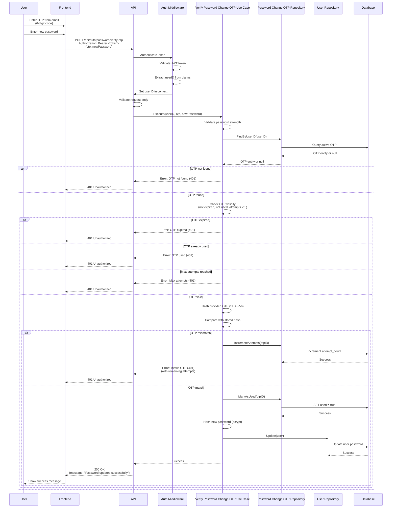

# Verify Password Change OTP API

## Overview

The Verify Password Change OTP API endpoint verifies the 6-digit OTP received via email and updates the user's password. This endpoint is used in conjunction with the Request Password Change OTP API to complete the password change flow for authenticated users.

**Endpoint:** `POST /api/auth/password/verify-otp`
**Authentication:** Required (Bearer token)

## Architectural Diagram



## Request Format

**HTTP Method:** `POST`
**Path:** `/api/auth/password/verify-otp`
**Content-Type:** `application/json`

### Request Headers

- `Authorization`: `Bearer <access_token>` (required)

### Request Body

```json
{
  "otp": "123456",
  "newPassword": "newSecurePassword123"
}
```

**Fields:**
- `otp` (required, string): 6-digit OTP from email
- `newPassword` (required, string): New password (minimum 8 characters)

## Response Format

### Success Response (200 OK)

```json
{
  "message": "Password updated successfully"
}
```

### Error Responses

#### 400 Bad Request - Invalid Request Data

```json
{
  "error": "OTP and new password are required"
}
```

#### 400 Bad Request - Invalid Password

```json
{
  "error": "Password must be at least 8 characters long"
}
```

#### 401 Unauthorized - Authentication Required

```json
{
  "error": "Authentication required"
}
```

#### 401 Unauthorized - OTP Not Found

```json
{
  "error": "OTP not found. Please request a new one."
}
```

#### 401 Unauthorized - OTP Expired

```json
{
  "error": "OTP has expired. Please request a new one."
}
```

#### 401 Unauthorized - OTP Already Used

```json
{
  "error": "OTP has already been used. Please request a new one."
}
```

#### 401 Unauthorized - Max Attempts Reached

```json
{
  "error": "Maximum attempts reached. Please request a new OTP."
}
```

#### 401 Unauthorized - Invalid OTP

```json
{
  "error": "Invalid OTP. X attempt(s) remaining."
}
```

#### 500 Internal Server Error

```json
{
  "error": "Failed to verify OTP"
}
```

#### 503 Service Unavailable - Service Not Configured

```json
{
  "error": "Password change service is not configured. Please contact support."
}
```

## Flow Details

### Step-by-Step Process

1. **Authentication**
   - Frontend sends request with access token in Authorization header
   - Middleware validates JWT token
   - Middleware extracts userID from token claims
   - Sets userID in request context

2. **Request Validation**
   - API validates request body structure
   - Validates password strength (minimum 8 characters)
   - Ensures OTP and new password are provided

3. **OTP Lookup**
   - Use case retrieves userID from context
   - Query database for active OTP by user ID
   - If OTP not found, returns 401 Unauthorized

4. **OTP Validation**
   - Check OTP is not expired (5 minutes)
   - Check OTP is not already used
   - Check attempt count is less than 5
   - If validation fails, returns 401 Unauthorized

5. **OTP Verification**
   - Hash provided OTP with SHA-256
   - Compare with stored OTP hash
   - If mismatch:
     - Increment attempt count
     - Return error with remaining attempts
   - If match:
     - Mark OTP as used
     - Proceed to password update

6. **Password Update**
   - Hash new password with bcrypt (cost: 10)
   - Update user password in database
   - Old password is replaced

7. **Response**
   - Return success message
   - Frontend shows success message
   - User can now login with new password

## Security Considerations

1. **Authentication Required**
   - Endpoint requires valid JWT token
   - Prevents unauthorized password changes
   - Ensures user identity is verified

2. **OTP Security**
   - OTPs are hashed before storage (SHA-256)
   - OTPs expire after 5 minutes
   - OTPs are single-use (marked as used after verification)
   - Maximum 5 attempts per OTP

3. **Password Security**
   - Passwords are hashed with bcrypt before storage
   - Password strength validation enforced
   - Plain text passwords never stored

4. **Attempt Limiting**
   - Maximum 5 attempts per OTP
   - Prevents brute force attacks
   - Forces OTP regeneration after max attempts

5. **OTP Validation**
   - OTP must be valid and not expired
   - OTP must not be already used
   - Attempt count must be less than 5

## Error Handling

### Missing Authentication

When access token is missing or invalid:
- Returns `401 Unauthorized` status code
- Error message: "Authentication required"
- Frontend should redirect to login page

### OTP Not Found

When no active OTP exists for user:
- Returns `401 Unauthorized` status code
- Error message: "OTP not found. Please request a new one."
- Frontend should allow requesting new OTP

### OTP Expired

When OTP has expired (5 minutes):
- Returns `401 Unauthorized` status code
- Error message: "OTP has expired. Please request a new one."
- Frontend should allow requesting new OTP

### OTP Already Used

When OTP has already been used:
- Returns `401 Unauthorized` status code
- Error message: "OTP has already been used. Please request a new one."
- Frontend should allow requesting new OTP

### Max Attempts Reached

When 5 attempts have been made:
- Returns `401 Unauthorized` status code
- Error message: "Maximum attempts reached. Please request a new OTP."
- Frontend should allow requesting new OTP

### Invalid OTP

When OTP doesn't match:
- Returns `401 Unauthorized` status code
- Error message includes remaining attempts: "Invalid OTP. X attempt(s) remaining."
- Frontend should show remaining attempts
- Attempt count is incremented

### Invalid Password

When password doesn't meet strength requirements:
- Returns `400 Bad Request` status code
- Error message describes password requirements
- Frontend should highlight password field

## Integration Points

### Backend Components

- **Handler**: `internal/interfaces/http/handlers/auth_handler.go::VerifyPasswordChangeOTP`
- **Middleware**: `internal/interfaces/http/middleware/auth_middleware.go::AuthenticateToken`
- **Use Case**: `internal/usecase/auth/verify_password_change_otp.go::VerifyPasswordChangeOTPUseCase`
- **Repository**: `internal/interfaces/repository/password_change_otp_repository.go`
- **Domain**: `internal/domain/password_change_otp.go`

### Frontend Components

- **Service**: `src/services/authService.ts::verifyPasswordChangeOTP`
- **Component**: `src/components/Profile/ProfilePage.tsx`
- **OTP Input**: 6-digit OTP input field
- **Password Input**: New password input field

## OTP Rules

- **Format**: 6-digit numeric (000000-999999)
- **Validity**: 5 minutes
- **Attempts**: Maximum 5 attempts per OTP
- **Single-Use**: OTP is marked as used after successful verification
- **Storage**: OTP is hashed with SHA-256 (not plaintext)

## Testing

### Manual Testing

```bash
# First, login to get access token
curl -X POST http://localhost:3000/api/auth/login \
  -H "Content-Type: application/json" \
  -d '{"email":"test@example.com","password":"password123"}'

# Request OTP
curl -X POST http://localhost:3000/api/auth/password/request-otp \
  -H "Authorization: Bearer <access_token>" \
  -H "Content-Type: application/json" \
  -d '{"email": "test@example.com"}'

# Extract OTP from email, then verify
curl -X POST http://localhost:3000/api/auth/password/verify-otp \
  -H "Authorization: Bearer <access_token>" \
  -H "Content-Type: application/json" \
  -d '{
    "otp": "123456",
    "newPassword": "newSecurePassword123"
  }'
```

### Expected Behavior

1. **Successful Verification:**
   - Returns 200 status code
   - Success message in response
   - User password updated in database
   - OTP marked as used
   - User can login with new password

2. **Invalid OTP:**
   - Returns 401 status code
   - Error message includes remaining attempts
   - Attempt count incremented

3. **Expired OTP:**
   - Returns 401 status code
   - Error message: "OTP has expired"

4. **Max Attempts:**
   - Returns 401 status code
   - Error message: "Maximum attempts reached"

5. **Invalid Password:**
   - Returns 400 status code
   - Error message describes password requirements

### Frontend Testing

1. Request OTP (see Request Password Change OTP API)
2. Enter 6-digit OTP from email
3. Enter new password
4. Submit form
5. Verify:
   - Success message displayed
   - Password updated
   - Can login with new password
   - OTP cannot be reused
   - Invalid OTP shows remaining attempts

## Related Documentation

- [System Design](./system-design.md) - Overall authentication architecture
- [Request Password Change OTP](./request-password-change-otp.md) - OTP request
- [Reset Password API](./reset-password.md) - Unauthenticated password reset

