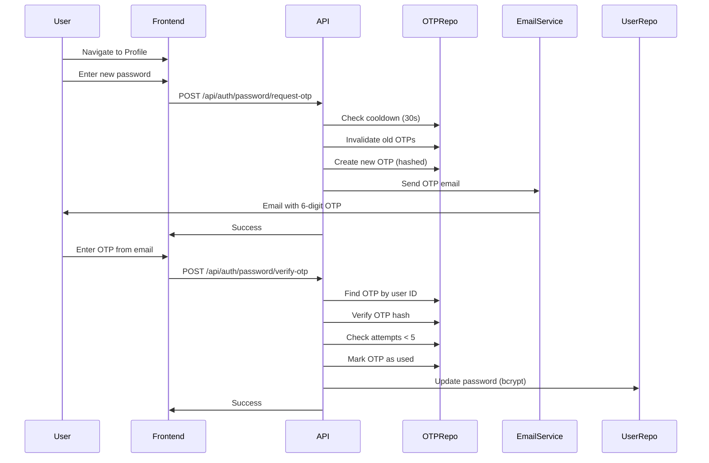

# Password Change with OTP Verification

## Overview

This feature allows authenticated users to change their password through a secure OTP (One-Time Password) verification process. The system sends a 6-digit numeric code to the user's email, which must be verified before the password can be updated.

## Architecture

### Flow Diagram



## OTP Specifications

### Format
- **Type**: 6-digit numeric
- **Range**: 000000-999999
- **Example**: 483921

### Validity
- **Duration**: 5 minutes
- **Rationale**: Balance between security and user convenience

### Security Rules

1. **Single-Use**: OTP is immediately invalidated after successful verification
2. **Regeneration**: Requesting a new OTP invalidates the previous one
3. **Attempt Limit**: Maximum 5 attempts per OTP
4. **Resend Cooldown**: 30 seconds minimum between requests
5. **Storage**: OTP is hashed with SHA-256 (not stored in plaintext)

## Backend Implementation

### Domain Layer

**File**: `internal/domain/password_change_otp.go`

**Entity**: `PasswordChangeOTP`
- `ID`: Unique identifier
- `UserID`: Associated user ID
- `Email`: User email address
- `OTPHash`: SHA-256 hash of the OTP
- `ExpiresAt`: Expiration timestamp (5 minutes)
- `AttemptCount`: Number of verification attempts
- `Used`: Whether OTP has been used
- `CreatedAt`: Creation timestamp

**Methods**:
- `IsExpired()`: Checks if OTP has expired
- `IsValid()`: Checks if OTP is valid (not expired, not used, attempts < 5)
- `IncrementAttempts()`: Increments attempt count
- `IsMaxAttemptsReached()`: Checks if max attempts reached

### Repository Layer

**Interface**: `internal/interfaces/repository/password_change_otp_repository.go`

**Methods**:
- `Create(ctx, otp)`: Create new OTP
- `FindByUserID(ctx, userID)`: Find active OTP for user
- `FindByOTPHash(ctx, hash)`: Find OTP by hash (for verification)
- `InvalidateByUserID(ctx, userID)`: Invalidate all OTPs for user
- `IncrementAttempts(ctx, otpID)`: Increment attempt count
- `MarkAsUsed(ctx, otpID)`: Mark OTP as used

**Implementation**: `internal/infrastructure/database/firestore/password_change_otp_repository.go`
- Stores OTPs in `password_change_otps` collection
- Uses SHA-256 hashing for OTP storage

### Use Case Layer

#### RequestPasswordChangeOTPUseCase

**File**: `internal/usecase/auth/request_password_change_otp.go`

**Process**:
1. Find user by ID
2. Check 30-second cooldown (compare `CreatedAt` of last OTP)
3. Invalidate existing OTPs for user
4. Generate 6-digit numeric OTP
5. Hash OTP with SHA-256
6. Create OTP entity (5-minute expiry)
7. Send OTP email
8. Return success

**Error Cases**:
- User not found: Returns error
- Cooldown not expired: Returns 429 Too Many Requests
- Email service unavailable: Logs error but continues

#### VerifyPasswordChangeOTPUseCase

**File**: `internal/usecase/auth/verify_password_change_otp.go`

**Process**:
1. Validate password strength
2. Find OTP by user ID
3. Check if expired
4. Check if already used
5. Check if max attempts reached
6. Hash provided OTP and compare with stored hash
7. If match: mark as used, update password, return success
8. If mismatch: increment attempts, return error

**Error Cases**:
- Invalid password: Returns 400 Bad Request
- OTP not found: Returns 401 Unauthorized
- OTP expired: Returns 401 Unauthorized
- OTP already used: Returns 401 Unauthorized
- Max attempts reached: Returns 401 Unauthorized
- Invalid OTP: Returns 401 Unauthorized (with remaining attempts)

### Email Service

**Template**: `internal/infrastructure/email/templates/password_change_otp.html`

**Features**:
- Large font OTP display
- Clear expiry message (5 minutes)
- Security notice
- Professional styling matching brand

**Subject**: "Your password update code (valid for 5 minutes)"

### HTTP Handlers

**File**: `internal/interfaces/http/handlers/auth_handler.go`

**Endpoints**:
- `POST /api/auth/password/request-otp`: Request OTP (authenticated, rate limited)
- `POST /api/auth/password/verify-otp`: Verify OTP (authenticated)

**Rate Limiting**: 30-second cooldown on request endpoint

## Frontend Implementation

### Service Methods

**File**: `src/services/authService.ts`

**Methods**:
- `requestPasswordChangeOTP(email)`: Request OTP
- `verifyPasswordChangeOTP(otp, newPassword)`: Verify OTP and update password

### Profile Page

**File**: `src/components/Profile/ProfilePage.tsx`

**Features**:
- User information display
- Password change form
- Two-step flow:
  1. Enter new password → request OTP
  2. Enter OTP → verify and update
- Cooldown timer (30 seconds)
- Expiry countdown (5 minutes)
- Attempt countdown (5 max)
- Error handling
- Success feedback

**States**:
- `idle`: Initial state
- `requesting`: Sending OTP request
- `otp-sent`: OTP sent, waiting for input
- `verifying`: Verifying OTP
- `success`: Password updated successfully
- `error`: Error occurred

## API Endpoints

### Request Password Change OTP

**Endpoint**: `POST /api/auth/password/request-otp`  
**Authentication**: Required (Bearer token)  
**Rate Limit**: 1 request per 30 seconds

**Request**:
```json
{
  "email": "user@example.com"
}
```

**Response** (200):
```json
{
  "message": "If an account with that email exists, we've sent a verification code."
}
```

**Error Responses**:
- `400 Bad Request`: Missing email
- `401 Unauthorized`: Authentication required
- `429 Too Many Requests`: Cooldown not expired
- `500 Internal Server Error`: Server error

### Verify Password Change OTP

**Endpoint**: `POST /api/auth/password/verify-otp`  
**Authentication**: Required (Bearer token)

**Request**:
```json
{
  "otp": "123456",
  "newPassword": "NewSecurePassword123"
}
```

**Response** (200):
```json
{
  "message": "Password updated successfully"
}
```

**Error Responses**:
- `400 Bad Request`: Invalid password or missing fields
- `401 Unauthorized`: Invalid/expired OTP, max attempts reached, or OTP already used
- `500 Internal Server Error`: Server error

## Security Considerations

1. **OTP Hashing**: SHA-256 hash stored (not plaintext)
2. **Single Use**: OTP marked as used immediately after verification
3. **Attempt Limiting**: Max 5 attempts, then force resend
4. **Expiry**: 5-minute validity enforced
5. **Cooldown**: 30-second minimum between resend requests
6. **Rate Limiting**: API-level rate limiting on request endpoint
7. **Authentication**: Both endpoints require valid JWT token
8. **Password Validation**: Uses existing password validator

## Testing

### Backend Tests

**Domain Tests**: `internal/domain/password_change_otp_test.go`
- Valid input creation
- Invalid input validation
- Expiry checks
- Validity checks
- Attempt counting

**Use Case Tests**:
- `internal/usecase/auth/request_password_change_otp_test.go`
- `internal/usecase/auth/verify_password_change_otp_test.go`

**Test Coverage**:
- Valid requests
- Cooldown enforcement
- OTP generation and hashing
- Expiry handling
- Attempt limiting
- Invalid OTP handling
- Password validation

### Frontend Tests

**Service Tests**: `src/services/authService.test.ts`
- OTP request success
- OTP verification success
- Error handling (invalid OTP, expired, max attempts, weak password)

**MSW Handlers**: `src/tests/mocks/handlers.ts`
- Mock handlers for both endpoints
- Error scenario simulation

## Database Schema

### Password Change OTPs Collection

**Collection**: `password_change_otps`

**Fields**:
- `id`: String (document ID)
- `user_id`: String (indexed)
- `email`: String
- `otp_hash`: String (SHA-256 hash, indexed)
- `expires_at`: Timestamp (indexed)
- `attempt_count`: Integer
- `used`: Boolean (indexed)
- `created_at`: Timestamp

**Indexes**:
- `user_id` + `used` (for finding active OTPs)
- `otp_hash` (for verification lookup)
- `expires_at` (for cleanup)

## Email Template

**File**: `internal/infrastructure/email/templates/password_change_otp.html`

**Features**:
- Large, readable OTP display (2.5rem font, monospace)
- Clear expiry message
- Security notice
- Brand-consistent styling
- Responsive design

## Error Messages

### User-Facing Errors

- **Cooldown**: "Please wait X seconds before requesting a new OTP"
- **Expired**: "OTP has expired. Please request a new one."
- **Used**: "OTP has already been used. Please request a new one."
- **Max Attempts**: "Maximum attempts reached. Please request a new OTP."
- **Invalid OTP**: "Invalid OTP. X attempt(s) remaining."
- **Weak Password**: "Password must be at least 8 characters long."

## Manual Testing

### Backend Testing

1. **Request OTP**:
   ```bash
   curl -X POST http://localhost:3000/api/auth/password/request-otp \
     -H "Authorization: Bearer <token>" \
     -H "Content-Type: application/json" \
     -d '{"email":"user@example.com"}'
   ```

2. **Verify OTP**:
   ```bash
   curl -X POST http://localhost:3000/api/auth/password/verify-otp \
     -H "Authorization: Bearer <token>" \
     -H "Content-Type: application/json" \
     -d '{"otp":"123456","newPassword":"NewPassword123"}'
   ```

### Frontend Testing

1. Navigate to `/profile`
2. Enter new password
3. Click "Request Verification Code"
4. Check email for 6-digit OTP
5. Enter OTP in form
6. Click "Verify & Update Password"
7. Verify success message

## Related Files

### Backend
- Domain: `internal/domain/password_change_otp.go`
- Repository Interface: `internal/interfaces/repository/password_change_otp_repository.go`
- Repository Implementation: `internal/infrastructure/database/firestore/password_change_otp_repository.go`
- Use Cases: `internal/usecase/auth/request_password_change_otp.go`, `verify_password_change_otp.go`
- Email Template: `internal/infrastructure/email/templates/password_change_otp.html`
- Handlers: `internal/interfaces/http/handlers/auth_handler.go`
- Router: `internal/interfaces/http/router.go`

### Frontend
- Service: `src/services/authService.ts`
- Component: `src/components/Profile/ProfilePage.tsx`
- Styles: `src/components/Profile/ProfilePage.css`
- Routes: `src/App.tsx`
- Navigation: `src/components/Dashboard/Dashboard.tsx`, `LayoutGallery.tsx`

## Future Enhancements

Potential improvements:
- OTP delivery via SMS (alternative to email)
- Biometric verification option
- Password history (prevent reuse)
- Account activity notifications

