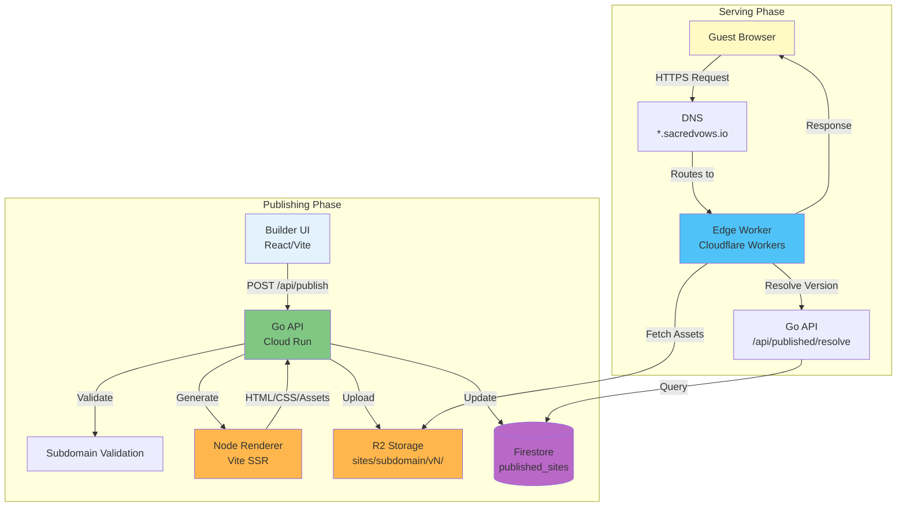
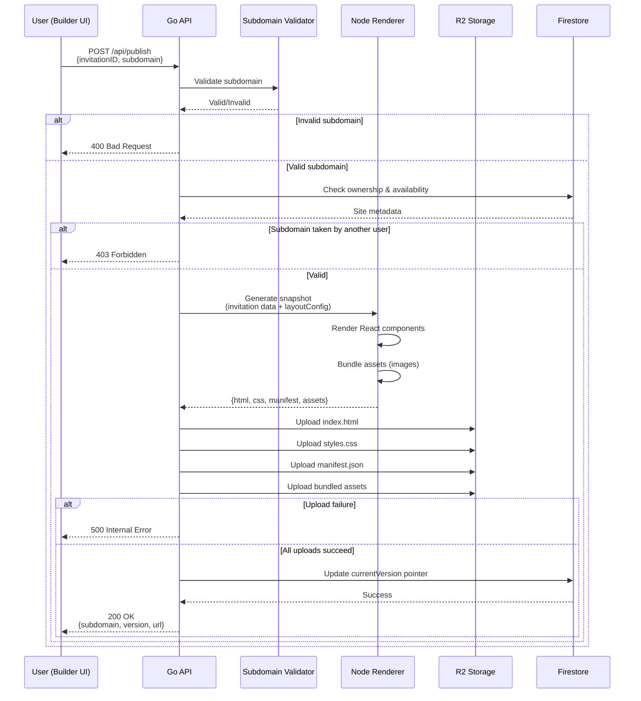
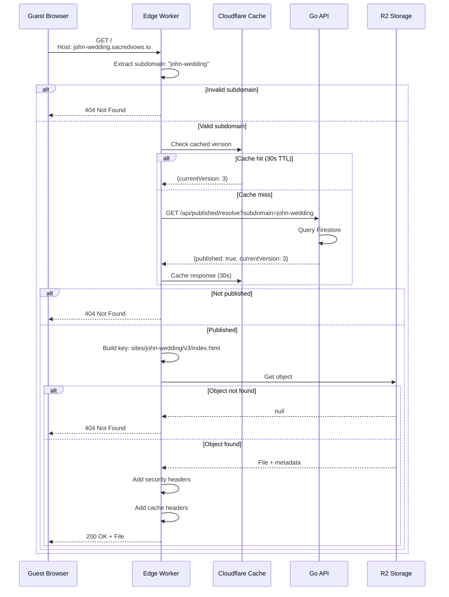
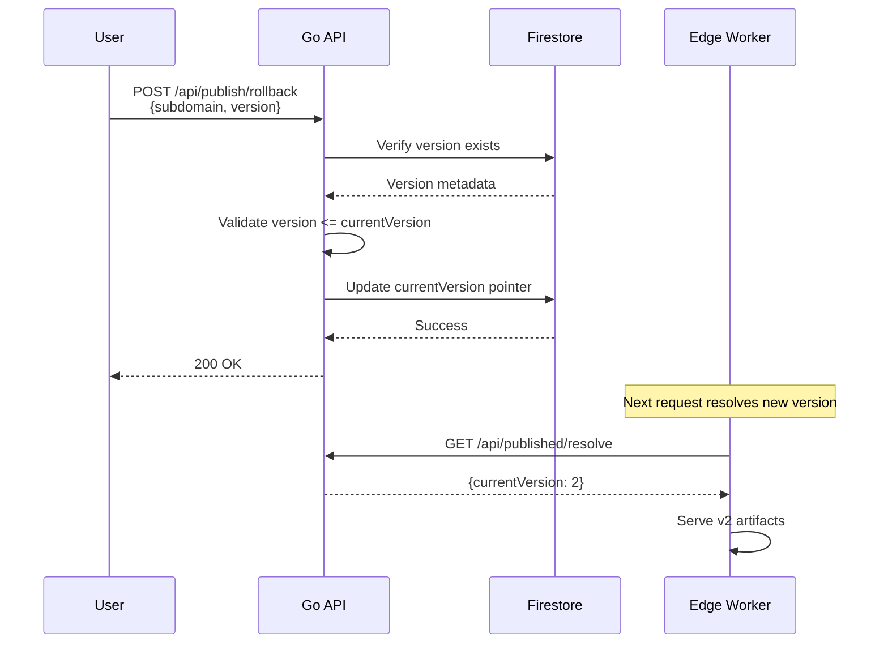

# Publishing Architecture

This document provides a comprehensive technical overview of the invitation publishing architecture in Sacred Vows, explaining the design decisions, component interactions, and implementation details.

## Table of Contents

1. [Overview](#overview)
2. [Architecture Goals](#architecture-goals)
3. [High-Level Architecture](#high-level-architecture)
4. [Component Breakdown](#component-breakdown)
5. [Publishing Flow](#publishing-flow)
6. [Serving Flow](#serving-flow)
7. [Architectural Decisions](#architectural-decisions)
8. [Versioning Strategy](#versioning-strategy)
9. [Subdomain Management](#subdomain-management)
10. [Asset Bundling](#asset-bundling)
11. [Error Handling & Observability](#error-handling--observability)
12. [Future Considerations](#future-considerations)

---

## Overview

The publishing system enables users to publish their wedding invitations to custom subdomains (e.g., `john-wedding.sacredvows.io`), making them accessible to guests worldwide. The architecture separates concerns between:

- **Publishing** (backend API): Validates, generates snapshots, and stores artifacts
- **Serving** (edge worker): Efficiently serves static content from edge locations
- **Storage** (R2): Versioned artifact storage with immutable deployments

This separation allows for:
- **Scalability**: Edge serving handles traffic spikes without backend load
- **Performance**: Static assets served from edge locations near users
- **Reliability**: Immutable versioned deployments enable safe rollbacks
- **Cost Efficiency**: Static serving is significantly cheaper than dynamic rendering

---

## Architecture Goals

### Primary Goals

1. **Subdomain-Based Hosting**: Each invitation gets a unique subdomain without deploying a new application
2. **Static Site Generation**: Pre-render invitations to static HTML/CSS for optimal performance
3. **Versioned Deployments**: Support immutable versioning with rollback capability
4. **Edge Performance**: Serve content from edge locations for global low latency
5. **Consistency**: Published sites must exactly match builder preview

### Non-Goals

- Custom domain support (future enhancement)
- Dynamic content generation at request time
- Multi-tenant application deployments per invitation
- Real-time content updates (requires republishing)

---

## High-Level Architecture



### Key Separation

- **Publishing**: Backend API handles all write operations (validation, generation, storage)
- **Serving**: Edge Worker handles all read operations (version resolution, asset fetching)
- **Storage**: R2 stores versioned static artifacts; Firestore stores metadata

---

## Component Breakdown

### 1. Builder UI (`apps/builder`)

**Role**: User interface for publishing invitations

**Responsibilities**:
- Subdomain input and validation
- Publish button and status feedback
- Error handling and user messaging

**Key Features**:
- Real-time subdomain validation via `/api/publish/validate`
- Autosave of invitation data (including `layoutConfig`)
- Preview that matches published output exactly

### 2. Go API (`apps/api-go`)

**Role**: Backend service handling publishing logic

**Key Components**:

#### Publish Use Case (`internal/usecase/publish/publish.go`)
- Orchestrates the entire publishing flow
- Validates subdomain and ownership
- Generates snapshot bundle
- Stores artifacts atomically
- Updates version pointers

#### Subdomain Validation (`internal/usecase/publish/subdomain.go`)
- Normalizes subdomain format
- Validates against reserved subdomains
- Checks availability and ownership

#### Snapshot Generator (`internal/infrastructure/publish/node_renderer.go`)
- Invokes Node.js renderer
- Passes invitation data (including `layoutConfig`)
- Receives HTML, CSS, manifest, and bundled assets

#### Artifact Storage (`internal/infrastructure/publish/r2_artifacts.go`)
- Uploads versioned artifacts to R2
- Manages cache headers
- Handles version cleanup

#### Published Site Repository (`internal/infrastructure/database/firestore/published_site_repository.go`)
- Stores metadata (subdomain, version, ownership)
- Manages version pointers
- Supports version listing and rollback

### 3. Node Renderer (`apps/renderer`)

**Role**: Server-side rendering engine for generating static HTML

**Architecture**:
- **Vite SSR**: Uses Vite's SSR capabilities for modern tooling
- **React SSR**: Renders React components to static HTML using `renderToStaticMarkup`
- **Shared Components**: Reuses layout components from `@shared` package
- **Asset Bundling**: Downloads and embeds images during SSR

**Key Files**:
- `src/entry-server.tsx`: Main render function
- `src/InvitationPage.tsx`: React component that renders invitation
- `src/render.ts`: CLI entry point for Go API invocation

**Why Node.js Renderer?**

1. **Consistency**: Uses the same React components as the builder preview, ensuring 1:1 visual parity
2. **Modern Tooling**: Vite provides fast builds, TypeScript support, and CSS handling
3. **Code Reuse**: Shared layouts between builder and renderer reduce duplication
4. **Flexibility**: Easy to add new layouts without changing the publishing pipeline

### 4. Edge Worker (`apps/edge-worker`)

**Role**: Edge service for serving published sites

**Responsibilities**:
- Extract subdomain from `Host` header
- Resolve current version via API
- Fetch assets from R2
- Apply security and cache headers
- Handle 404s gracefully

**Key Features**:
- **Edge Performance**: Runs at Cloudflare edge locations worldwide
- **Caching**: Caches version resolution responses (30s TTL)
- **Security Headers**: CSP, X-Frame-Options, etc.
- **Cache Strategy**: Long cache for versioned assets, short cache for HTML

### 5. Storage Systems

#### Cloudflare R2
- **Purpose**: Object storage for versioned static artifacts
- **Structure**: `sites/<subdomain>/v<version>/<file>`
- **Benefits**:
  - No egress fees (unlike S3)
  - Global edge network
  - Compatible with S3 API

#### Firestore
- **Purpose**: Metadata storage for published sites
- **Schema**: `published_sites` collection
- **Fields**: `subdomain`, `invitationID`, `currentVersion`, `published`, `ownerUserID`

---

## Publishing Flow

### Step-by-Step Process



### Detailed Flow

1. **User Initiates Publish**
   - User clicks "Publish" in Builder UI
   - Frontend sends `POST /api/publish` with `invitationID` and `subdomain`

2. **Authentication & Authorization**
   - API extracts `userID` from JWT token
   - Verifies invitation ownership

3. **Subdomain Validation**
   - Normalizes subdomain (lowercase, trim, etc.)
   - Checks against reserved subdomains (`www`, `api`, `admin`, etc.)
   - Validates format (alphanumeric + hyphens, length limits)
   - Checks if subdomain is available or owned by current user

4. **Snapshot Generation**
   - API invokes Node renderer: `node render.js --mode=bundle`
   - Passes invitation data via stdin (JSON)
   - Renderer:
     - Parses invitation data and `layoutConfig`
     - Renders `InvitationPage` React component using `renderToStaticMarkup`
     - Generates CSS using layout export functions
     - Bundles assets (downloads images, converts to base64 or rewrites URLs)
     - Returns JSON bundle: `{html, css, manifest, assets: []}`

5. **Artifact Storage**
   - Calculates new version: `currentVersion + 1`
   - Constructs prefix: `sites/<subdomain>/v<version>/`
   - Uploads artifacts atomically:
     - `index.html` (main HTML)
     - `styles.css` (compiled CSS)
     - `manifest.json` (PWA manifest)
     - `assets/*` (bundled images)
   - Sets cache headers: `public, max-age=31536000, immutable` for versioned assets

6. **Version Pointer Update**
   - Only after all uploads succeed, updates Firestore:
     - `currentVersion = newVersion`
     - `published = true`
     - `publishedAt = now()`
   - This ensures atomicity: if uploads fail, version pointer doesn't advance

7. **Response**
   - Returns success response with:
     - `subdomain`: Normalized subdomain
     - `version`: New version number
     - `url`: Full URL to published site

8. **Background Cleanup** (async)
   - Deletes old versions beyond retention count (default: 3)
   - Runs in background goroutine to not block response

---

## Serving Flow

### Request Lifecycle



### Detailed Steps

1. **Request Arrives at Edge**
   - Guest navigates to `https://john-wedding.sacredvows.io/`
   - DNS routes to Cloudflare Workers edge location

2. **Subdomain Extraction**
   - Worker reads `Host` header: `john-wedding.sacredvows.io`
   - Extracts subdomain: `john-wedding`
   - Returns 404 if host doesn't match base domain pattern

3. **Version Resolution**
   - Checks Cloudflare cache first (30s TTL)
   - If cache miss, calls `GET /api/published/resolve?subdomain=john-wedding`
   - API queries Firestore for `published_sites` document
   - Returns `{subdomain, published, currentVersion}` or 404
   - Worker caches response for 30 seconds

4. **Path Normalization**
   - `/` → `/index.html`
   - `/about/` → `/about/index.html`
   - Preserves query strings and fragments

5. **Asset Retrieval**
   - Constructs R2 key: `sites/<subdomain>/v<currentVersion>/<path>`
   - Fetches object from R2 bucket
   - Returns 404 if object doesn't exist

6. **Response Headers**
   - **Content-Type**: Inferred from file extension if missing
   - **Security Headers**:
     - `Content-Security-Policy`: Restricts resource loading
     - `X-Frame-Options`: Prevents clickjacking
     - `X-Content-Type-Options`: Prevents MIME sniffing
   - **Cache Headers**:
     - HTML: `Cache-Control: public, max-age=60, stale-while-revalidate=300`
     - Assets: `Cache-Control: public, max-age=31536000, immutable`
   - **ETag**: Preserved from R2 metadata

7. **Response**
   - Returns file content with headers
   - Guest browser caches according to headers

---

## Architectural Decisions

### 1. Why Static Site Generation?

**Decision**: Pre-render invitations to static HTML/CSS at publish time

**Rationale**:
- **Performance**: Static files serve instantly, no server-side rendering delay
- **Scalability**: Edge workers can serve millions of requests without backend load
- **Cost**: Static serving is orders of magnitude cheaper than dynamic rendering
- **Reliability**: No runtime errors, no database queries per request
- **SEO**: Static HTML is fully crawlable by search engines

**Trade-offs**:
- ✅ Pros: Fast, cheap, reliable, scalable
- ❌ Cons: Requires republishing for content changes (acceptable for wedding invitations)

### 2. Why Separate Publishing and Serving?

**Decision**: Backend API handles publishing; Edge Worker handles serving

**Rationale**:
- **Separation of Concerns**: Write operations (publishing) vs read operations (serving)
- **Scalability**: Serving doesn't require backend resources
- **Performance**: Edge serving provides global low latency
- **Cost**: Edge workers are cheaper than keeping backend instances warm
- **Reliability**: Serving failures don't affect publishing, and vice versa

**Alternative Considered**: Single backend serving both
- ❌ Rejected: Would require backend instances to handle all traffic, increasing cost and latency

### 3. Why Versioned Artifacts?

**Decision**: Store artifacts with version prefixes (`sites/subdomain/v1/`, `v2/`, etc.)

**Rationale**:
- **Immutable Deployments**: Each publish creates a new version directory
- **Safe Republishing**: New versions don't overwrite old files
- **Rollback Capability**: Previous versions remain accessible
- **Long-Term Caching**: Versioned assets can be cached indefinitely (`immutable`)
- **Atomic Updates**: Version pointer update is separate from artifact uploads

**Alternative Considered**: Overwrite existing files
- ❌ Rejected: No rollback capability, cache invalidation issues, risk of partial updates

### 4. Why Node.js Renderer?

**Decision**: Use Node.js with Vite SSR for rendering

**Rationale**:
- **Consistency**: Uses same React components as builder preview
- **Modern Tooling**: Vite provides fast builds, TypeScript, CSS handling
- **Code Reuse**: Shared layouts between builder and renderer
- **Flexibility**: Easy to add new layouts without changing pipeline
- **Asset Bundling**: Can download and embed images during SSR

**Alternatives Considered**:
- **Go Template Engine**: ❌ Rejected - Would require duplicating layout logic
- **Python/Other**: ❌ Rejected - No React component reuse, additional language overhead

### 5. Why React SSR Instead of Template Strings?

**Decision**: Use `renderToStaticMarkup` to render React components

**Rationale**:
- **Consistency**: Same components as builder preview = guaranteed visual parity
- **Maintainability**: Single source of truth for layout rendering
- **Type Safety**: TypeScript ensures data structure compatibility
- **Developer Experience**: React is familiar to frontend team

**Alternative Considered**: Template strings (like original export functions)
- ❌ Rejected: Would require maintaining separate rendering logic, risk of divergence

### 6. Why Edge Worker for Serving?

**Decision**: Use Cloudflare Workers at edge locations

**Rationale**:
- **Global Performance**: Serves from edge locations near users
- **Low Latency**: First byte time < 50ms from most locations
- **Cost Efficiency**: Pay per request, no idle costs
- **Automatic Scaling**: Handles traffic spikes without configuration
- **Security**: Built-in DDoS protection, WAF capabilities

**Alternatives Considered**:
- **Cloud Run**: ❌ Rejected - Higher latency, requires keeping instances warm
- **Cloudflare Pages**: ❌ Rejected - Less control over routing and headers
- **Direct R2 Public Access**: ❌ Rejected - No version resolution, no custom headers

### 7. Why R2 for Storage?

**Decision**: Use Cloudflare R2 for artifact storage

**Rationale**:
- **No Egress Fees**: Unlike S3, no charges for data transfer
- **S3-Compatible API**: Easy migration, familiar tooling
- **Global Edge Network**: Assets served from edge locations
- **Cost Effective**: Storage costs are competitive
- **Integration**: Works seamlessly with Cloudflare Workers

**Alternative Considered**: Google Cloud Storage
- ❌ Rejected: Egress fees would be significant for high-traffic sites

### 8. Why Firestore for Metadata?

**Decision**: Use Firestore for published site metadata

**Rationale**:
- **Existing Infrastructure**: Already used for other data
- **Low Latency**: Fast queries for version resolution
- **Consistency**: Single database for all application data
- **Real-time Capabilities**: Can support real-time updates if needed

**Alternative Considered**: R2 metadata
- ❌ Rejected: Would require listing objects, slower and more expensive

### 9. Why Atomic Version Updates?

**Decision**: Only update version pointer after all artifact uploads succeed

**Rationale**:
- **Data Integrity**: Prevents serving partial/incomplete sites
- **Rollback Safety**: If uploads fail, old version remains active
- **Consistency**: All-or-nothing publishing ensures site completeness

**Implementation**:
- Upload all artifacts first
- Only if all succeed, update `currentVersion` in Firestore
- If any upload fails, return error and don't advance version

### 10. Why Cache Version Resolution?

**Decision**: Cache version resolution responses for 30 seconds

**Rationale**:
- **Reduced API Load**: Most requests don't hit backend API
- **Performance**: Faster response times for cached requests
- **Cost**: Fewer API calls = lower costs
- **Acceptable Staleness**: 30s delay for new publishes is acceptable

**Trade-offs**:
- ✅ Pros: Performance, cost, reduced backend load
- ❌ Cons: 30s delay before new publishes are visible (acceptable)

---

## Versioning Strategy

### Version Numbering

- **Initial Publish**: Version 1
- **Subsequent Publishes**: Increment by 1 (`currentVersion + 1`)
- **Rollback**: Can revert to any previous version (within retention window)

### Version Structure in R2

```
sites/
  └── john-wedding/
      ├── v1/
      │   ├── index.html
      │   ├── styles.css
      │   ├── manifest.json
      │   └── assets/
      │       ├── image1.jpg
      │       └── image2.png
      ├── v2/
      │   ├── index.html
      │   ├── styles.css
      │   └── ...
      └── v3/  (current)
          ├── index.html
          ├── styles.css
          └── ...
```

### Version Retention

- **Default**: Keep last 3 versions
- **Configurable**: Via `PUBLISH_VERSION_RETENTION_COUNT` environment variable
- **Cleanup**: Runs in background goroutine after successful publish
- **Rollback Window**: Can rollback to any version within retention count

### Rollback Flow



---

## Subdomain Management

### Subdomain Format

- **Allowed Characters**: Alphanumeric and hyphens (`a-z`, `0-9`, `-`)
- **Length**: 3-63 characters
- **Case**: Normalized to lowercase
- **Format**: `^[a-z0-9]([a-z0-9-]*[a-z0-9])?$`

### Validation Rules

1. **Format Validation**: Must match regex pattern
2. **Reserved Subdomains**: Cannot use `www`, `api`, `admin`, `app`, etc.
3. **Availability Check**: Subdomain must be available or owned by current user
4. **Ownership Verification**: User must own the invitation being published

### Reserved Subdomains

- `www`, `api`, `admin`, `app`, `mail`, `ftp`, `localhost`
- System subdomains for internal use
- Configurable via code (can be extended)

### Subdomain Normalization

```go
func NormalizeSubdomain(raw string) (string, error) {
    // 1. Trim whitespace
    // 2. Convert to lowercase
    // 3. Remove leading/trailing hyphens
    // 4. Validate format
    // 5. Check length
}
```

---

## Asset Bundling

### Asset Types

1. **Images**: Photos, icons, backgrounds
2. **Fonts**: Custom web fonts (handled via CSS imports)
3. **Manifest**: PWA manifest for installability

### Bundling Strategy

**During SSR**:
1. Renderer scans HTML for image URLs
2. Downloads images from MinIO/CDN
3. Converts to base64 or rewrites URLs to relative paths
4. Embeds or uploads as separate assets

**Image URL Rewriting**:
- **Before**: `http://minio:9000/sacred-vows-public-assets-local/defaults/couple1/bride/1.jpeg`
- **After**: `./assets/1.jpeg` (relative path in published site)

**Asset Storage**:
- Stored in `sites/<subdomain>/v<version>/assets/` directory
- Content-Type preserved from original
- Cache headers: `public, max-age=31536000, immutable`

### Default Assets

- **Fallback Images**: Used when user hasn't uploaded custom images
- **Path Conversion**: Builder paths (`/assets/photos/...`) converted to CDN URLs
- **Utility Function**: `convertAssetPathToUrl()` handles path conversion

---

## Error Handling & Observability

### Error Scenarios

1. **Invalid Subdomain**
   - Format validation fails
   - Reserved subdomain
   - Returns: `400 Bad Request`

2. **Subdomain Taken**
   - Another user owns the subdomain
   - Returns: `403 Forbidden`

3. **Render Failure**
   - Node renderer crashes or times out
   - Returns: `500 Internal Server Error`
   - Version pointer not advanced

4. **Upload Failure**
   - R2 upload fails (network, permissions, etc.)
   - Returns: `500 Internal Server Error`
   - Version pointer not advanced (atomicity)

5. **Version Resolution Failure**
   - Firestore query fails
   - Returns: `404 Not Found` (graceful degradation)

### Observability

**Metrics Tracked**:
- `publish_attempt_total`: Total publish attempts (success/failure)
- `invitation_published_total`: Successful publishes
- `publish_duration_seconds`: Time taken for publish operation

**Logging**:
- Structured logging with Zap
- Fields: `userId`, `invitationId`, `subdomain`, `version`, `error`

**Monitoring**:
- Prometheus metrics exported
- Grafana dashboards for visualization
- Alerts for high failure rates

---

## Future Considerations

### Potential Enhancements

1. **Custom Domains**
   - Allow users to connect their own domains
   - DNS verification and SSL certificate management
   - CNAME records pointing to edge worker

2. **Preview Deployments**
   - Publish to preview subdomains before going live
   - Share preview links for feedback
   - Merge preview to production

3. **A/B Testing**
   - Support multiple versions simultaneously
   - Route traffic based on rules
   - Analytics for variant performance

4. **Incremental Updates**
   - Update specific sections without full republish
   - Partial asset updates
   - Faster iteration cycles

5. **CDN Integration**
   - Additional CDN layer for even better performance
   - Custom cache invalidation strategies
   - Geographic routing

6. **Analytics Integration**
   - Track page views, user engagement
   - Guest interaction metrics
   - Conversion tracking (RSVP, etc.)

### Scalability Considerations

**Current Limits**:
- Subdomain length: 63 characters
- Version retention: Configurable (default 3)
- Asset size: Limited by R2 object size limits

**Scaling Strategies**:
- Horizontal scaling: Edge workers scale automatically
- Storage: R2 handles petabytes of data
- API: Cloud Run auto-scales based on traffic
- Database: Firestore scales automatically

---

## Conclusion

The publishing architecture in Sacred Vows is designed for:

- **Performance**: Edge serving, static generation, long-term caching
- **Reliability**: Atomic updates, versioning, rollback capability
- **Scalability**: Separation of concerns, edge distribution, auto-scaling
- **Cost Efficiency**: Static serving, no egress fees, pay-per-use
- **Consistency**: Shared components ensure builder-published parity

This architecture enables the platform to serve millions of published invitations efficiently while maintaining low operational costs and high reliability.

