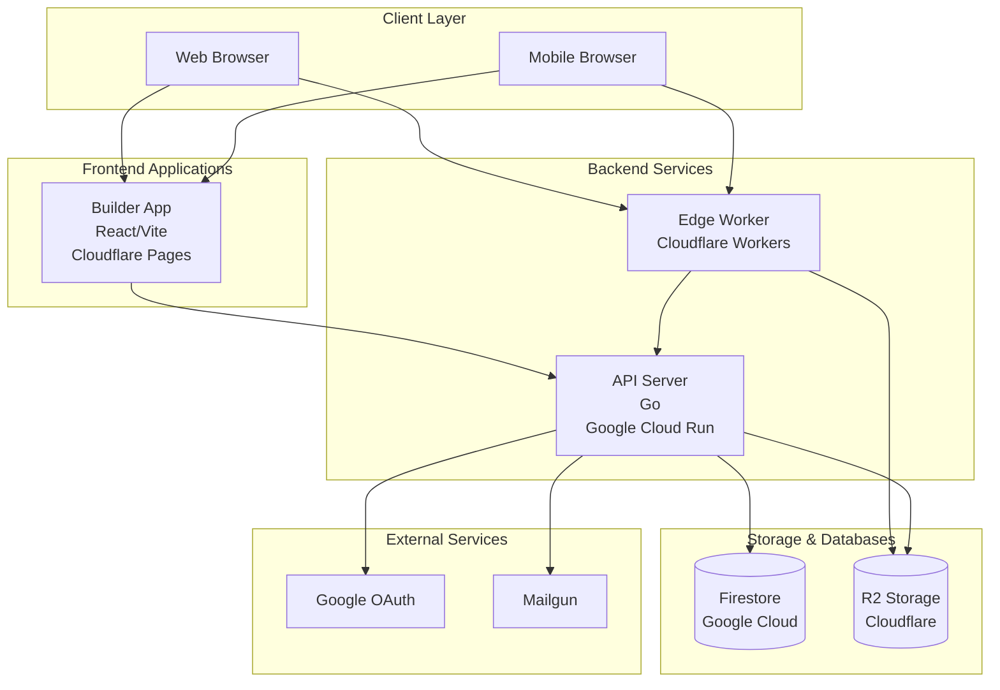

# System Overview

This document provides a high-level overview of the Sacred Vows architecture and system components.

## Architecture Diagram

## System Components

### Frontend Applications

#### Builder App
- **Technology**: React 18, Vite, TypeScript
- **Deployment**: Cloudflare Pages
- **Purpose**: Web-based interface for creating and customizing wedding invitations
- **Features**:
  - Real-time preview
  - Layout selection
  - Asset management
  - Theme customization
  - Multi-language support

### Backend Services

#### API Server
- **Technology**: Go, Clean Architecture
- **Deployment**: Google Cloud Run
- **Purpose**: REST API for all backend operations
- **Features**:
  - User authentication (JWT, OAuth)
  - Invitation CRUD operations
  - Asset upload and management
  - Publishing workflow
  - RSVP tracking
  - Analytics

#### Edge Worker
- **Technology**: Cloudflare Workers, TypeScript
- **Deployment**: Cloudflare Workers
- **Purpose**: Serve published invitation sites from R2
- **Features**:
  - Subdomain-based routing
  - Version resolution
  - Caching strategies
  - Security headers

### Storage & Databases

#### Firestore
- **Provider**: Google Cloud Firestore
- **Purpose**: Primary database for user data, invitations, and metadata
- **Data Stored**:
  - User accounts
  - Invitations
  - Published site mappings
  - RSVP responses
  - Analytics data

#### R2 Storage
- **Provider**: Cloudflare R2
- **Purpose**: Object storage for published sites and public assets
- **Data Stored**:
  - Published site artifacts (HTML, CSS, JS)
  - Public assets (images, layouts, music)
  - Versioned site snapshots

### External Services

#### Google OAuth
- **Purpose**: User authentication via Google accounts

#### Mailgun
- **Purpose**: Email delivery for notifications and password resets

## Data Flow

### Publishing Flow

1. User creates invitation in Builder app
2. User clicks "Publish" with subdomain
3. Builder sends publish request to API
4. API validates subdomain and ownership
5. API generates static snapshot using Node renderer
6. API uploads artifacts to R2 with versioning
7. API updates published site mapping in Firestore
8. API returns published URL to Builder

### Serving Published Sites

1. Guest visits subdomain URL (e.g., `john-wedding.sacredvows.io`)
2. Edge Worker extracts subdomain from Host header
3. Worker calls API to resolve current version
4. Worker fetches artifacts from R2 using versioned path
5. Worker serves content with appropriate caching headers

### Authentication Flow

1. User initiates login/registration in Builder
2. Builder sends credentials to API
3. API validates credentials or OAuth token
4. API generates JWT access token and refresh token
5. API stores refresh token in Firestore
6. Builder stores access token (in-memory)
7. Builder includes token in subsequent API requests

## Infrastructure

### Google Cloud Platform

- **Cloud Run**: Hosts API server
- **Firestore**: Primary database
- **Artifact Registry**: Docker image storage
- **Secret Manager**: Sensitive configuration

### Cloudflare

- **Pages**: Hosts Builder app
- **Workers**: Edge computing for published sites
- **R2**: Object storage
- **DNS**: Domain management

## Observability

- **Tempo**: Distributed tracing backend
- **Prometheus**: Metrics collection
- **Grafana**: Visualization and dashboards
- **OpenTelemetry**: Vendor-neutral telemetry protocol

## Security

- JWT-based authentication with refresh token rotation
- HttpOnly cookies for refresh tokens
- CORS policies for API access
- Security headers on public sites
- Environment-based configuration separation

## Scalability

- Serverless architecture (Cloud Run, Workers)
- Stateless API design
- CDN-backed asset delivery (R2)
- Horizontal scaling via Cloud Run
- Edge computing for low latency

## Related Documentation

- [Project Goals](./goal.md) - Vision and objectives
- [Publishing Process](./publishing-process.md) - Detailed publishing flow
- [Authentication](./authentication.md) - Auth system details
- [Deployment Guide](../infrastructure/deployment/overview.md) - Deployment architecture

