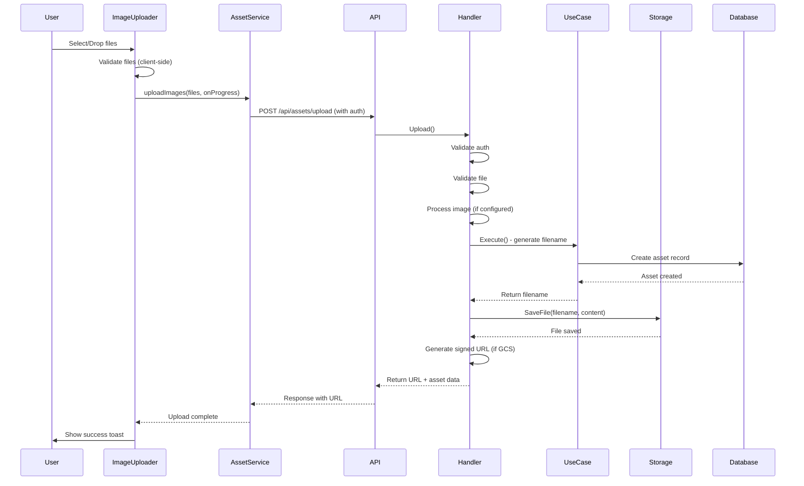
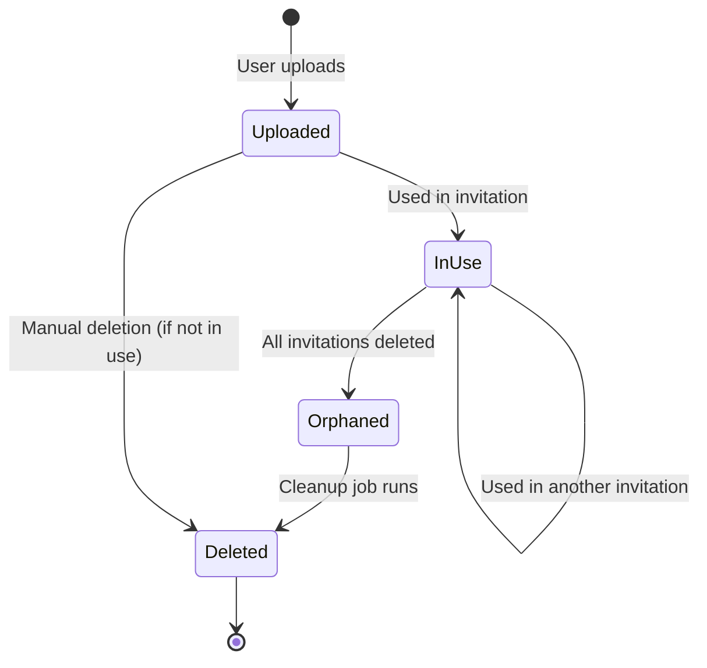
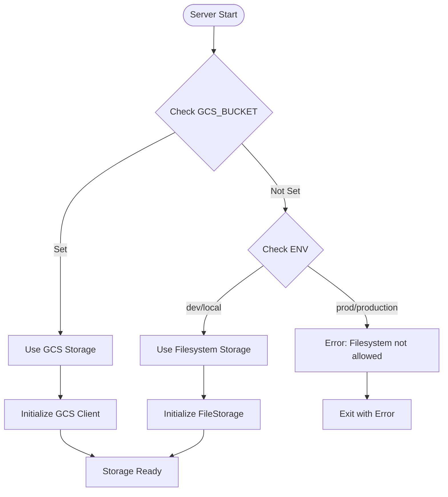

# Builder Asset Architecture

## Overview

This document describes the complete architecture for uploading, accessing, and managing assets (images) in the Sacred Vows builder application. Assets are user-uploaded photos that are stored in cloud storage and associated with user accounts and invitations.

## Table of Contents

1. [Asset Upload Architecture](#asset-upload-architecture)
2. [Asset Access Patterns](#asset-access-patterns)
3. [Asset Lifecycle](#asset-lifecycle)
4. [Storage Backends](#storage-backends)
5. [Database Schema](#database-schema)
6. [Security Considerations](#security-considerations)
7. [Error Handling](#error-handling)
8. [Diagrams](#diagrams)

## Asset Upload Architecture

### Frontend Upload Flow

#### ImageUploader Component
- **Location**: `apps/builder/src/components/AssetManager/ImageUploader.jsx`
- **Features**:
  - Supports multiple file uploads (drag & drop or file picker)
  - Client-side validation (file type, size)
  - Upload progress indicators for each file
  - Auto-retry with exponential backoff on failures
  - Toast notifications and inline error messages
  - Uses `assetService.uploadImage()` for single files or `uploadImages()` for multiple

#### EditableImage Component
- **Location**: `apps/builder/src/layouts/classic-scroll/components/shared/EditableImage.jsx`
- **Features**:
  - Single file upload for inline image replacement
  - Upload progress indicator
  - Auto-retry on failure
  - Toast notifications for success/error

#### Asset Service
- **Location**: `apps/builder/src/services/assetService.js`
- **Functions**:
  - `uploadImage(file, onProgress)` - Upload single image with progress tracking
  - `uploadImages(files, onFileProgress)` - Upload multiple images
  - `getAssetCountByUrls(urls)` - Get count of assets by URLs
  - `deleteImage(imageUrl)` - Delete an asset
  - `getAssets()` - Get all assets for current user
- **Features**:
  - Uses XMLHttpRequest for progress tracking
  - Retry logic with exponential backoff (max 3 retries)
  - Proper error handling (no silent fallbacks)

### Backend Upload Flow

#### API Endpoint
- **Route**: `POST /api/assets/upload`
- **Authentication**: Required (Bearer token)
- **Content-Type**: `multipart/form-data`
- **Request**: FormData with `image` field

#### Handler Processing
- **Location**: `apps/api-go/internal/interfaces/http/handlers/asset_handler.go`
- **Steps**:
  1. Validate authentication (401 if not authenticated)
  2. Extract file from FormData
  3. Read file content into buffer
  4. Validate file (size, MIME type)
  5. Process image (resize/compress if configured)
  6. Call use case to generate filename and create DB record
  7. Save file to storage using use case's filename
  8. Generate signed URL if using GCS
  9. Return URL and asset metadata

#### Use Case Execution
- **Location**: `apps/api-go/internal/usecase/asset/upload.go`
- **Steps**:
  1. Generate unique filename (ksuid + extension)
  2. Create asset entity with filename
  3. Save to database
  4. Return filename and asset data

#### Image Processing
- **Location**: `apps/api-go/internal/infrastructure/storage/image_processor.go`
- **Features**:
  - Resize images maintaining aspect ratio (if max dimensions configured)
  - Compress JPEG images (configurable quality)
  - Supports JPEG, PNG formats
  - WebP support requires additional dependencies

## Asset Access Patterns

### Retrieving Assets

#### Get All Assets
- **Route**: `GET /api/assets`
- **Authentication**: Required
- **Returns**: Array of assets for the authenticated user
- **Signed URLs**: Automatically generated for GCS assets

#### Get Asset Count by URLs
- **Route**: `POST /api/assets/count-by-urls`
- **Authentication**: Required
- **Request**: `{ "urls": ["/uploads/...", ...] }`
- **Returns**: `{ "count": 5 }`
- **Use Case**: Used by delete modal to show how many assets will be deleted

### Signed URL Generation

#### GCS Storage
- **Expiration**: Configurable (default: 1 hour)
- **Method**: Uses IAM SignBlob API
- **Auto-refresh**: Frontend can refresh URLs before expiration
- **Location**: `apps/api-go/internal/infrastructure/storage/gcs.go`

#### Filesystem Storage
- **URL Pattern**: `/uploads/{filename}`
- **Access**: Direct file serving (development only)
- **Production**: Filesystem storage is blocked in production

## Asset Lifecycle

### Creation Flow

```
User uploads image
  ↓
Frontend validates (size, type)
  ↓
POST /api/assets/upload
  ↓
Backend validates authentication
  ↓
Backend validates file
  ↓
Backend processes image (resize/compress)
  ↓
Use case generates unique filename
  ↓
Use case creates DB record
  ↓
Handler saves file to storage
  ↓
Handler generates signed URL (if GCS)
  ↓
Returns URL to frontend
  ↓
Frontend updates UI
```

### Usage Tracking

Assets are tracked when used in invitations:
- **On Invitation Create**: Extract asset URLs, track usage
- **On Invitation Update**: Update usage tracking (remove old, add new)
- **On Invitation Delete**: Untrack usage, delete assets if not used elsewhere

**Storage**: `asset_usage` collection in Firestore
- Document ID: `{assetID}_{invitationID}`
- Fields: `asset_id`, `invitation_id`, `created_at`

### Deletion Flow

#### Manual Deletion
- **Route**: `DELETE /api/assets/delete`
- **Authentication**: Required
- **Process**:
  1. Find asset by URL
  2. Check if used by any invitation
  3. Delete from database
  4. Delete from storage

#### Invitation Deletion
- **Process**:
  1. Extract asset URLs from invitation data
  2. Delete invitation
  3. Untrack asset usage
  4. For each asset:
     - Check if used by other invitations
     - If not used, delete from database and storage

#### Cleanup Job
- **Location**: `apps/api-go/cmd/cleanup/main.go`
- **Purpose**: Find and delete orphaned assets
- **Types of Orphans**:
  - Assets in DB but not in storage
  - Assets in storage but not in DB
  - Assets not used by any invitation
- **Usage**: `make cleanup` (dry-run) or `make cleanup-exec` (actual deletion)

## Storage Backends

### GCS Storage (Production)

- **Configuration**: Set `GCS_ASSETS_BUCKET` environment variable
- **Access**: Private bucket, accessed via signed URLs
- **Features**:
  - Automatic signed URL generation
  - Configurable expiration
  - Private by default (no public access)
- **Location**: `apps/api-go/internal/infrastructure/storage/gcs.go`

### Filesystem Storage (Development)

- **Configuration**: `UPLOAD_PATH` environment variable (default: `./uploads`)
- **Access**: Direct file serving
- **Restrictions**: Blocked in production (validated on startup)
- **Location**: `apps/api-go/internal/infrastructure/storage/filesystem.go`

### Storage Selection

Storage backend is selected based on configuration:
```go
if cfg.Storage.GCSBucket != "" {
    // Use GCS
} else {
    // Use filesystem (only if not production)
}
```

## Database Schema

### Asset Entity

```go
type Asset struct {
    ID           string
    URL          string        // e.g., "/uploads/{filename}"
    Filename     string        // Unique filename (ksuid + ext)
    OriginalName string        // Original filename from user
    Size         int64         // File size in bytes
    MimeType     string        // e.g., "image/jpeg"
    UserID       string        // Owner user ID
    CreatedAt    time.Time
}
```

### Firestore Collection: `assets`

- **Document ID**: Asset ID (ksuid)
- **Fields**:
  - `id`: string
  - `url`: string
  - `filename`: string
  - `original_name`: string
  - `size`: int64
  - `mime_type`: string
  - `user_id`: string
  - `created_at`: timestamp

### Firestore Collection: `asset_usage`

- **Document ID**: `{assetID}_{invitationID}`
- **Fields**:
  - `asset_id`: string
  - `invitation_id`: string
  - `created_at`: timestamp

### Indexing Requirements

- **Collection**: `assets`
  - Index on `user_id` (for `FindByUserID`)
  - Index on `url` (for `FindByURL`)

- **Collection**: `asset_usage`
  - Index on `asset_id` (for finding usage)
  - Index on `invitation_id` (for untracking)

## Security Considerations

### Authentication

- **Required**: All asset operations require authentication
- **Middleware**: `AuthenticateToken` (not `OptionalAuth`)
- **Endpoints**:
  - `POST /api/assets/upload` - Requires auth
  - `GET /api/assets` - Requires auth
  - `DELETE /api/assets/delete` - Requires auth
  - `POST /api/assets/count-by-urls` - Requires auth

### File Validation

- **Size Limit**: Configurable per environment (default: 10MB)
- **Allowed Types**: `image/jpeg`, `image/jpg`, `image/png`, `image/gif`, `image/webp`
- **Validation Points**:
  - Client-side (before upload)
  - Handler (server-side)

### Access Control

- **User Scoping**: Users can only access their own assets
- **Usage Tracking**: Prevents deleting assets still in use
- **Storage**: Private buckets with signed URLs (GCS)

### Production Restrictions

- **Filesystem Storage**: Blocked in production
- **Validation**: Server fails to start if filesystem selected in production

## Error Handling

### Upload Failures

#### Client-Side
- **Network Errors**: Auto-retry with exponential backoff
- **Validation Errors**: Toast notification + inline error
- **Server Errors**: Toast notification with error message

#### Server-Side
- **Validation Failures**: 400 Bad Request with error message
- **Authentication Failures**: 401 Unauthorized
- **Storage Failures**: 500 Internal Server Error (with cleanup)

### Storage Failures

- **GCS Failures**: Logged, returns error to client
- **Filesystem Failures**: Logged, returns error to client
- **Cleanup**: If DB record creation fails, storage file is deleted

### Database Failures

- **Create Failures**: Storage file is cleaned up
- **Delete Failures**: Logged but doesn't fail invitation deletion

## Diagrams

### Upload Flow Sequence Diagram



### Asset Lifecycle Diagram



### Storage Backend Selection



## Configuration

### Environment Variables

- `GCS_ASSETS_BUCKET`: GCS bucket name (required for production)
- `UPLOAD_PATH`: Filesystem upload path (default: `./uploads`)
- `ASSET_SIGNED_URL_EXPIRATION`: Signed URL expiration (default: `1h`)
- `ASSET_MAX_IMAGE_WIDTH`: Max image width after resize (default: `1920`)
- `ASSET_MAX_IMAGE_HEIGHT`: Max image height after resize (default: `1920`)
- `ASSET_IMAGE_QUALITY`: JPEG quality 1-100 (default: `85`)
- `ASSET_MAX_FILE_SIZE`: Max file size in bytes (default: `10485760` = 10MB)

### Config File (YAML)

```yaml
storage:
  upload_path: "./uploads"
  max_file_size: 10485760
  gcs_bucket: ""
  signed_url_expiration: "1h"
  max_image_width: 1920
  max_image_height: 1920
  image_quality: 85
```

## Related Files

### Frontend
- `apps/builder/src/components/AssetManager/ImageUploader.jsx`
- `apps/builder/src/layouts/classic-scroll/components/shared/EditableImage.jsx`
- `apps/builder/src/services/assetService.js`
- `apps/builder/src/components/Dashboard/DeleteInvitationModal.jsx`
- `apps/builder/src/utils/assetUtils.js`

### Backend
- `apps/api-go/internal/interfaces/http/handlers/asset_handler.go`
- `apps/api-go/internal/usecase/asset/upload.go`
- `apps/api-go/internal/usecase/asset/delete_by_urls.go`
- `apps/api-go/internal/usecase/asset/get_by_urls.go`
- `apps/api-go/internal/usecase/asset/cleanup.go`
- `apps/api-go/internal/infrastructure/storage/gcs.go`
- `apps/api-go/internal/infrastructure/storage/filesystem.go`
- `apps/api-go/internal/infrastructure/storage/image_processor.go`
- `apps/api-go/internal/infrastructure/database/firestore/asset_repository.go`
- `apps/api-go/cmd/cleanup/main.go`

### Configuration
- `apps/api-go/internal/infrastructure/config/config.go`
- `apps/api-go/config/*.yaml`

