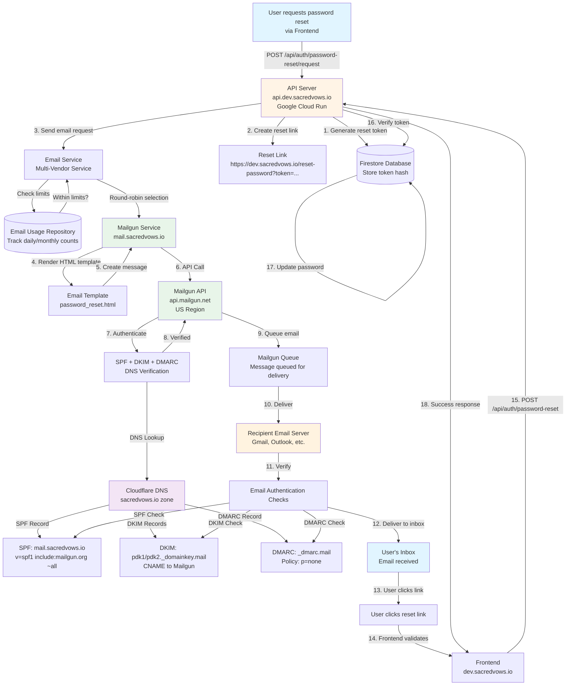
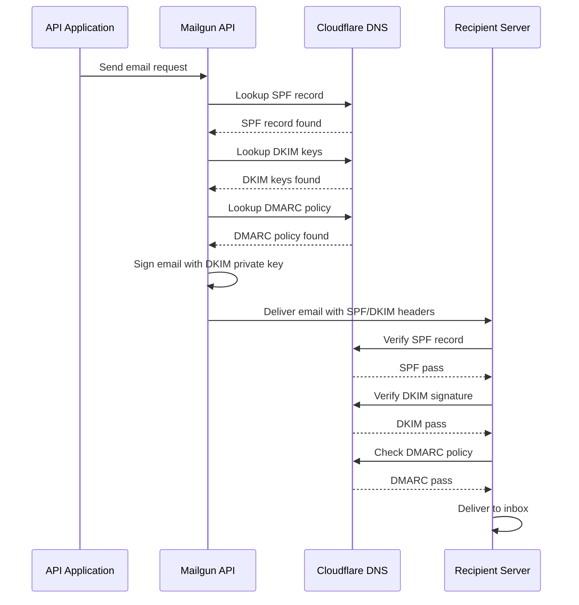

# Mailgun Email Service Configuration

This document describes how Mailgun is configured for Sacred Vows to send transactional emails (primarily password reset emails).

## Table of Contents

1. [Overview](#overview)
2. [Domain Configuration](#domain-configuration)
3. [DNS Records Setup](#dns-records-setup)
4. [Email Delivery Architecture](#email-delivery-architecture)
5. [Application Integration](#application-integration)
6. [Configuration Details](#configuration-details)
7. [Troubleshooting](#troubleshooting)

---

## Overview

Mailgun is configured as an email service provider for sending transactional emails from Sacred Vows. The primary use case is sending password reset emails to users.

### Key Decisions

- **Domain**: `mail.sacredvows.io` (single domain for both dev and production)
- **Region**: US (United States) - default region with global coverage
- **Purpose**: Transactional emails only (sending, not receiving)
- **Integration**: Part of multi-vendor email system (supports Mailgun and Mailjet)

### Why Mailgun?

- Reliable transactional email delivery
- Good deliverability rates
- Simple API integration
- Free tier available (100 emails/day, 3,000/month)
- Part of multi-vendor strategy for redundancy

---

## Domain Configuration

### Domain Setup

- **Domain Name**: `mail.sacredvows.io`
- **Region**: US (United States)
- **Status**: Verified and active

### Domain Selection Rationale

We chose `mail.sacredvows.io` (subdomain) instead of the root domain (`sacredvows.io`) for the following reasons:

1. **Separation of Concerns**: Isolates transactional emails from the main domain
2. **DNS Management**: Easier to manage SPF/DKIM records without conflicts
3. **Deliverability**: Better tracking and reputation management
4. **Flexibility**: Easier to switch providers or add more domains later
5. **Security**: Limits exposure if email domain is compromised

### Why Not Separate Dev/Prod Domains?

We use a single domain (`mail.sacredvows.io`) for both environments because:
- Mailgun free tier allows one custom domain
- Transactional email volume is low
- Environment separation is handled at the application level (different API keys/configs)
- Simplifies DNS management

---

## DNS Records Setup

All DNS records are configured in Cloudflare for the `sacredvows.io` zone.

### Records Added ✅

#### 1. SPF (TXT Record) - Required
- **Type**: `TXT`
- **Name**: `mail`
- **Content**: `v=spf1 include:mailgun.org ~all`
- **Purpose**: Authorizes Mailgun servers to send email from `mail.sacredvows.io`
- **Comment**: `Mailgun SPF - Authorizes Mailgun to send from mail.sacredvows.io`
- **Proxy Status**: DNS only (gray cloud)

**What it does**: Tells receiving email servers that Mailgun is authorized to send emails on behalf of `mail.sacredvows.io`. The `~all` means "soft fail" for other servers (not strict rejection).

#### 2. DKIM #1 (CNAME Record) - Required
- **Type**: `CNAME`
- **Name**: `pdk1._domainkey.mail`
- **Target**: `pdk1._domainkey.d70791.dkim2.us.mgsend.org`
- **Purpose**: Email authentication - cryptographic signing key #1
- **Comment**: `Mailgun DKIM #1 - Email authentication for mail.sacredvows.io`
- **Proxy Status**: DNS only (gray cloud)

#### 3. DKIM #2 (CNAME Record) - Required
- **Type**: `CNAME`
- **Name**: `pdk2._domainkey.mail`
- **Target**: `pdk2._domainkey.d70791.dkim2.us.mgsend.org`
- **Purpose**: Email authentication - cryptographic signing key #2
- **Comment**: `Mailgun DKIM #2 - Email authentication for mail.sacredvows.io`
- **Proxy Status**: DNS only (gray cloud)

**What DKIM does**: Mailgun cryptographically signs each email with a private key. Receiving servers look up these public keys in DNS to verify the email came from your domain and wasn't tampered with. Two keys provide redundancy and rotation capability.

#### 4. DMARC (TXT Record) - Recommended
- **Type**: `TXT`
- **Name**: `_dmarc.mail`
- **Content**: `v=DMARC1; p=none; pct=100; fo=1; ri=3600; rua=mailto:d0310f7d@dmarc.mailgun.org,mailto:f2477c18@inbox.ondmarc.com; ruf=mailto:d0310f7d@dmarc.mailgun.org,mailto:f2477c18@inbox.ondmarc.com;`
- **Purpose**: Email authentication policy (required by Google and Yahoo)
- **Comment**: `Mailgun DMARC - Email authentication policy for mail.sacredvows.io (required by Google/Yahoo)`
- **Proxy Status**: DNS only (gray cloud)

**What DMARC does**: 
- `p=none`: Monitor only (don't reject emails that fail authentication)
- `pct=100`: Apply to 100% of emails
- `rua`/`ruf`: Where to send aggregate and failure reports
- **Best Practice**: Start with `p=none` to monitor, then move to `p=quarantine` and eventually `p=reject` once confident

#### 5. Tracking (CNAME Record) - Recommended
- **Type**: `CNAME`
- **Name**: `email.mail`
- **Target**: `mailgun.org`
- **Purpose**: Enables email open/click tracking and unsubscribe links
- **Comment**: `Mailgun Tracking - Enables email open/click tracking and unsubscribe links`
- **Proxy Status**: DNS only (gray cloud)

**What it does**: Allows Mailgun to rewrite links in emails to track clicks, add tracking pixels for opens, and provide unsubscribe functionality.

### Records Skipped ❌

#### MX Records (Receiving) - Skipped
- **Type**: `MX`
- **Name**: `mail.sacredvows.io`
- **Targets**: 
  - `mxa.mailgun.org` (Priority 10)
  - `mxb.mailgun.org` (Priority 10)

**Why skipped**: We only use Mailgun for **sending** transactional emails, not receiving. Our existing Titan Email (GoDaddy) handles email receiving for the root domain (`sacredvows.io`). Setting MX records would route incoming emails to Mailgun, which we don't need.

**Impact**: No impact on existing email receiving setup. Titan Email continues to work normally.

---

## Email Delivery Architecture

### Complete Email Flow Diagram



### Step-by-Step Email Delivery Process

1. **User Request**: User requests password reset via frontend
2. **Token Generation**: API generates secure token and stores hash in Firestore
3. **Email Service**: Multi-vendor email service checks usage limits and selects Mailgun
4. **Template Rendering**: Mailgun service renders HTML email template with reset link
5. **API Call**: Application calls Mailgun API (`api.mailgun.net`) with email content
6. **Authentication**: Mailgun verifies domain ownership via DNS records
7. **Queue**: Mailgun queues email for delivery
8. **Delivery**: Mailgun delivers email to recipient's email server
9. **Verification**: Recipient server verifies SPF, DKIM, and DMARC records
10. **Inbox**: Email delivered to user's inbox
11. **User Action**: User clicks reset link in email
12. **Password Reset**: Frontend validates token and resets password

### Authentication Flow



---

## Application Integration

### Code Structure

```
apps/api-go/
├── internal/
│   ├── infrastructure/
│   │   ├── email/
│   │   │   ├── mailgun.go          # Mailgun service implementation
│   │   │   ├── multi_vendor.go     # Multi-vendor email service
│   │   │   └── factory.go          # Email service factory
│   │   └── config/
│   │       └── config.go           # Configuration loading
│   └── usecase/
│       └── auth/
│           └── request_password_reset.go  # Password reset use case
```

### Mailgun Service Implementation

The Mailgun service is implemented in `apps/api-go/internal/infrastructure/email/mailgun.go`:

- Uses `github.com/mailgun/mailgun-go/v4` SDK
- Implements `EmailService` interface
- Renders HTML email templates
- Sends emails via Mailgun API

### Multi-Vendor Support

Mailgun is part of a multi-vendor email system that supports:
- **Mailgun**: Primary/backup vendor
- **Mailjet**: Primary/backup vendor

The system:
- Tracks daily/monthly usage per vendor
- Implements round-robin selection
- Falls back to next vendor if one fails or reaches limits
- Stores usage metrics in Firestore

### Email Template

Password reset emails use an HTML template located at:
```
apps/api-go/internal/infrastructure/email/templates/password_reset.html
```

The template includes:
- Branded styling
- Reset link with token
- Security messaging
- Expiration notice (24 hours)

---

## Configuration Details

### Environment Variables

Mailgun is configured via environment variables in `apps/api-go/.env`:

```bash
# Multi-vendor mode
EMAIL_VENDORS=mailgun,mailjet

# Mailgun Configuration
MAILGUN_API_KEY=your-api-key-here
MAILGUN_DOMAIN=mail.sacredvows.io
MAILGUN_DAILY_LIMIT=100
MAILGUN_MONTHLY_LIMIT=3000

# Default from address (used if vendor doesn't specify)
EMAIL_FROM_ADDRESS=noreply@mail.sacredvows.io
EMAIL_FROM_NAME=Sacred Vows
```

### Configuration Reference

**Note**: The `keys.yaml` file is for reference only and is not used by the application code. All configuration is done via environment variables in `.env` files.

For reference, the Mailgun configuration structure would be:
```yaml
Email:
  Mailgun:
    APIKey: <api-key>
    Domain: mail.sacredvows.io
    DailyLimit: 100
    MonthlyLimit: 3000
    Enabled: true
    FromAddress: noreply@mail.sacredvows.io
    FromName: Sacred Vows
```

### Mailgun API Endpoints

- **US Region** (configured): `https://api.mailgun.net/v3`
- **EU Region** (not used): `https://api.eu.mailgun.net/v3`

The Go SDK automatically uses the US endpoint by default.

### Rate Limits

- **Free Tier**: 100 emails/day, 3,000/month
- **Paid Tier**: Higher limits available
- **Current Configuration**: Set to free tier limits

---

## Troubleshooting

### DNS Verification Issues

**Problem**: Mailgun shows DNS records as unverified

**Solutions**:
1. Ensure all records are set to "DNS only" (not proxied) in Cloudflare
2. Wait 24-48 hours for DNS propagation
3. Verify record names match exactly (including subdomain)
4. Check for typos in record values

### Email Delivery Failures

**Problem**: Emails not being delivered

**Check**:
1. Mailgun dashboard logs for bounce/spam reasons
2. SPF/DKIM/DMARC verification status
3. Sender reputation in Mailgun dashboard
4. API key validity and permissions

### Authentication Failures

**Problem**: Emails marked as spam or failing authentication

**Solutions**:
1. Verify all DNS records are correctly configured
2. Check DMARC reports for authentication failures
3. Ensure DKIM keys are properly set up
4. Review SPF record syntax

### API Errors

**Problem**: API calls failing

**Check**:
1. API key is valid and has sending permissions
2. Domain is verified in Mailgun dashboard
3. Rate limits haven't been exceeded
4. Network connectivity to `api.mailgun.net`

### Common Issues

| Issue | Cause | Solution |
|-------|-------|----------|
| DNS not verified | Records proxied in Cloudflare | Set to DNS only |
| Emails in spam | Missing DMARC | Add DMARC record |
| Authentication fails | DKIM not set up | Add DKIM CNAME records |
| Rate limit exceeded | Too many emails sent | Check usage, upgrade plan |

---

## Best Practices

### Security

1. **Never commit API keys**: Store in environment variables or secrets manager
2. **Use subdomain**: Isolate email domain from main domain
3. **Monitor DMARC reports**: Review regularly for authentication issues
4. **Rotate keys**: Periodically rotate API keys

### Deliverability

1. **Start with monitoring**: Use `p=none` DMARC policy initially
2. **Gradually tighten**: Move to `p=quarantine` then `p=reject`
3. **Monitor reputation**: Check Mailgun dashboard for sender reputation
4. **Handle bounces**: Implement bounce handling in application

### Maintenance

1. **Regular DNS checks**: Verify all records are still valid
2. **Monitor usage**: Track daily/monthly email counts
3. **Review logs**: Check Mailgun logs for delivery issues
4. **Update templates**: Keep email templates current and tested

---

## References

- [Mailgun Documentation](https://documentation.mailgun.com/)
- [SPF Record Syntax](https://www.ietf.org/rfc/rfc4408.txt)
- [DKIM Specification](https://www.ietf.org/rfc/rfc6376.txt)
- [DMARC Specification](https://www.ietf.org/rfc/rfc7489.txt)
- [Cloudflare DNS Documentation](https://developers.cloudflare.com/dns/)

---

## Summary

Mailgun is configured for Sacred Vows with:

- ✅ Domain: `mail.sacredvows.io` (US region)
- ✅ 5 DNS records added (SPF, 2x DKIM, DMARC, Tracking)
- ✅ 2 MX records skipped (receiving not needed)
- ✅ Integrated with multi-vendor email system
- ✅ Used for transactional emails (password resets)
- ✅ Free tier limits configured (100/day, 3,000/month)

The setup provides reliable email delivery with proper authentication and tracking capabilities.

