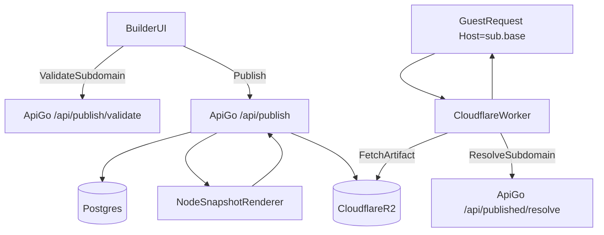

# Publishing Process (How “Publish” Works)

This document explains what happens end-to-end when a user publishes an invitation, and how a guest request is served afterwards.

## High-level architecture

## Data model (published site mapping)

Publishing introduces a mapping between a **subdomain** and an invitation:

- **`published_sites.subdomain`**: the chosen subdomain (unique)
- **`published_sites.invitation_id`**: which invitation is published
- **`published_sites.current_version`**: the latest published snapshot version
- **`published_sites.published`**: whether publishing has been completed successfully

Artifacts are stored versioned:

- `sites/<subdomain>/v<version>/index.html`
- `sites/<subdomain>/v<version>/styles.css`
- `sites/<subdomain>/v<version>/manifest.json`
- (optional) `sites/<subdomain>/v<version>/...assets...`

This “versioned prefix” design gives you:

- Immutable artifacts per publish
- Safe republish (new version doesn’t overwrite old files)
- Simple cache strategy (long cache for versioned assets)

## End-to-end publish flow (user clicks Publish)

### 1) Builder UI collects subdomain

In the builder, the Publish modal asks the user for a subdomain and performs a debounced availability check.

### 2) Subdomain validation

Builder calls:

- `POST /api/publish/validate`

The API:

- normalizes subdomain (lowercase, trim, replace spaces/underscores with `-`)
- rejects invalid patterns (length, characters, leading/trailing `-`, etc.)
- blocks reserved subdomains (e.g. `www`, `api`, `admin`)
- checks if `published_sites.subdomain` already exists

### 3) Publish request (authenticated)

Builder calls:

- `POST /api/publish` (Bearer token required)

The API enforces:

- invitation exists
- invitation is owned by the authenticated user
- subdomain is not taken by another user

### 4) Snapshot generation (“static snapshot”)

The API generates a snapshot bundle by invoking a Node renderer script:

- Script: `apps/builder/src/template-engine/src/renderPublishedHTML.js`
- Mode: `--mode=bundle`

Inputs (stdin JSON):

- invitation data (layoutId + data)
- translations (currently empty payload; can be extended later)

Output (stdout JSON):

- `html`: the final `index.html`
- `css`: layout-derived CSS
- `manifest`: PWA manifest
- `assets`: optional list of additional files

Why Node?

- It reuses the same layout export logic your builder already uses (consistent output).

### 5) Upload artifacts (R2 or filesystem)

The API uploads artifacts under the next version prefix:

1. Determine `newVersion = current_version + 1`
2. Upload bundle to `sites/<subdomain>/v<newVersion>/...`

Artifact storage is selected via:

- `PUBLISH_ARTIFACT_STORE=filesystem|r2`

For R2 the API uses an S3-compatible client:

- `R2_ACCOUNT_ID`, `R2_ACCESS_KEY_ID`, `R2_SECRET_ACCESS_KEY`, `R2_BUCKET`

### 6) Atomic “publish pointer update”

Only after **all uploads succeed**, the API updates:

- `published=true`
- `current_version=newVersion`
- `published_at=now`

This prevents “half-published” sites from becoming live.

### 7) Publish response to builder

The API returns:

- `url`: `https://<subdomain>.<PUBLISHED_BASE_DOMAIN>` (if `PUBLISHED_BASE_DOMAIN` is set)
- `subdomain`
- `version`

## Serving flow (guest opens the link)

When a guest visits:

- `https://john-wedding.<PUBLISHED_BASE_DOMAIN>/`

### 1) Cloudflare Worker extracts the subdomain

The Worker reads the `Host` header and extracts:

- `subdomain = john-wedding`

### 2) Worker resolves the current version

Worker calls the API resolve endpoint:

- `GET /api/published/resolve?subdomain=john-wedding`

Response includes:

- `currentVersion`

The Worker caches this mapping for a short period (TTL ~30s by default).

### 3) Worker rewrites the request to the versioned artifact key

If the request path is `/`, Worker maps it to `/index.html`.

It then fetches from R2:

- `sites/<subdomain>/v<currentVersion>/<path>`

### 4) Caching strategy

The Worker sets caching headers:

- **HTML**: short cache, with `stale-while-revalidate`
- **versioned assets**: long cache, `immutable`

Because the artifact path includes the version, old cached assets never “accidentally” become stale.

## Version Retention and Rollback

### Automatic Version Cleanup

After each successful publish, the system automatically cleans up old versions:
- **Retention Policy**: Only the last N versions are kept (configurable via `PUBLISH_VERSION_RETENTION_COUNT`, default: 3)
- **Automatic Deletion**: Versions older than the retention window are automatically deleted
- **Background Process**: Cleanup runs in the background and doesn't block the publish response
- **Error Handling**: If cleanup fails, it's logged but doesn't affect the publish operation

### Rollback Functionality

Users can rollback to any available previous version:
- **Available Versions**: Only versions within the retention window are available for rollback
- **Instant Rollback**: Rollback updates the `current_version` pointer immediately (no new version created)
- **UI Access**: Rollback is available in the builder UI's publish modal
- **Authentication**: Rollback requires authentication and ownership validation

### API Endpoints

- `GET /api/published/versions?subdomain={subdomain}` - List available versions for a site
- `POST /api/published/rollback` - Rollback to a specific version (requires auth)

## Operational notes

### Required env vars (production)

API:

- `PUBLISHED_BASE_DOMAIN`
- `PUBLISH_ARTIFACT_STORE=r2`
- `SNAPSHOT_RENDERER_SCRIPT`
- `R2_ACCOUNT_ID`, `R2_ACCESS_KEY_ID`, `R2_SECRET_ACCESS_KEY`, `R2_BUCKET`
- `PUBLISH_VERSION_RETENTION_COUNT` (optional, default: 3)

Worker:

- `PUBLISHED_BASE_DOMAIN`
- `API_ORIGIN`
- `R2_BUCKET` binding

### Rate limiting

Publish endpoints are rate-limited to reduce abuse:

- `/api/publish/validate`: higher burst, faster refill
- `/api/publish`: lower burst, slower refill

### Security headers (public sites)

Public responses served by the Worker include conservative security headers (CSP, nosniff, etc.).

## Where to look in the code

- Builder publish UI: `apps/builder/src/components/Export/ExportModal.jsx`
- Builder publish API client: `apps/builder/src/services/publishService.js`
- Publish endpoints: `apps/api-go/internal/interfaces/http/handlers/publish_handler.go`
- Publish usecase: `apps/api-go/internal/usecase/publish/publish.go`
- Resolve endpoint: `apps/api-go/internal/interfaces/http/handlers/published_resolve_api.go`
- Snapshot renderer: `apps/builder/src/template-engine/src/renderPublishedHTML.js`
- R2 artifact store: `apps/api-go/internal/infrastructure/publish/r2_artifacts.go`
- Worker routing: `apps/edge-worker/src/index.ts`

